# MediCart System Architecture

병원 순회 로봇의 **미션 흐름**, **레이어 구조**, **패키지 역할**, **데이터 입출력**을 정리한다. ROS2 토픽·서비스 상세는 [03_ros2_interfaces.md](03_ros2_interfaces.md), 패키지별 책임·디렉터리는 [02_ros2_packages.md](02_ros2_packages.md)를 참고한다.

## 운영 모델 — 모드 전환

동일한 플랫폼(TurtleBot4 + OAK-D + RPLIDAR)이 `mission_manager`의 `mission_type` 파라미터로 두 미션을 운영한다. **로봇은 평소 Station에 도킹**되어 있고, **관리자 web(dashboard)에서 모드를 선택**하면 해당 미션이 시작된다 — 모드 선택 = 서비스 호출(`/robot6/start_patrol`=순찰, `/robot6/start_medication`=투약).

여러 대를 함께 운용할 수 있도록(예: `/robot3` 순찰 로봇 + `/robot6` 투약 로봇) 각 로봇은 **자기 namespace**로 동작하고, **Fast DDS Discovery Server**가 host(dashboard·db_bridge)와 로봇들을 서로 디스커버리시킨다. 현재 코드/문서는 `/robot6` 단일 namespace 기준이며, 멀티로봇 시 동일 패키지를 namespace만 바꿔 재기동한다.

> ⚠️ Fast DDS Discovery Server 설정·멀티 namespace launch는 `medi_bringup`(미생성)에서 다룰 예정. 아래 미션/인터페이스 설명은 단일 로봇 `/robot6` 기준.

| `mission_type` | 시나리오 | 핵심 패키지 |
| --- | --- | --- |
| `patrol` | **A. 자율 순찰 + 문진 보조** — 병실을 순회하며 환자 재실·신원 확인, 웹 문진표 작성, DB 방문상태 기록 | `patient_identifier`, `mission_manager`, `db_bridge`, `dashboard` |
| `medication` | **B. 투약 보조** — **(기본)** Nav2 자율주행으로 약 제조실·호실 이동 후 처방 로드·약품 OCR 검증, **(챌린지)** 간호사 추종 이동 | `scanner`, `ocr_detector`, `mission_manager`, `db_bridge`, `dashboard` · 챌린지 시 `nurse_tracker` |

> **시나리오 B 이동 방식**: 자율주행(Nav2 NavigateToPose)이 **기본 플로우**다. **간호사 추종(`nurse_tracker` + `/robot6/start_tracking`)은 챌린지 확장**으로, 활성화 시에만 `target_pose` 기반 추종으로 전환한다.

> **문진(interview)은 ROS 노드가 아니라 웹 앱에서 작성**하고 결과는 직접 DB에 저장된다. 로봇은 신원 확인 후 문진 완료를 기다렸다가 다음 병실로 이동한다.

## 패키지 역할 요약

| 패키지 | 역할 | 주요 입력 | 주요 출력 |
| --- | --- | --- | --- |
| `dashboard` | 운영자 UI·모드 선택·미션 명령 (두 시나리오 공용) | `/robot6/robot_state`, `/robot6/patient_identified` | A: `/robot6/start_patrol` · B: `/robot6/start_medication`(기본)·`/robot6/start_tracking`(챌린지), `/robot6/scan_*`, `/robot6/move_home`, `/robot6/emergency_stop` |
| `mission_manager` | 상태기(`mission_type`)·처방 세션·Nav2/도킹 조율 | `/robot6/target_pose`, `/robot6/patient_identified`, `/robot6/emergency_stop`, 서비스 요청 | `/robot6/robot_state`, `/robot6/navigate_to_pose`, `/robot6/undock`, `/robot6/dock`, `/robot6/db/update_visit_status` |
| `patient_identifier` | (A) 재실 확인(YOLO)+QR 신원 확인+병실 검증 | `/robot6/oakd/image_raw`, `/robot6/oakd/depth_image` | `/robot6/patient_identified` |
| `nurse_tracker` | (B 챌린지) 간호사 추적 (호스트 추론, OCL+ReID) | `/robot6/oakd/image_raw`, `/robot6/oakd/depth_image`, `/tf` | `/robot6/target_pose`, `/robot6/target_bbox` |
| `obstacle_detector` | pure-vision depth 추론 → 장애물 point cloud (모델 미확정) | `/robot6/oakd/image_raw` | `/robot6/vision_obstacles` |
| `ocr_detector` | (B) 약품 라벨 OCR | `/robot6/oakd/image_raw` | `/robot6/ocr/get_result` (service) |
| `scanner` | (B) OCR+처방 step 검증 | `/robot6/scanner/verify_medicine` | `/robot6/ocr/get_result`, `/robot6/db/verify_medicine` |
| `db_bridge` | Firestore 처방·검증·환자 상태 | `/robot6/db/get_prescription`, `/robot6/db/verify_medicine` | patient/medicines, 환자 상태 |
| `medi_bringup` | launch·Nav2 yaml 통합 | — | 전 노드 기동 |
| `medi_interfaces` | 커스텀 msg/srv 정의 | — | 타입만 제공 |

외부(빌트인): `depthai_ros_driver`(Pi), `rplidar_ros`, `turtlebot4_node`, Nav2, Create3 dock/undock — [03_ros2_interfaces.md § Builtin](03_ros2_interfaces.md#builtin--external-interfaces).

> **구현 현황**: `medi_bringup`은 아직 패키지로 생성되지 않았고(launch 부재), 대부분 perception/data 노드는 스켈레톤 단계다. 패키지별 상태는 [02_ros2_packages.md § 구현 현황](02_ros2_packages.md#구현-현황)을 참고한다.

## 미션 전체 흐름

### 시나리오 A — 자율 순찰 + 문진 보조 (`mission_type=patrol`)

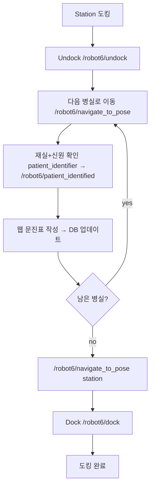

예외: 부재/불일치(`absent`/`mismatch`) → DB에 상태 기록 후 **마지막에 재방문**. 통증 max 등 이상 수치 알림은 **웹 문진 앱**이 담당.

### 시나리오 B — 투약 보조 (`mission_type=medication`)

기본은 **자율주행(Nav2)** 으로 약 제조실·호실을 이동한다. **간호사 추종은 챌린지 확장**(`/robot6/start_tracking` 활성화 시 `MOVE` 단계를 `target_pose` 추종으로 대체).

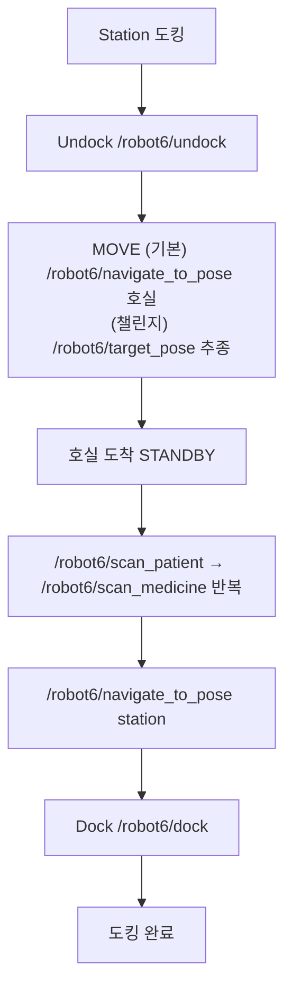

`mission_manager` 상태:
- `patrol`: `IDLE → UNDOCK → PATROL → IDENTIFY → INTERVIEW → NEXT_ROOM → (반복) → RETURN → DOCK → IDLE`
- `medication`(기본): `IDLE → UNDOCK → MOVE → SCAN → RETURN → DOCK → IDLE`
- `medication`(챌린지): `MOVE` 단계를 `FOLLOW`(간호사 추종)로 대체

## 레이어와 데이터 흐름

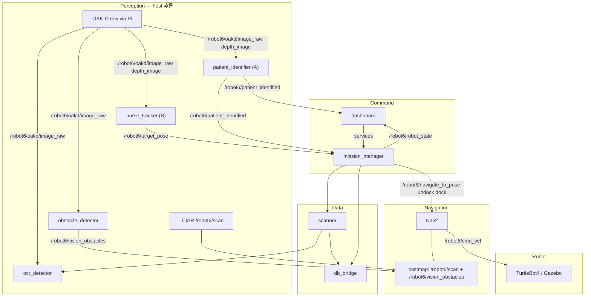

- **Command**: dashboard만 operator-facing service 발행 (모드 선택 A: `/robot6/start_patrol` · B: `/robot6/start_medication`[+챌린지 `/robot6/start_tracking`], `/robot6/scan_*`, `/robot6/move_home`, `/robot6/cancel_mission`); Nav2/action은 mission_manager만 호출.
- **Perception**: OAK-D는 VPU 추론 없이 raw만 Pi→호스트. 추론은 `patient_identifier`(A: YOLO+QR), `nurse_tracker`(B 챌린지: OCL+ReID), `obstacle_detector`(pure-vision depth, 모델 미확정), `ocr_detector`.
- **Navigation**: `/robot6/cmd_vel` 단일 소스(Nav2). emergency 시 mission_manager가 `Twist(0)` 직접 발행.
- **Data**: `db_bridge`는 수직 독립; `scanner`·`mission_manager`·`patient_identifier`가 처방 조회·검증·환자 상태에 사용.

## OAK-D → 호스트 데이터 경로

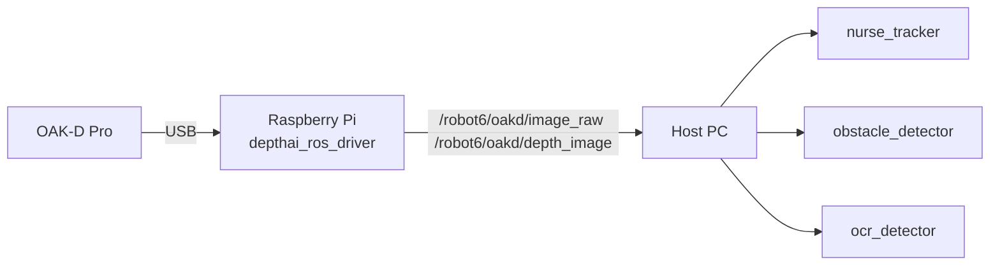

## 모드별 시퀀스

### Patrol + Identify (A)

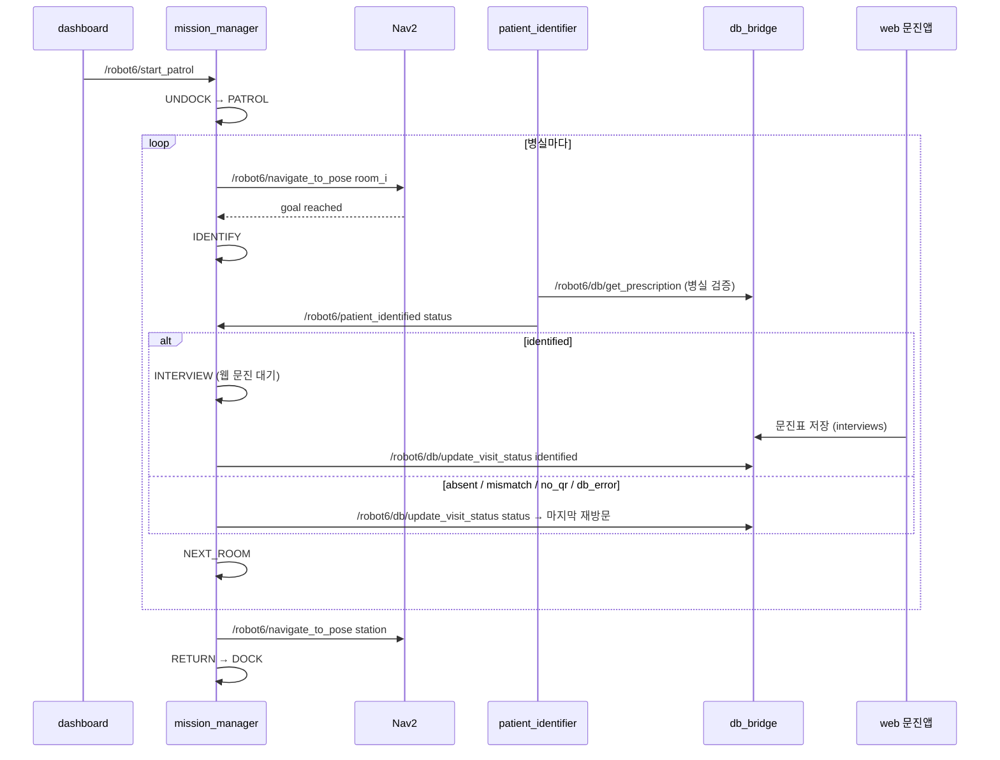

### Medication Move — 기본(자율주행)

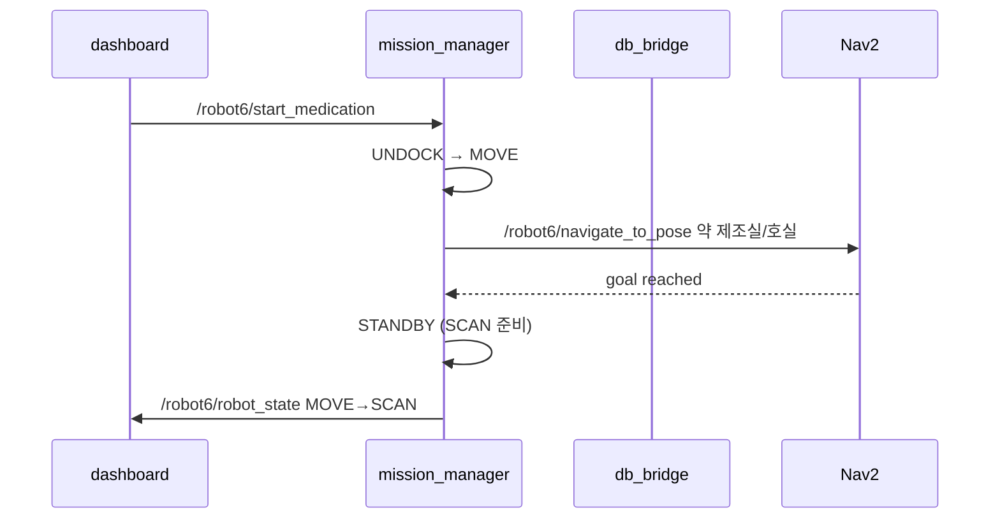

호실 좌표는 `/robot6/scan_patient`의 `GetPrescription` 응답(`PatientInfo.room`) 또는 사전 정의 waypoint에서 얻는다.

### Medication Follow — 챌린지(간호사 추종)

`/robot6/start_tracking` 활성화 시 `MOVE`를 추종으로 대체.

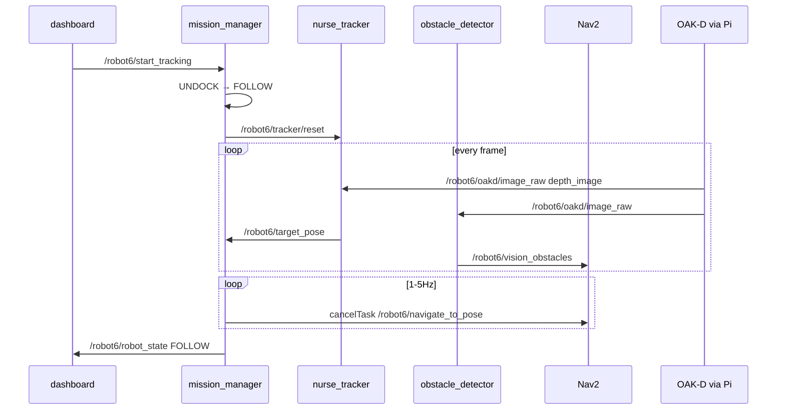

### Scan Patient

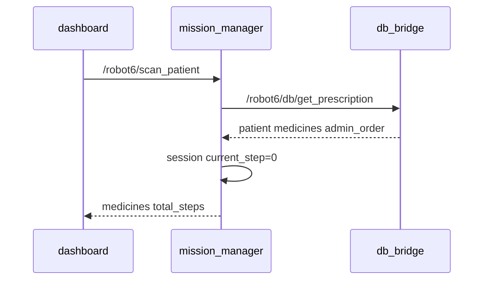

`medicines[]` 순서 = `admin_order` 오름차순(투약 순서).

### Scan Medicine (반복)

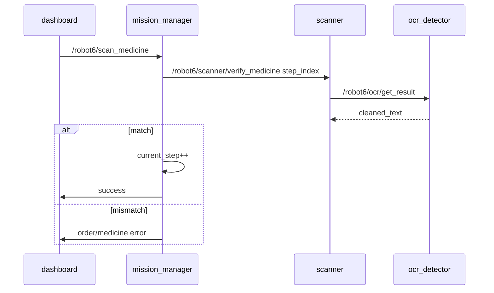

현재 `current_step`의 expected 약만 검증.

### Return Home

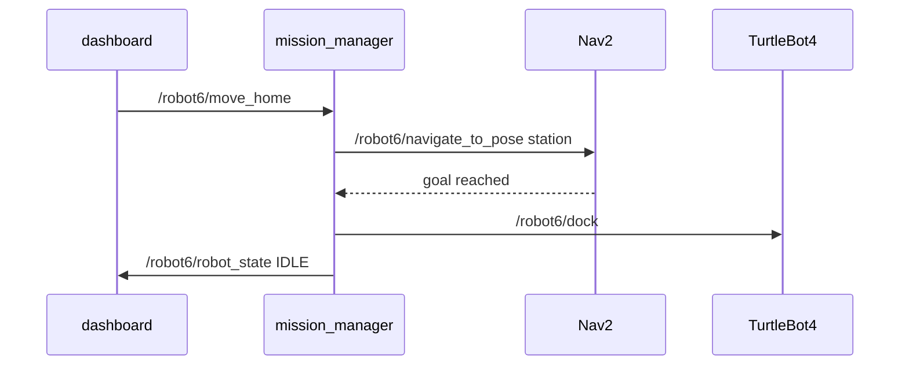

### Emergency Stop

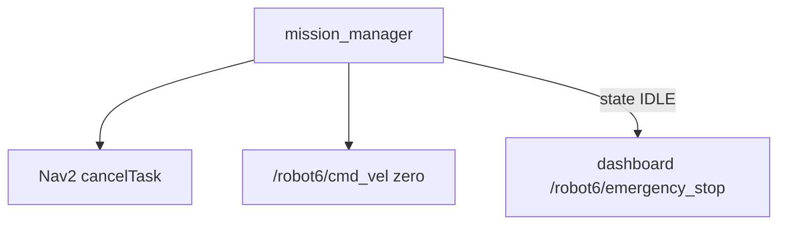
