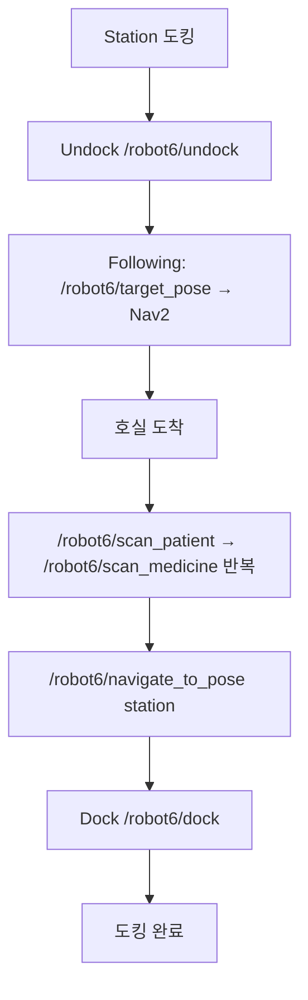
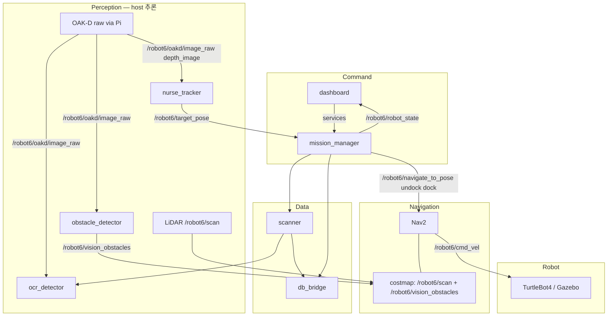
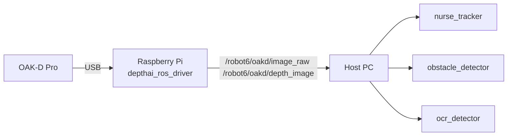
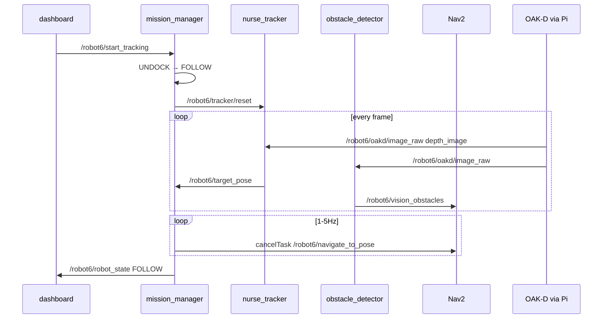
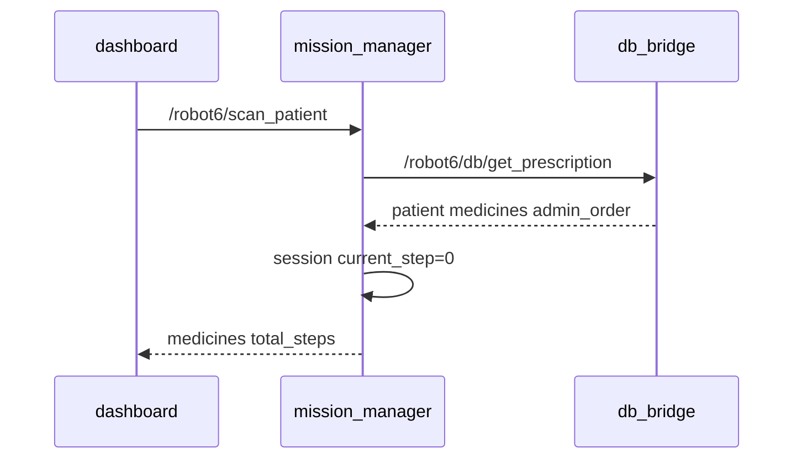
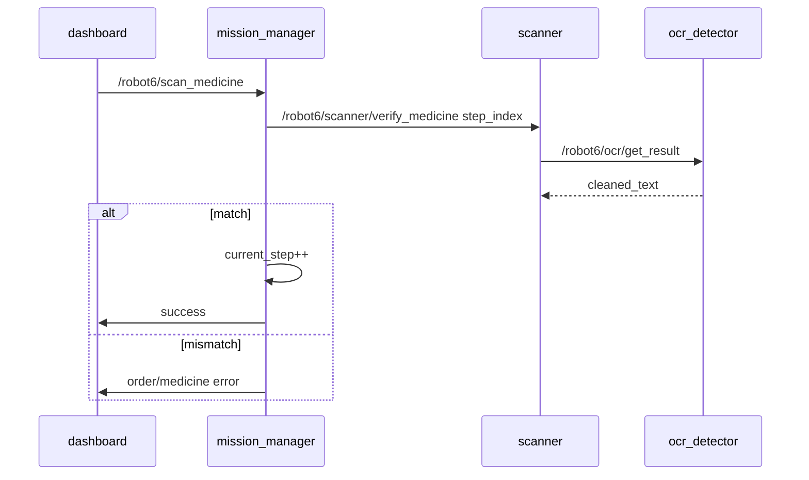
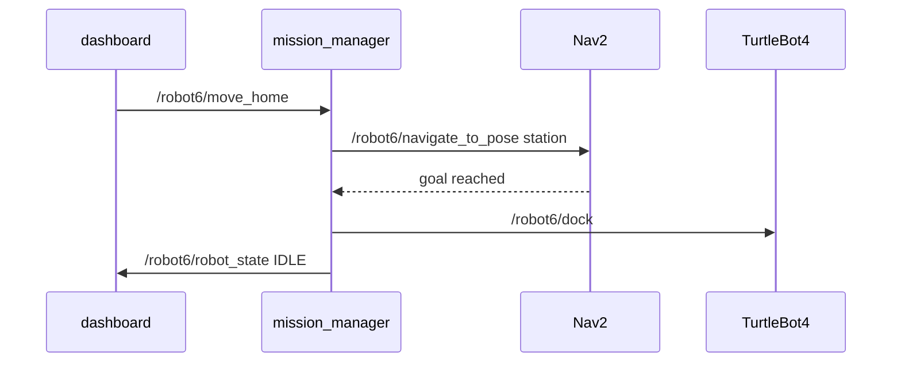
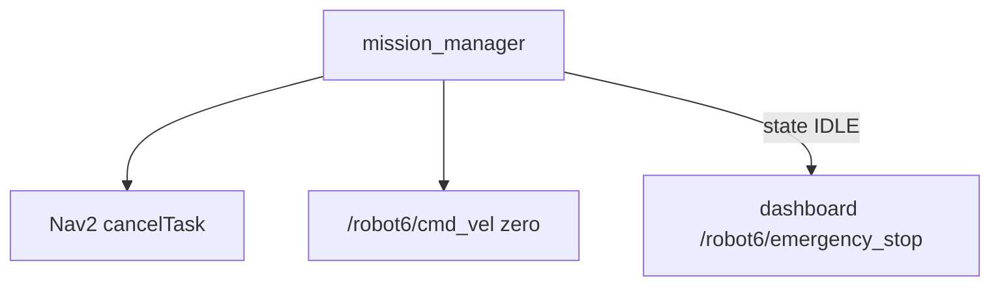

# MediCart System Architecture

병원 순회 로봇의 **미션 흐름**, **레이어 구조**, **패키지 역할**, **데이터 입출력**을 정리한다. ROS2 토픽·서비스 상세는 [03_ros2_interfaces.md](03_ros2_interfaces.md), 패키지별 책임·디렉터리는 [02_ros2_packages.md](02_ros2_packages.md)를 참고한다.

## 패키지 역할 요약

| 패키지 | 역할 | 주요 입력 | 주요 출력 |
| --- | --- | --- | --- |
| `dashboard` | 운영자 UI·미션 명령 | `/robot6/robot_state` | `/robot6/start_tracking`, `/robot6/scan_*`, `/robot6/move_home`, `/robot6/emergency_stop` |
| `mission_manager` | 상태기·처방 세션·Nav2/도킹 조율 | `/robot6/target_pose`, `/robot6/emergency_stop`, 서비스 요청 | `/robot6/robot_state`, `/robot6/navigate_to_pose`, `/robot6/undock`, `/robot6/dock` |
| `nurse_tracker` | 간호사 추적 (호스트 추론, OCL+ReID) | `/robot6/oakd/image_raw`, `/robot6/oakd/depth_image`, `/tf` | `/robot6/target_pose`, `/robot6/target_bbox` |
| `obstacle_detector` | pure-vision depth 추론 → 장애물 point cloud (모델 미확정) | `/robot6/oakd/image_raw` | `/robot6/vision_obstacles` |
| `ocr_detector` | 약품 라벨 OCR | `/robot6/oakd/image_raw` | `/robot6/ocr/get_result` (service) |
| `scanner` | OCR+처방 step 검증 | `/robot6/scanner/verify_medicine` | `/robot6/ocr/get_result`, `/robot6/db/verify_medicine` |
| `db_bridge` | Firestore 처방·검증 | `/robot6/db/get_prescription`, `/robot6/db/verify_medicine` | patient/medicines |
| `medi_bringup` | launch·Nav2 yaml 통합 | — | 전 노드 기동 |
| `medi_interfaces` | 커스텀 msg/srv 정의 | — | 타입만 제공 |

외부(빌트인): `depthai_ros_driver`(Pi), `rplidar_ros`, `turtlebot4_node`, Nav2, Create3 dock/undock — [03_ros2_interfaces.md § Builtin](03_ros2_interfaces.md#builtin--external-interfaces).

## 미션 전체 흐름

`mission_manager` 상태: `IDLE → UNDOCK → FOLLOW → SCAN → RETURN → DOCK → IDLE`

## 레이어와 데이터 흐름

- **Command**: dashboard만 operator-facing service 발행 (`/robot6/start_tracking`, `/robot6/scan_*`, `/robot6/move_home`, `/robot6/cancel_mission`); Nav2/action은 mission_manager만 호출.
- **Perception**: OAK-D는 VPU 추론 없이 raw만 Pi→호스트. 추론은 `nurse_tracker`(OCL+ReID), `obstacle_detector`(pure-vision depth, 모델 미확정), `ocr_detector`.
- **Navigation**: `/robot6/cmd_vel` 단일 소스(Nav2). emergency 시 mission_manager가 `Twist(0)` 직접 발행.
- **Data**: `db_bridge`는 수직 독립; `scanner`·`mission_manager`가 처방 조회·검증에 사용.

## OAK-D → 호스트 데이터 경로

## 모드별 시퀀스

### Following Mode

### Scan Patient

`medicines[]` 순서 = `admin_order` 오름차순(투약 순서).

### Scan Medicine (반복)

현재 `current_step`의 expected 약만 검증.

### Return Home

### Emergency Stop

