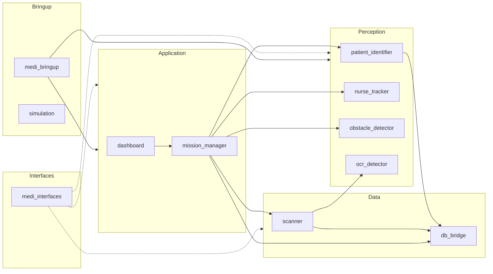
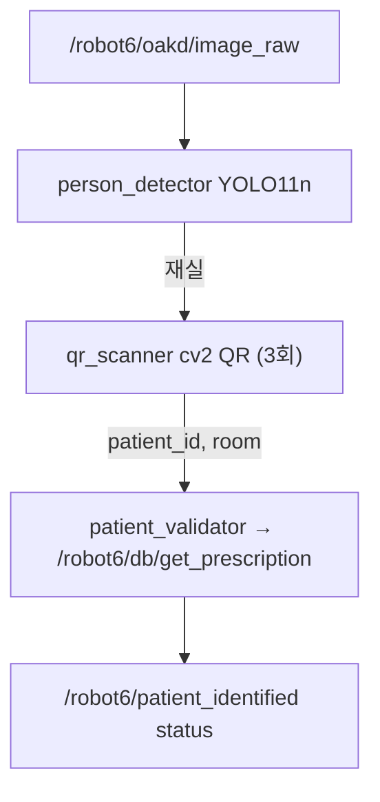
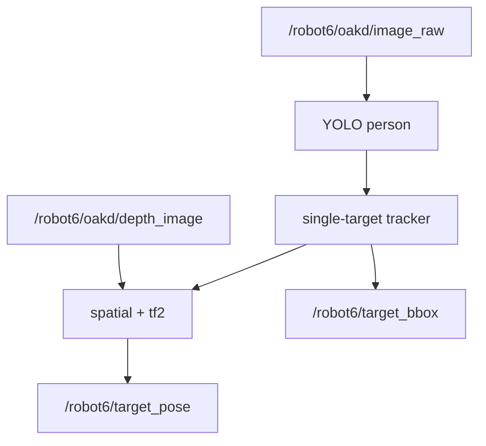
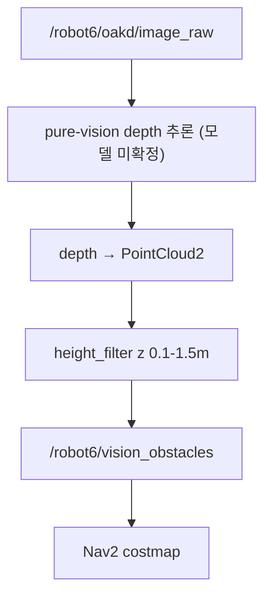

# ROS2 Packages

> Interfaces: [03_ros2_interfaces.md](03_ros2_interfaces.md)

`medicart_ws/src/` 패키지별 **역할**과 **ROS 데이터 입출력**. 디렉터리 트리·launch 예시는 구현 시 패키지 README를 따른다.

## 워크스페이스 개요

| 패키지 | Scope | 시나리오 | 핵심 노드 |
| --- | --- | --- | --- |
| `dashboard` | 1 | A·B | `dashboard_node`, `gui_panel` |
| `mission_manager` | 1 | A·B | `mission_manager_node`, `state_machine`, `prescription_session` |
| `patient_identifier` | 1 | A | `identifier_node`, `person_detector`, `qr_scanner`, `patient_validator` |
| `nurse_tracker` | 1 | B 챌린지 | `tracker_node`, OCL detection/tracking + feature memory·ReID/spatial |
| `obstacle_detector` | 1 | A·B | `obstacle_node`, `height_filter`, pure-vision depth 추론 (모델 미확정) |
| `ocr_detector` | 1 | B | `ocr_node`, `ocr_engine` |
| `scanner` | 1 | B | `scanner_node`, `medicine_matcher` |
| `db_bridge` | 1 | A·B | `db_node`, `firebase_client`, `models` |
| `medi_bringup` | 1 | A·B | launch + `nav2_params.yaml` |
| `medi_interfaces` | 1 | A·B | msg/srv only |
| `simulation` | — | — | Gazebo |

`nurse_tracker`는 scope 분리 없이 처음부터 OCL 기반으로 구현한다 (feature memory·ReID 포함).

## 구현 현황

> 정합성 기준: 아래는 **코드 골격(노드/타입/배선) 기준** 상태. 로직 완성도와는 별개다.

| 패키지 | 정적 구조 | ROS 배선 | 로직 | 비고 |
| --- | --- | --- | --- | --- |
| `medi_interfaces` | ✅ | — | ✅ | 타입 정의 완료 |
| `patient_identifier` | ✅ | ✅ | ✅ | 재실+QR+병실검증 파이프라인 구현 (YOLO 가중치·DB 서비스 필요) |
| `mission_manager` | ✅ | ⚠️ | ⚠️ | 상태기·`mission_type`·`start_patrol`만; Nav2/도킹/순회 루프 미구현 |
| `dashboard` | ✅ | ⚠️ | ⚠️ | patrol 진행·상태 팝업만; 실제 GUI·시나리오 B 컨트롤 미구현 |
| `scanner` | ✅ | ❌ | ⚠️ | `medicine_matcher` 로직만; 노드 배선·서비스 미구현 |
| `db_bridge` | ✅ | ❌ | ❌ | `firebase_client` 전부 스텁; **서비스 미등록** (최우선 블로커) |
| `nurse_tracker` | ✅ | ❌ | ❌ | 전부 placeholder |
| `ocr_detector` | ✅ | ❌ | ❌ | `ocr_engine` 스텁 |
| `obstacle_detector` | ✅ | ❌ | ❌ | placeholder, 모델 미확정 |
| `simulation` | ✅ | ❌ | ❌ | placeholder |
| `medi_bringup` | ❌ | — | — | **패키지 미생성** (launch 부재) |

---

## dashboard

**역할**: 운영자가 미션을 시작·중단하고 로봇 상태를 표시한다. 두 시나리오 공용.

| 방향 | 데이터 | 시나리오 | 비고 |
| --- | --- | --- | --- |
| OUT | `/robot6/start_patrol` | A | 순찰 모드 선택; mission_manager 클라이언트 |
| OUT | `/robot6/start_medication`, `/robot6/move_home`, `/robot6/scan_patient`, `/robot6/scan_medicine` | B | 투약 모드 선택(자율주행 기본); `medi_interfaces` srv |
| OUT | `/robot6/start_tracking` | B 챌린지 | 간호사 추종 활성화 |
| OUT | `/robot6/cancel_mission` (`std_srvs/Trigger`) | A·B | |
| OUT | `/robot6/emergency_stop` (`std_msgs/Bool`) | A·B | |
| IN | `/robot6/robot_state` | A·B | UI 갱신 |
| IN | `/robot6/patient_identified` | A | 순찰 진행률 + 실패 status(`no_qr`/`mismatch`/`db_error`) 팝업 |
| IN | `/robot6/target_bbox` (선택) | B | 추적 시각화 |

> 별도 알림 토픽 없이 `/robot6/patient_identified`의 `status` 필드로 운영자 팝업을 처리한다 (간호사 알림 토픽 제거됨).

---

## mission_manager

**역할**: 미션 상태기(`mission_type`로 시나리오 선택), 처방 세션, Nav2·도킹 action, perception/DB 조율.

**ROS param**: `mission_type` = `patrol` | `medication` (기본 `medication`).

| 방향 | 데이터 | 시나리오 | 비고 |
| --- | --- | --- | --- |
| IN | `/robot6/start_patrol` | A | dashboard (순찰 모드 선택) |
| IN | `/robot6/start_medication`, `/robot6/move_home`, `/robot6/scan_patient`, `/robot6/scan_medicine`, `/robot6/cancel_mission` | B | dashboard (투약 모드 선택) |
| IN | `/robot6/start_tracking` | B 챌린지 | dashboard (간호사 추종 활성화) |
| IN | `/robot6/patient_identified` | A | 신원 확인 결과 → INTERVIEW/NEXT_ROOM 전이 |
| IN | `/robot6/target_pose`, `/robot6/emergency_stop` | B 챌린지 | |
| OUT | `/robot6/robot_state` | A·B | |
| OUT | `/robot6/navigate_to_pose`, `/robot6/undock`, `/robot6/dock` | A·B | action client |
| OUT | `/robot6/tracker/reset` | B 챌린지 | 추종 활성화 후 |
| OUT | `/robot6/db/get_prescription` (내부) | B | scan_patient 시 |
| OUT | `/robot6/db/update_visit_status` (내부) | A | 병실 방문 결과 기록 |
| OUT | `/robot6/scanner/verify_medicine` (내부) | B | scan_medicine 시 |

**상태기**:
- `patrol`: `IDLE → UNDOCK → PATROL → IDENTIFY → INTERVIEW → NEXT_ROOM → (반복) → RETURN → DOCK`
- `medication`(기본): `IDLE → UNDOCK → MOVE → SCAN → RETURN → DOCK`
- `medication`(챌린지): `MOVE` → `FOLLOW`(간호사 추종)로 대체

**Patrol(A)**: 병실 waypoint 순서대로 `navigate_to_pose` → `patient_identifier`가 `/robot6/patient_identified` 발행 → `identified`면 INTERVIEW(웹 문진 대기), `absent`/`mismatch`면 재방문 큐에 적재 → 결과는 `/robot6/db/update_visit_status`로 기록 → 마지막에 재방문 후 RETURN.

**Prescription session(B)**: `/robot6/scan_patient` 성공 시 `medicines[]` + `current_step=0`. `/robot6/scan_medicine`마다 `medicines[current_step]`과 검증 결과 비교, match 시 step++.

**Move(B 기본)**: `MOVE` 동안 호실/제조실 waypoint로 `navigate_to_pose` 자율주행. 도착 시 SCAN으로 전이.

**Follow(B 챌린지)**: `/robot6/start_tracking` 활성화 시 `FOLLOW`로 진입, `/robot6/target_pose` 수신마다 0.2–1.0s 주기로 `cancelTask` → `/robot6/navigate_to_pose`.

---

## patient_identifier

**역할** (A): OAK-D RGB로 병실 내 환자 재실 확인(YOLO11n) → QR 팔찌 디코딩으로 신원 추출 → DB 조회로 방문 병실 일치 검증 → 결과를 단일 토픽으로 발행.

| 방향 | 데이터 | 비고 |
| --- | --- | --- |
| IN | `/robot6/oakd/image_raw`, `/robot6/oakd/depth_image` | builtin `sensor_msgs/Image` |
| OUT | `/robot6/patient_identified` | `medi_interfaces/PatientIdentified` |
| OUT | `/robot6/db/get_prescription` | client (병실 검증) |

**처리 흐름**: `person_detector`(YOLO 재실) → `qr_scanner`(`cv2.QRCodeDetector`, QR `{"patient_id","room"}`, 최대 3회 재시도) → `patient_validator`(DB 병실 일치).

**status**: `identified` / `absent`(부재) / `mismatch`(병실 불일치) / `no_qr`(QR 실패) / `db_error`(DB 오류). 실패 status는 dashboard 팝업·DB 상태 기록으로 처리.

ROS param: `mission_type` 무관 독립 노드. `current_room`(방문 병실), `period_sec`, `model_path`.

---

## nurse_tracker

**역할** (B 챌린지): RGB+depth로 간호사 1명 추적 → map frame `/robot6/target_pose`·`/robot6/target_bbox` 발행. OCL 기반 detection/tracking에 feature memory·ReID를 결합한다 (scope 분리 없이 처음부터 OCL). 투약 시나리오 기본 플로우는 자율주행이며, 본 노드는 `/robot6/start_tracking` 활성화 시에만 사용한다.

| 방향 | 데이터 | 비고 |
| --- | --- | --- |
| IN | `/robot6/oakd/image_raw`, `/robot6/oakd/depth_image` | builtin `sensor_msgs/Image` |
| IN | `/robot6/tracker/reset` | |
| IN | `/tf` | camera→map |
| OUT | `/robot6/target_pose` | `geometry_msgs/PoseStamped` |
| OUT | `/robot6/target_bbox` | `medi_interfaces/TargetBBox` |

ROS param: `target_class=person`, `follow_distance=1.0` (m). reset 직후 1명 lock-on.

---

## obstacle_detector

**역할**: pure-vision으로 depth를 추론 → 장애물 PointCloud2 → Nav2 costmap. scope 분리 없이 단일 모델로 구현한다.

> ⚠️ 구체 모델은 **미확정**. RGB 단일 입력에서 depth를 추론하는 monocular depth 계열을 가정하되, 최종 모델·입력 구성은 변경될 수 있다. depth_image 입력 기반 fallback도 가능.

| 방향 | 데이터 | 비고 |
| --- | --- | --- |
| IN | `/robot6/oakd/image_raw` (+ `/robot6/oakd/camera_info`) | pure-vision depth 추론 입력 (미확정) |
| OUT | `/robot6/vision_obstacles` | `PointCloud2`; Nav2 ObstacleLayer yaml 구독 |

---

## ocr_detector

**역할**: 현재 RGB 프레임 OCR 서비스.

| 방향 | 데이터 | 비고 |
| --- | --- | --- |
| IN | `/robot6/oakd/image_raw` | |
| OUT | `/robot6/ocr/get_result` | server; `GetOcrResult` |

---

## scanner

**역할**: step_index 기준 약품 검증(OCR 텍스트 vs expected).

| 방향 | 데이터 | 비고 |
| --- | --- | --- |
| IN | `/robot6/scanner/verify_medicine` | mission_manager 호출 |
| OUT | `/robot6/ocr/get_result` | client |
| OUT | `/robot6/db/verify_medicine` | client (선택) |

---

## db_bridge

**역할**: Firestore 처방·약품 데이터 + 환자 순찰 상태. 두 시나리오 공용.

| 방향 | 데이터 | 시나리오 | 비고 |
| --- | --- | --- | --- |
| IN | `/robot6/db/get_prescription` | A·B | A: 병실 검증 / B: 처방 로드 |
| IN | `/robot6/db/verify_medicine` | B | |
| IN | `/robot6/db/update_visit_status` | A | 병실 방문 결과 기록 |
| OUT | `PatientInfo`, `MedicineInfo[]` | A·B | `admin_order` 순 |

**방문 상태**: `/robot6/db/update_visit_status`(`UpdateVisitStatus`) → `firebase_client.update_visit_status(patient_id, room, status, session_id)` — patrol 중 `identified`/`absent`/`mismatch`/`no_qr`/`db_error`를 Firestore `patient_visits`에 기록 (재방문·운영 통계용). 문진표 자체는 **웹 앱이 직접 Firestore에 저장**하므로 db_bridge ROS 서비스 대상이 아니다.

스키마: [04_db_schema.md](04_db_schema.md)

---

## medi_bringup

> ⚠️ **미생성 패키지** — 설계상 예정이며 아직 `medicart_ws/src/`에 존재하지 않는다. 현재 워크스페이스에 launch 파일이 하나도 없다.

**역할(예정)**: localization / Nav2 / perception / rviz launch 통합, namespace `/robot6`.

| launch | 포함 |
| --- | --- |
| `localization.launch.py` | turtlebot4 localization |
| `nav2.launch.py` | Nav2 + `nav2_params.yaml` (costmap에 `/robot6/vision_obstacles`) |
| `perception.launch.py` | A: patient_identifier · B: tracker + obstacle + ocr |
| `mission.launch.py` | `mission_type`별 mission_manager + dashboard |
| `simulation.launch.py` | Gazebo |

일반적으로 터미널 분리: localization → nav2 → perception → (rviz).

---

## medi_interfaces

**역할**: MediCart 전용 msg/srv 타입 정의만. 노드 없음.

정의 목록·builtin과의 관계: [03_ros2_interfaces.md](03_ros2_interfaces.md)
