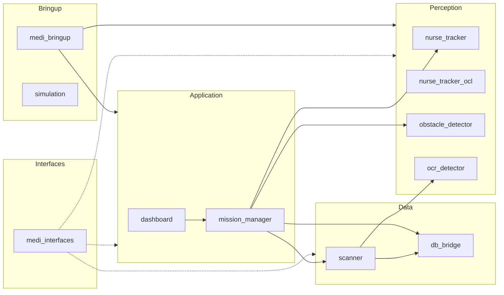
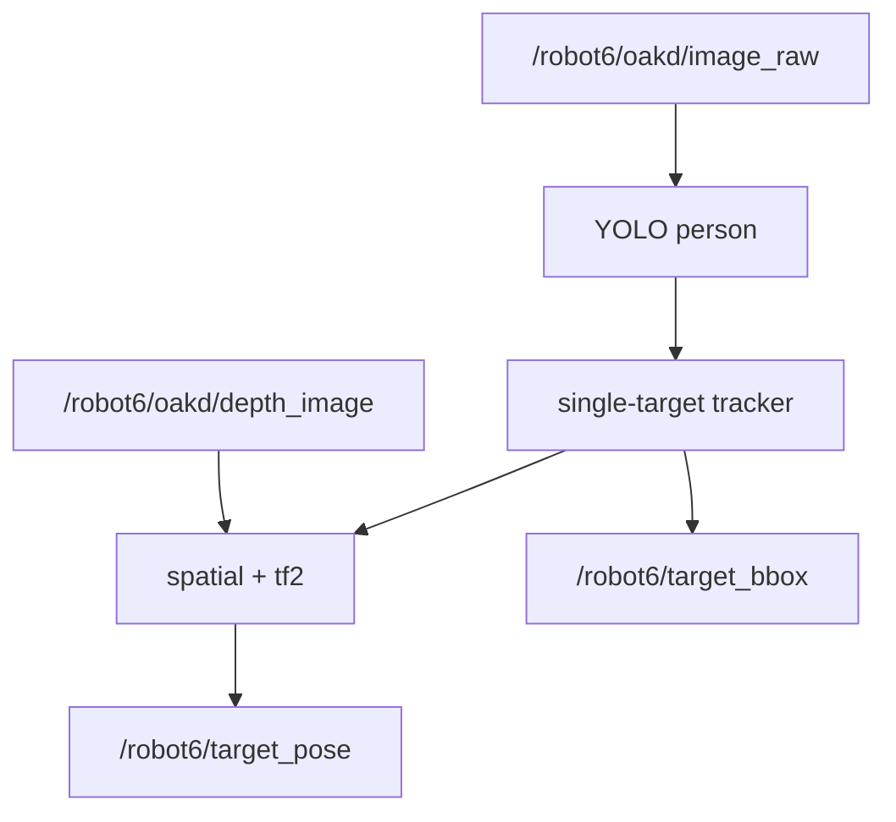
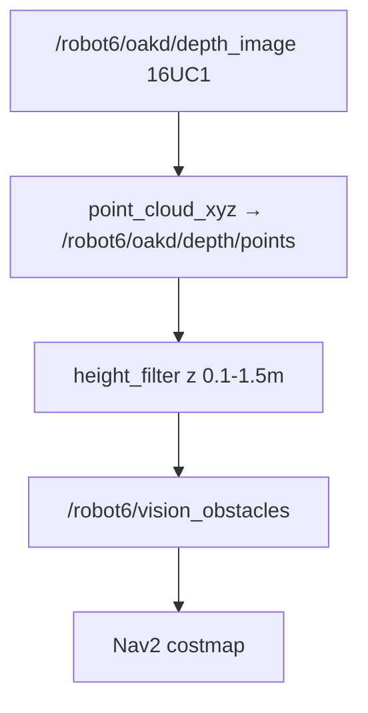

# ROS2 Packages

> Interfaces: [03_ros2_interfaces.md](03_ros2_interfaces.md)

`medicart_ws/src/` 패키지별 **역할**과 **ROS 데이터 입출력**. 디렉터리 트리·launch 예시는 구현 시 패키지 README를 따른다.

## 워크스페이스 개요

| 패키지 | Scope | 핵심 노드 |
| --- | --- | --- |
| `dashboard` | 1 | `dashboard_node`, `gui_panel` |
| `mission_manager` | 1 | `mission_manager_node`, `state_machine`, `prescription_session` |
| `nurse_tracker` | 1 | `tracker_node`, YOLO/tracking/spatial |
| `nurse_tracker_ocl` | 2 | `ocl_tracker_node` (동일 출력 I/F) |
| `obstacle_detector` | 1 | `obstacle_node`, `height_filter` |
| `ocr_detector` | 1 | `ocr_node`, `ocr_engine` |
| `scanner` | 1 | `scanner_node`, `medicine_matcher` |
| `db_bridge` | 1 | `db_node`, `firebase_client` |
| `medi_bringup` | 1 | launch + `nav2_params.yaml` |
| `medi_interfaces` | 1 | msg/srv only |
| `simulation` | — | Gazebo |

`perception.launch.py` 인자 `tracker:=nurse` \| `ocl` — downstream 토픽/서비스 이름 동일.

---

## dashboard

**역할**: 운영자가 미션을 시작·중단하고 로봇 상태를 표시한다.

| 방향 | 데이터 | 비고 |
| --- | --- | --- |
| OUT | `/robot6/start_tracking`, `/robot6/move_home`, `/robot6/scan_patient`, `/robot6/scan_medicine` | `medi_interfaces` srv; mission_manager 클라이언트 |
| OUT | `/robot6/cancel_mission` (`std_srvs/Trigger`) | |
| OUT | `/robot6/emergency_stop` (`std_msgs/Bool`) | |
| IN | `/robot6/robot_state` | UI 갱신 |
| IN | `/robot6/target_bbox` (선택) | 추적 시각화 |

---

## mission_manager

**역할**: 미션 상태기, 처방 세션, Nav2·도킹 action, perception/DB 조율.

| 방향 | 데이터 | 비고 |
| --- | --- | --- |
| IN | `/robot6/start_tracking`, `/robot6/move_home`, `/robot6/scan_patient`, `/robot6/scan_medicine`, `/robot6/cancel_mission` | dashboard |
| IN | `/robot6/target_pose`, `/robot6/emergency_stop` | |
| OUT | `/robot6/robot_state` | |
| OUT | `/robot6/navigate_to_pose`, `/robot6/undock`, `/robot6/dock` | action client |
| OUT | `/robot6/tracker/reset` | undock 후 |
| OUT | `/robot6/db/get_prescription` (내부) | scan_patient 시 |
| OUT | `/robot6/scanner/verify_medicine` (내부) | scan_medicine 시 |

**Prescription session**: `/robot6/scan_patient` 성공 시 `medicines[]` + `current_step=0`. `/robot6/scan_medicine`마다 `medicines[current_step]`과 검증 결과 비교, match 시 step++.

**Following**: `FOLLOW` 동안 `/robot6/target_pose` 수신 시 0.2–1.0s 주기로 `cancelTask` → `/robot6/navigate_to_pose`.

---

## nurse_tracker / nurse_tracker_ocl

**역할**: RGB+depth로 간호사 1명 추적 → map frame `/robot6/target_pose`·`/robot6/target_bbox` 발행.

| 방향 | 데이터 | 비고 |
| --- | --- | --- |
| IN | `/robot6/oakd/image_raw`, `/robot6/oakd/depth_image` | builtin `sensor_msgs/Image` |
| IN | `/robot6/tracker/reset` | |
| IN | `/tf` | camera→map |
| OUT | `/robot6/target_pose` | `geometry_msgs/PoseStamped` |
| OUT | `/robot6/target_bbox` | `medi_interfaces/TargetBBox` |

ROS param: `target_class=person`, `follow_distance=1.0` (m). reset 직후 1명 lock-on.

---

## obstacle_detector

**역할**: depth → 높이 필터 PointCloud2 → Nav2 costmap.

| 방향 | 데이터 | 비고 |
| --- | --- | --- |
| IN | `/robot6/oakd/depth_image`, `/robot6/oakd/camera_info` | |
| OUT | `/robot6/vision_obstacles` | `PointCloud2`; Nav2 ObstacleLayer yaml 구독 |

---

## ocr_detector

**역할**: 현재 RGB 프레임 OCR 서비스.

| 방향 | 데이터 | 비고 |
| --- | --- | --- |
| IN | `/robot6/oakd/image_raw` | |
| OUT | `/robot6/ocr/get_result` | server; `GetOcrResult` |

---

## scanner

**역할**: step_index 기준 약품 검증(OCR 텍스트 vs expected).

| 방향 | 데이터 | 비고 |
| --- | --- | --- |
| IN | `/robot6/scanner/verify_medicine` | mission_manager 호출 |
| OUT | `/robot6/ocr/get_result` | client |
| OUT | `/robot6/db/verify_medicine` | client (선택) |

---

## db_bridge

**역할**: Firestore 처방·약품 데이터.

| 방향 | 데이터 | 비고 |
| --- | --- | --- |
| IN | `/robot6/db/get_prescription`, `/robot6/db/verify_medicine` | |
| OUT | `PatientInfo`, `MedicineInfo[]` | `admin_order` 순 |

스키마: [04_db_schema.md](04_db_schema.md)

---

## medi_bringup

**역할**: localization / Nav2 / perception / rviz launch 통합, namespace `/robot6`.

| launch | 포함 |
| --- | --- |
| `localization.launch.py` | turtlebot4 localization |
| `nav2.launch.py` | Nav2 + `nav2_params.yaml` (costmap에 `/robot6/vision_obstacles`) |
| `perception.launch.py` | tracker + obstacle + ocr |
| `simulation.launch.py` | Gazebo |

일반적으로 터미널 분리: localization → nav2 → perception → (rviz).

---

## medi_interfaces

**역할**: MediCart 전용 msg/srv 타입 정의만. 노드 없음.

정의 목록·builtin과의 관계: [03_ros2_interfaces.md](03_ros2_interfaces.md)
