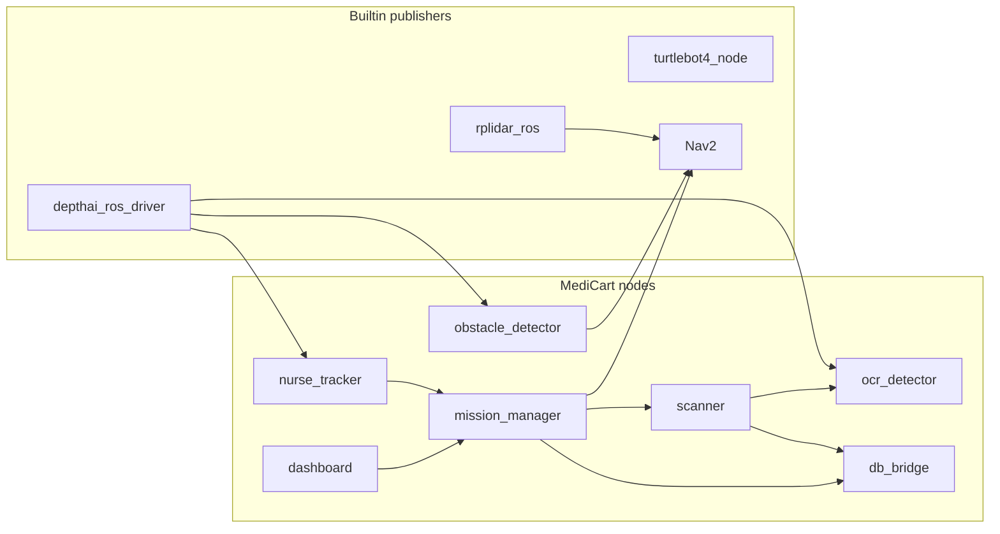

# ROS2 Interfaces

> Package roles: [02_ros2_packages.md](02_ros2_packages.md)

**Builtin(외부) 타입·토픽**이 Nav2·센서·로봇과의 경계이고, **medi_interfaces**는 MediCart 패키지 간 계약이다. 아래 표는 *어느 패키지가 무엇을 publish/serve 해야 하는지*를 한눈에 보기 위한 것이다.

## 패키지별 인터페이스 책임

| 패키지 | Publish / Serve (정의·발행) | Subscribe / Call (사용) |
| --- | --- | --- |
| `depthai_ros_driver` (Pi) | `/robot6/oakd/image_raw`, `/robot6/oakd/depth_image`, `/robot6/oakd/camera_info` | — |
| `rplidar_ros` | `/robot6/scan` | — |
| `turtlebot4_node` | `/robot6/odom`, `/tf` | `/robot6/cmd_vel` |
| Nav2 | `/robot6/cmd_vel`, `/robot6/map` | `/robot6/scan`, `/robot6/vision_obstacles`; `/robot6/navigate_to_pose` |
| Create3 | — | `/robot6/undock`, `/robot6/dock` |
| `dashboard` | `/robot6/emergency_stop` | `/robot6/robot_state`; calls `/robot6/start_tracking`, `/robot6/move_home`, `/robot6/scan_*`, `/robot6/cancel_mission` |
| `mission_manager` | `/robot6/robot_state` | `/robot6/target_pose`, `/robot6/emergency_stop`; serves dashboard srv; clients Nav2/Create3/tracker/db/scanner |
| `nurse_tracker` | `/robot6/target_pose`, `/robot6/target_bbox` | `/robot6/oakd/*`, `/robot6/tracker/reset`, `/tf` |
| `obstacle_detector` | `/robot6/vision_obstacles` | `/robot6/oakd/image_raw` (+`camera_info`); pure-vision depth, 미확정 |
| `ocr_detector` | `/robot6/ocr/get_result` | `/robot6/oakd/image_raw` |
| `scanner` | `/robot6/scanner/verify_medicine` | `/robot6/ocr/get_result`, `/robot6/db/verify_medicine` |
| `db_bridge` | `/robot6/db/get_prescription`, `/robot6/db/verify_medicine` | — |
| `medi_interfaces` | *(타입만)* msg/srv `.msg`/`.srv` | — |



---

## Builtin / External interfaces

MediCart가 정의하지 않는 타입. 구현·버전은 각 upstream 패키지 문서를 따른다.

### depthai_ros_driver (OAK-D Pro, Raspberry Pi)

| Topic | 타입 | Subscriber (MediCart) | 사용 필드 |
| --- | --- | --- | --- |
| `/robot6/oakd/image_raw` | `sensor_msgs/Image` | nurse_tracker, ocr_detector | `header`, `encoding`, `width`, `height`, `data` |
| `/robot6/oakd/depth_image` | `sensor_msgs/Image` | nurse_tracker, obstacle_detector | `encoding=16UC1`, `data` (mm) |
| `/robot6/oakd/camera_info` | `sensor_msgs/CameraInfo` | obstacle_detector | `K`, `D`, `width`, `height` |

VPU 추론 없음 — bbox/tracking_id는 호스트 `nurse_tracker`가 생성.

### rplidar_ros

| Topic | 타입 | Subscriber | 사용 필드 |
| --- | --- | --- | --- |
| `/robot6/scan` | `sensor_msgs/LaserScan` | Nav2 AMCL, costmap | `angle_*`, `range_*`, `ranges[]` |

### turtlebot4_node

| Topic | 타입 | Subscriber | 사용 필드 |
| --- | --- | --- | --- |
| `/robot6/odom` | `nav_msgs/Odometry` | Nav2 | `pose`, `twist` |
| `/tf`, `/tf_static` | `tf2_msgs/TFMessage` | nurse_tracker, Nav2 | `transforms[]` |

### Nav2

| Interface | 타입 | Client / Subscriber | 사용 필드 |
| --- | --- | --- | --- |
| `/robot6/navigate_to_pose` | `nav2_msgs/action/NavigateToPose` | mission_manager | Goal `pose`; Feedback `current_pose`, `distance_remaining` |
| `/robot6/map` | `nav_msgs/OccupancyGrid` | Nav2 내부 | `info`, `data[]` |
| `/robot6/cmd_vel` | `geometry_msgs/Twist` | TurtleBot4 | `linear.x`, `angular.z` — **Nav2가 통상 유일 발행**; emergency 시 mission_manager `Twist(0)` |

Costmap: `/robot6/scan` + `/robot6/vision_obstacles` — ObstacleLayer yaml.

### irobot_create_msgs (TurtleBot4 Create3)

| Action | 타입 | Client | Result |
| --- | --- | --- | --- |
| `/robot6/undock` | `irobot_create_msgs/action/Undock` | mission_manager | `is_docked` |
| `/robot6/dock` | `irobot_create_msgs/action/Dock` | mission_manager | `is_docked` |

### std_srvs / std_msgs (builtin, 이름만 MediCart namespace)

| Name | 타입 | Server | Client |
| --- | --- | --- | --- |
| `/robot6/cancel_mission` | `std_srvs/Trigger` | mission_manager | dashboard |
| `/robot6/tracker/reset` | `std_srvs/Trigger` | nurse_tracker | mission_manager |
| `/robot6/emergency_stop` | `std_msgs/Bool` | — (topic) | mission_manager ← dashboard |

### geometry_msgs / sensor_msgs / nav_msgs (builtin, 토픽만)

| Topic | 타입 | Publisher | Subscriber |
| --- | --- | --- | --- |
| `/robot6/target_pose` | `geometry_msgs/PoseStamped` | nurse_tracker | mission_manager |
| `/robot6/vision_obstacles` | `sensor_msgs/PointCloud2` | obstacle_detector | Nav2 costmap |

---

## medi_interfaces — 정의 위치

패키지 `medi_interfaces/` 에서만 아래 타입을 **정의**한다. 다른 패키지는 depend + import만 한다.

```
medi_interfaces/
├── msg/  RobotState, Obstacle, ObstacleArray, MedicineInfo, PatientInfo, TargetBBox
└── srv/  StartTracking, MoveHome, ScanPatient, ScanMedicine,
          GetOcrResult, GetPrescription, VerifyMedicine
```

### Topic graph (`/robot6` namespace)

| Topic | 타입 | Publisher | Subscriber |
| --- | --- | --- | --- |
| `/robot6/oakd/image_raw` | `sensor_msgs/Image` | depthai_ros_driver | nurse_tracker, ocr_detector |
| `/robot6/oakd/depth_image` | `sensor_msgs/Image` | depthai_ros_driver | nurse_tracker, obstacle_detector |
| `/robot6/oakd/camera_info` | `sensor_msgs/CameraInfo` | depthai_ros_driver | obstacle_detector |
| `/robot6/scan` | `sensor_msgs/LaserScan` | rplidar_ros | Nav2 (amcl, costmap) |
| `/robot6/odom` | `nav_msgs/Odometry` | turtlebot4_node | Nav2 |
| `/tf` | `tf2_msgs/TFMessage` | turtlebot4_node, Nav2 | 전체 |
| `/robot6/target_pose` | `geometry_msgs/PoseStamped` | nurse_tracker | mission_manager |
| `/robot6/target_bbox` | `medi_interfaces/TargetBBox` | nurse_tracker | dashboard |
| `/robot6/vision_obstacles` | `sensor_msgs/PointCloud2` | obstacle_detector | Nav2 costmap |
| `/robot6/cmd_vel` | `geometry_msgs/Twist` | Nav2 | TurtleBot4 |
| `/robot6/emergency_stop` | `std_msgs/Bool` | dashboard | mission_manager |
| `/robot6/robot_state` | `medi_interfaces/RobotState` | mission_manager | dashboard |
| `/robot6/map` | `nav_msgs/OccupancyGrid` | Nav2 (map_server) | Nav2 (amcl, costmap) |

### Service graph

| Service | 타입 | Server | Client |
| --- | --- | --- | --- |
| `/robot6/start_tracking` | `StartTracking` | mission_manager | dashboard |
| `/robot6/move_home` | `MoveHome` | mission_manager | dashboard |
| `/robot6/scan_patient` | `ScanPatient` | mission_manager | dashboard |
| `/robot6/scan_medicine` | `ScanMedicine` | mission_manager | dashboard |
| `/robot6/ocr/get_result` | `GetOcrResult` | ocr_detector | scanner |
| `/robot6/scanner/verify_medicine` | `VerifyMedicine` | scanner | mission_manager |
| `/robot6/db/get_prescription` | `GetPrescription` | db_bridge | mission_manager |
| `/robot6/db/verify_medicine` | `VerifyMedicine` | db_bridge | scanner (선택) |
| `/robot6/cancel_mission` | `std_srvs/Trigger` | mission_manager | dashboard |
| `/robot6/tracker/reset` | `std_srvs/Trigger` | nurse_tracker | mission_manager |

> **Note:** operator는 `/robot6/scan_patient` / `/robot6/scan_medicine`만 사용. `/robot6/db/get_prescription`은 mission_manager→db_bridge 내부용.

### Action graph

| Action | 타입 | Server | Client |
| --- | --- | --- | --- |
| `/robot6/navigate_to_pose` | `nav2_msgs/NavigateToPose` | Nav2 | mission_manager |
| `/robot6/undock`, `/robot6/dock` | `irobot_create_msgs` | Create3 | mission_manager |

---

## medi_interfaces — Message 정의

### TargetBBox.msg

```
std_msgs/Header header
float32[4] bbox                    # [x, y, w, h] normalized 0~1
float32 confidence
int32 tracking_id
float32 depth
geometry_msgs/Point spatial_coordinates
```

### RobotState.msg

```
std_msgs/Header header
string state          # IDLE, UNDOCK, FOLLOW, SCAN, RETURN, DOCK, ERROR
float32 battery
int32 error_code
string error_message
string detail_json
```

### Obstacle.msg / ObstacleArray.msg

```
# Obstacle.msg
std_msgs/Header header
float32[4] bbox
float32 depth
float32 confidence
string label
geometry_msgs/Point position

# ObstacleArray.msg
std_msgs/Header header
Obstacle[] obstacles
```

### MedicineInfo.msg / PatientInfo.msg

```
# MedicineInfo.msg
string medicine_id
string name
string dosage
string expiry
string manufacturer
int32 sequence_order    # admin_order, 0-based

# PatientInfo.msg
string patient_id
string name
string room
```

처방 목록은 `ScanPatient` / `GetPrescription` 응답의 `MedicineInfo[] medicines`.

---

## medi_interfaces — Service 정의

### StartTracking.srv

```yaml
# Request (empty)
---
bool success
string message
```

### ScanPatient.srv

```yaml
string patient_id
---
bool success
medi_interfaces/PatientInfo patient
medi_interfaces/MedicineInfo[] medicines
int32 total_steps
string message
```

### ScanMedicine.srv

```yaml
string patient_id
---
bool success
bool match
int32 step_index
int32 total_steps
MedicineInfo scanned_medicine
MedicineInfo expected_medicine
string message
```

### GetOcrResult.srv

```yaml
# Request empty
---
bool success
string raw_text
string cleaned_text
float32 confidence
string message
```

### GetPrescription.srv

```yaml
string patient_id
---
bool success
PatientInfo patient
MedicineInfo[] medicines
string message
```

### VerifyMedicine.srv

```yaml
string patient_id
int32 step_index
string scanned_text
---
bool success
bool match
MedicineInfo expected
MedicineInfo scanned
string message
```

### MoveHome.srv

```yaml
# Request empty
---
bool success
string message
```

---

## Builtin Actions — 필드 요약

### NavigateToPose (`/robot6/navigate_to_pose`)

```yaml
# Goal
geometry_msgs/PoseStamped pose
string behavior_tree
---
# Feedback
geometry_msgs/PoseStamped current_pose
float32 distance_remaining
builtin_interfaces/Duration navigation_time
---
# Result: (empty)
```

### Undock / Dock

```yaml
# Goal/Feedback: empty
---
bool is_docked
```
