# MediCart Architecture (Mermaid)

> 통합 브랜치(`integration` = main ↔ jaehoon) 기준. 전체 시스템 · 워크플로우 · **주 기능별 노드
> 아키텍처(주고받는 토픽/서비스/액션 명칭·타입 포함)** 를 mermaid로 정리한다. namespace 기본 `robot6`.
> 텍스트 상세는 `01_system_architecture.md`~`04_db_schema.md`, 시각본은 `diagrams/` 참고.

---

## 1. 전체 시스템 아키텍처

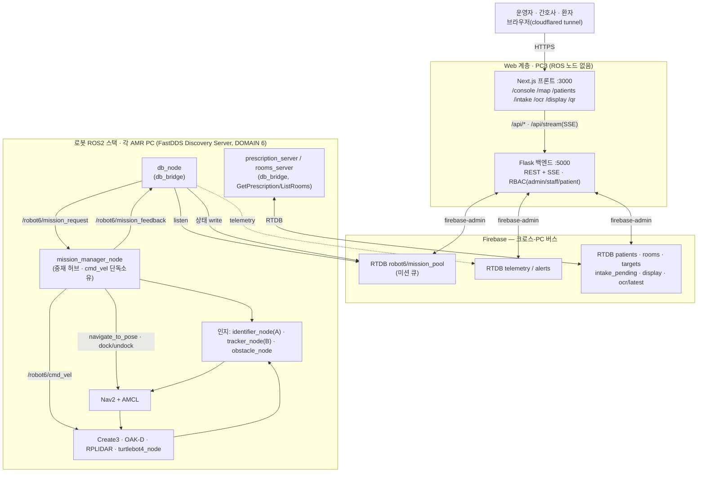

---

## 2. 워크플로우

### 2.1 미션 요청 파이프라인 (웹 → 로봇)

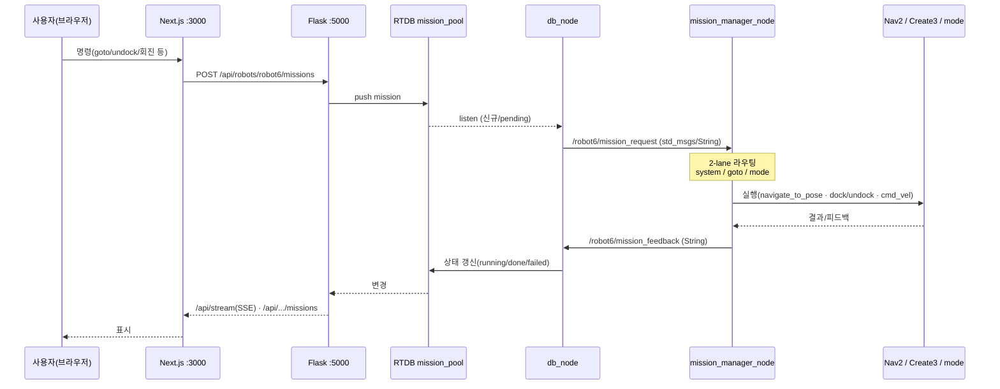

### 2.2 시나리오 A — 자율 순찰 + 문진 (patrol)

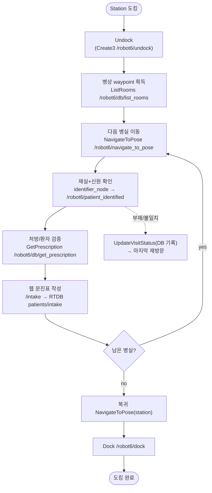

### 2.3 시나리오 B — 간호사 투약 보조 (round)

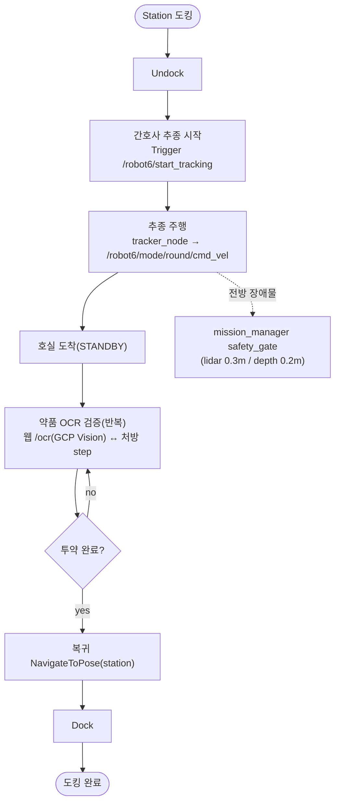

### 2.4 회진 풀스크린 모드 (웹 주도, jaehoon)

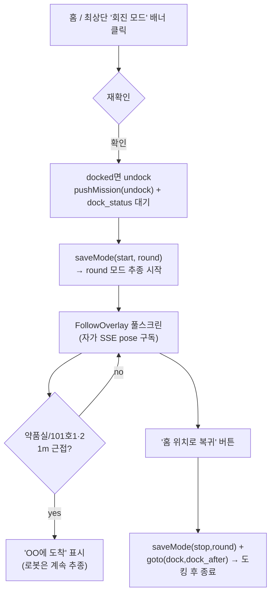

---

## 3. 주 기능별 노드 아키텍처 (토픽 · 서비스 · 액션 명칭·타입)

### 3.1 미션 중재 허브 — mission_manager_node

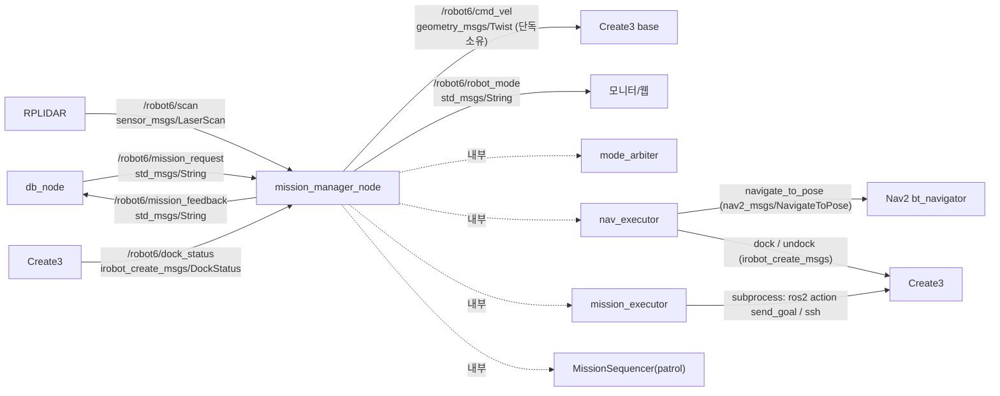

### 3.2 모드 중재 — mode_arbiter (REACTIVE 모드 계약)

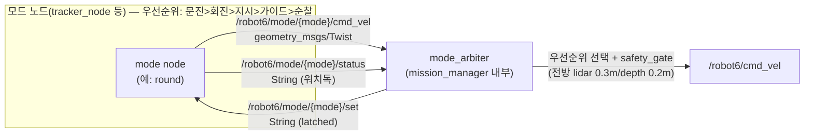

### 3.3 시나리오 A 인지 — patient_identifier + db_bridge

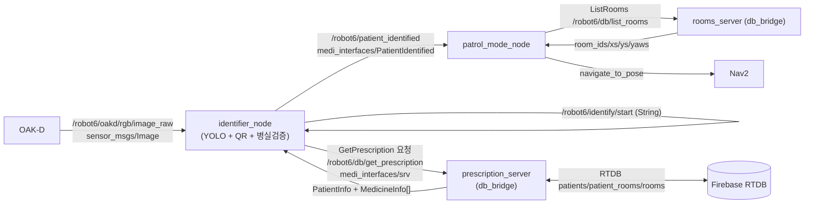

### 3.4 시나리오 B 추종 — nurse_tracker (round)

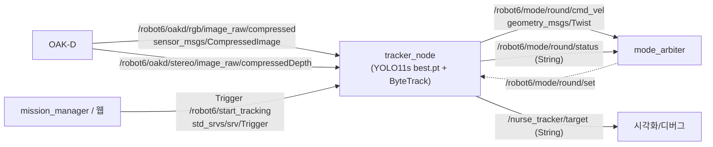

### 3.5 장애물 안전 — obstacle_detector

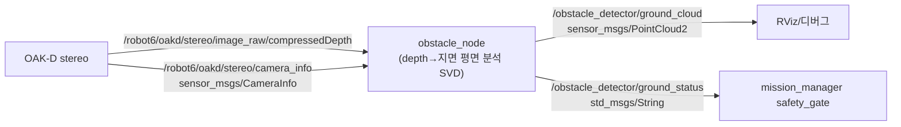

### 3.6 자율주행 · 하드웨어 (빌트인/외부)

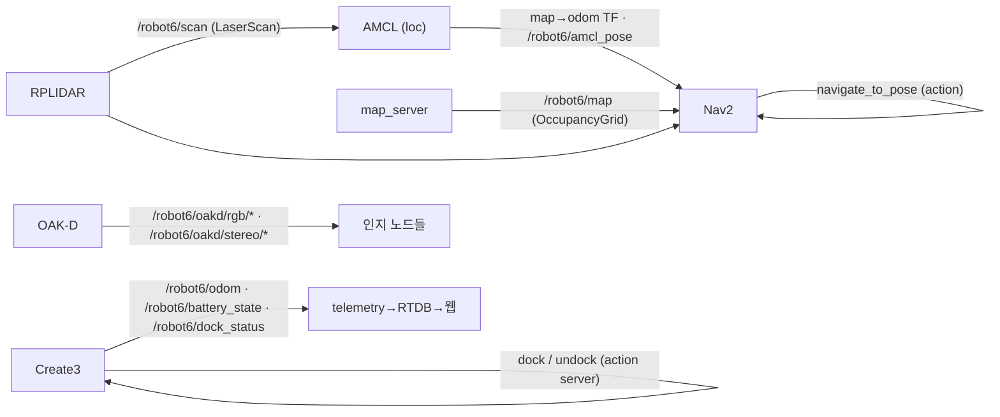

---

## 4. 인터페이스 레퍼런스 (요약 표)

### 토픽
| 토픽 | 타입 | pub → sub |
| --- | --- | --- |
| `/robot6/mission_request` | std_msgs/String | db_node → mission_manager_node |
| `/robot6/mission_feedback` | std_msgs/String | mission_manager_node → db_node |
| `/robot6/cmd_vel` | geometry_msgs/Twist | mission_manager_node(단독) → Create3 |
| `/robot6/robot_mode` | std_msgs/String | mission_manager_node → 모니터 |
| `/robot6/mode/{mode}/cmd_vel` | geometry_msgs/Twist | 모드노드 → mode_arbiter |
| `/robot6/mode/{mode}/status` | std_msgs/String | 모드노드 → mode_arbiter |
| `/robot6/mode/{mode}/set` | std_msgs/String(latched) | mode_arbiter → 모드노드 |
| `/robot6/patient_identified` | medi_interfaces/PatientIdentified | identifier_node → patrol_mode_node |
| `/nurse_tracker/target` | std_msgs/String | tracker_node → 시각화 |
| `/obstacle_detector/ground_cloud` | sensor_msgs/PointCloud2 | obstacle_node → RViz |
| `/obstacle_detector/ground_status` | std_msgs/String | obstacle_node → safety_gate |
| `/robot6/scan` | sensor_msgs/LaserScan | RPLIDAR → amcl/nav2/mission_manager |
| `/robot6/odom` · `/robot6/battery_state` · `/robot6/dock_status` | nav_msgs/Odometry · sensor_msgs/BatteryState · irobot_create_msgs/DockStatus | Create3 → 구독자 |
| `/robot6/amcl_pose` · `/robot6/map` | geometry_msgs/PoseWithCovarianceStamped · nav_msgs/OccupancyGrid | AMCL/map_server → Nav2 |
| `/robot6/oakd/rgb/*` · `/robot6/oakd/stereo/*` | sensor_msgs/Image·CompressedImage·CameraInfo | OAK-D → 인지 |

### 서비스
| 서비스 | 타입 | 서버 → 클라이언트 |
| --- | --- | --- |
| `/robot6/db/get_prescription` | medi_interfaces/GetPrescription | prescription_server → patient_validator(identifier) |
| `/robot6/db/list_rooms` | medi_interfaces/ListRooms | rooms_server → patrol_mode_node |
| `/robot6/start_tracking` | std_srvs/Trigger | tracker_node ← mission_manager/웹 |

### 액션
| 액션 | 타입 | 서버 → 클라이언트 |
| --- | --- | --- |
| `/robot6/navigate_to_pose` | nav2_msgs/NavigateToPose | Nav2 bt_navigator ← nav_executor·patrol_mode·dashboard |
| `/robot6/dock` · `/robot6/undock` | irobot_create_msgs/Dock·Undock | Create3 ← nav_executor·mission_executor·dashboard |

### Firebase RTDB 경로
| 경로 | 용도 |
| --- | --- |
| `robot6/mission_pool` | 미션 큐(웹→로봇), 상태(로봇→웹) |
| `robot6/cmd` | 모드 명령(웹 publish_mode_cmd → db_node) |
| `patients/{pid}/{info,injections,intake,visits,vitals}` | 환자 데이터·문진·생체징후·약품 |
| `rooms` · `targets` | 병실 waypoint · goto 프리셋 |
| `intake_pending` · `display/current_patient` · `ocr/latest` · `{src}/alerts` | 환자 자가문진·디스플레이·OCR·알림 |

> 빌트인(외부): `depthai_ros_driver`(OAK-D) · `rplidar_ros` · `turtlebot4_node` · `nav2_*` · `irobot_create_msgs`. 시나리오 B 일부 srv(ScanMedicine·VerifyMedicine·GetOcrResult 등)는 medi_interfaces에 **선정의·미결선**(`integration_todoList.md` 참고).
