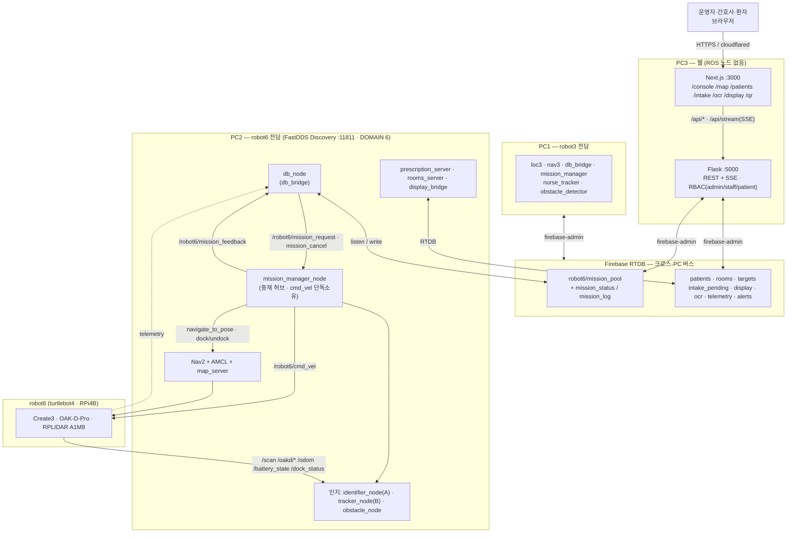

# MediCart Architecture (Mermaid · HERA급)

> 통합 브랜치(`integration` = main ↔ jaehoon) 기준. 참조 수준: HERABot System Architecture Diagram.
> namespace 기본 `robot6` — **robot3(AMR1)도 PC1에서 동일 구조로 동작**(노드·토픽 네임스페이스만 `robot3`).
> 구성: §1 마스터 오버뷰 → §2 컴퓨트·네트워크 → §3 ROS 노드 그래프 → §4 상태머신 → §5 시나리오 플로우 → §6 인터페이스 표.
> 텍스트 상세는 `01_system_architecture.md`~`04_db_schema.md`, 시각본은 `diagrams/` 참고.

---

## 1. 마스터 오버뷰 (전체 배치)

> robot3(AMR1)은 PC1에서 위 robot6 스택과 동일하게 동작하며 네임스페이스만 `robot3`.
