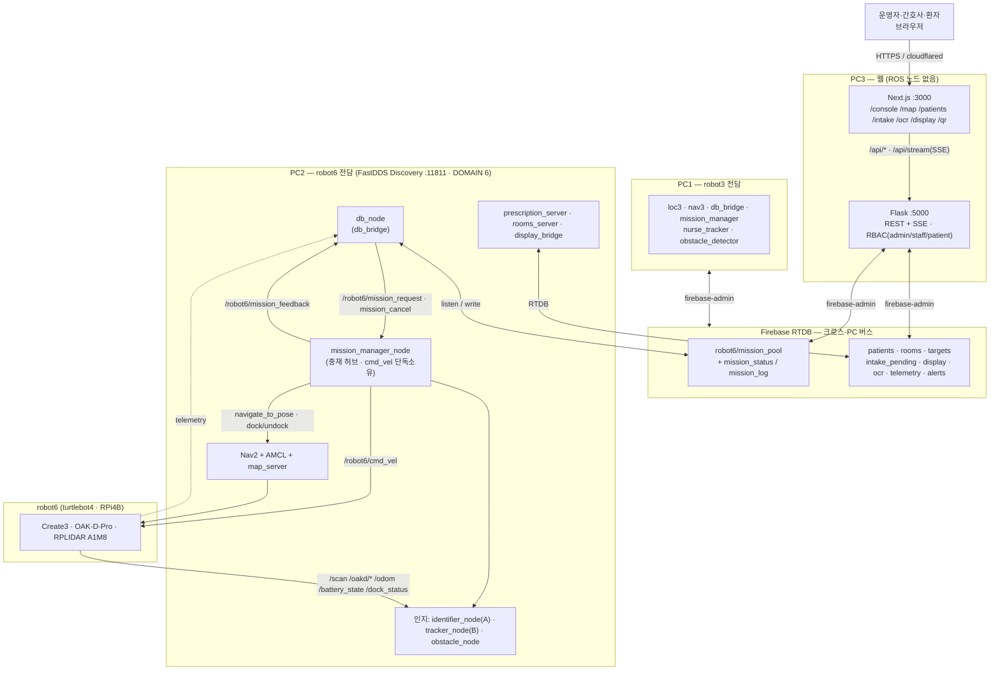
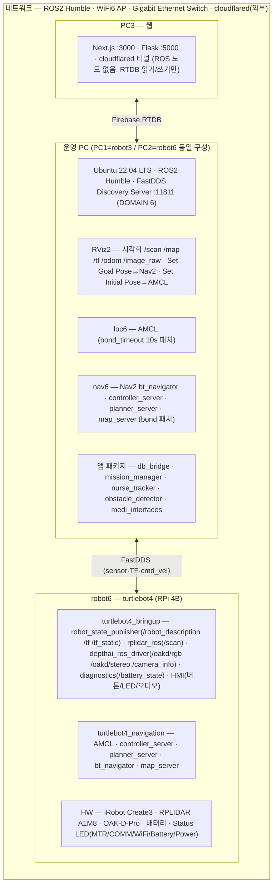
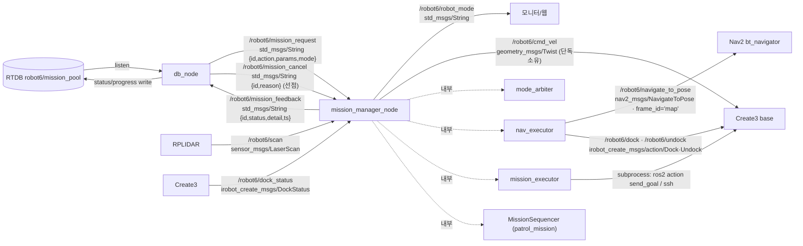
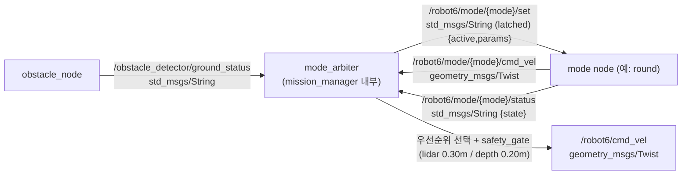
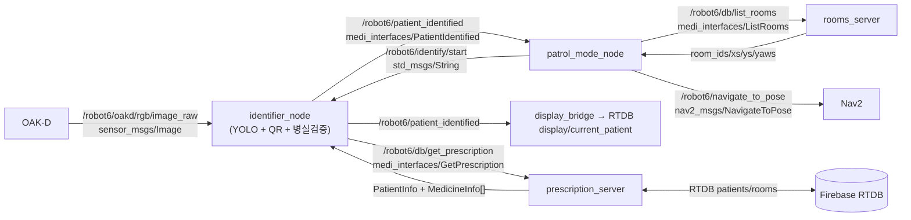
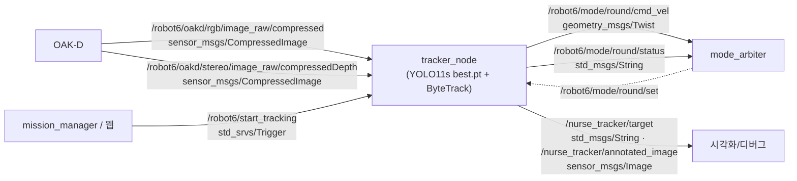
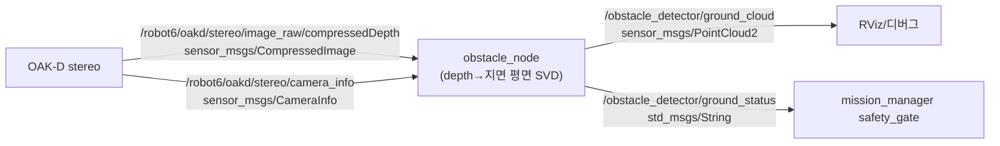
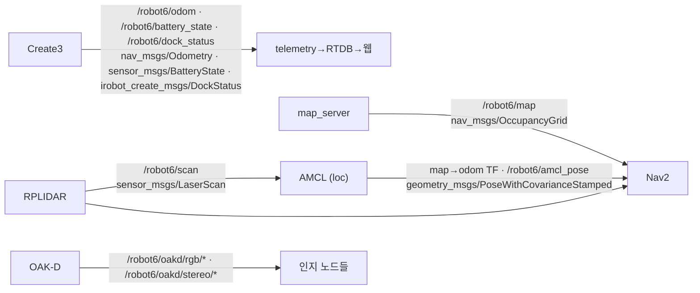
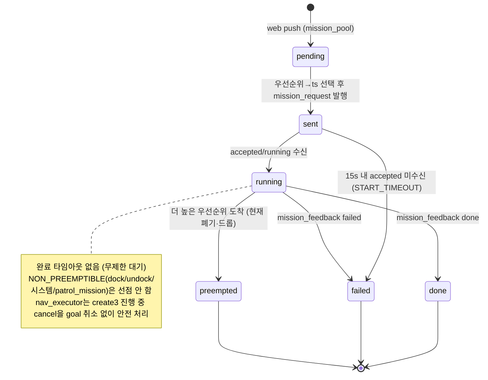
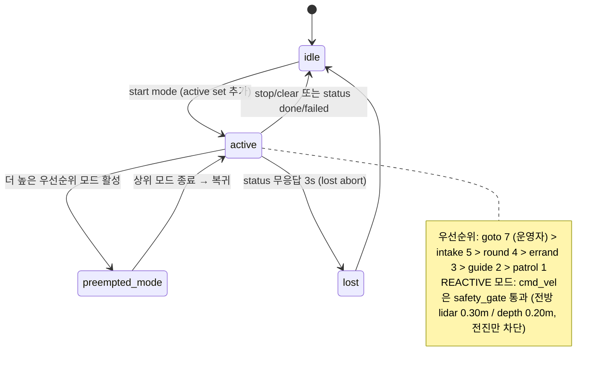

# MediCart Architecture (Mermaid · HERA급)

> 통합 브랜치(`integration` = main ↔ jaehoon) 기준. 참조 수준: HERABot System Architecture Diagram.
> namespace 기본 `robot6` — **robot3(AMR1)도 PC1에서 동일 구조로 동작**(노드·토픽 네임스페이스만 `robot3`).
> 구성: §1 마스터 오버뷰 → §2 컴퓨트·네트워크 → §3 ROS 노드 그래프 → §4 상태머신 → §5 시나리오 플로우 → §6 인터페이스 표.
> 텍스트 상세는 `01_system_architecture.md`~`04_db_schema.md`, 시각본은 `diagrams/` 참고.

---

## 1. 마스터 오버뷰 (전체 배치)

> robot3(AMR1)은 PC1에서 위 robot6 스택과 동일하게 동작하며 네임스페이스만 `robot3`.

## 2. 컴퓨트 & 네트워크 레이아웃

## 3. ROS 노드 그래프 (토픽/서비스/액션 — name + type + 값)

### 3.1 미션 오케스트레이션 — db_node ↔ mission_manager

### 3.2 모드 중재 — mode_arbiter (REACTIVE 계약)

### 3.3 시나리오 A 인지 — identifier_node + db_bridge

### 3.4 시나리오 B 추종 — nurse_tracker (round)

### 3.5 장애물 안전 — obstacle_detector

### 3.6 자율주행 · 하드웨어

## 4. 상태머신

### 4.1 미션 라이프사이클 (db_node 오케스트레이션 — 신규 동작)

### 4.2 모드 중재 — 우선순위 선점/복귀 + safety_gate

