# MediCart Architecture (Mermaid · HERA급)

> 통합 브랜치(`integration` = main ↔ jaehoon) 기준. 참조 수준: HERABot System Architecture Diagram.
> namespace 기본 `robot6` — **robot3(AMR1)도 PC1에서 동일 구조로 동작**(노드·토픽 네임스페이스만 `robot3`).
> 구성: §0 범례 → §1 마스터 오버뷰 → §2 컴퓨트·네트워크 → §3 ROS 노드 그래프 → §4 상태머신 → §5 워크플로우 → §6 인터페이스·노드 역할 표.
> 텍스트 상세는 `01_system_architecture.md`~`04_db_schema.md`, 시각본은 `diagrams/` 참고.

---

## 0. 범례 (통신 종류 · 노드 역할)

**통신 종류 = 화살표 모양**으로 구분한다.

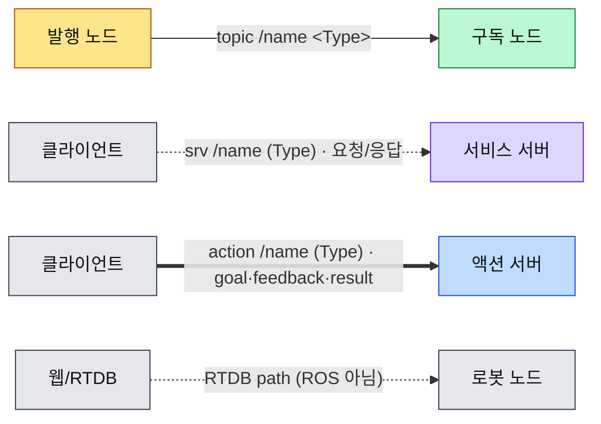

- `-->` 실선 = **topic** (publish → subscribe)
- `-.->` 점선 = **service** (client → server, 요청/응답 1회)
- `==>` 굵은선 = **action** (client → server, goal → feedback(다회) → result)
- `-.->` + `RTDB` 라벨 = Firebase RTDB 읽기/쓰기(ROS 통신 아님)

**노드 역할 = 색**: 🟨 오케스트레이터 · 🟪 서비스 서버 · 🟩 인지/모드 노드 · 🟦 자율주행(Nav2/AMCL) · ⬜ 하드웨어/드라이버.

---

## 1. 마스터 오버뷰 (전체 배치)

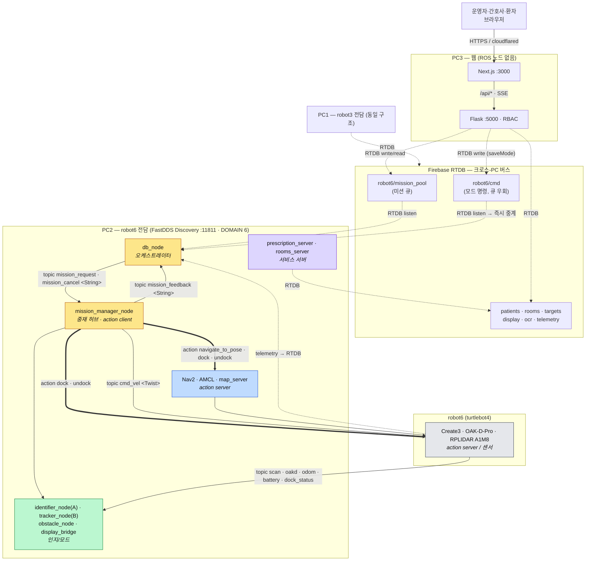

> robot3(AMR1)은 PC1에서 위 robot6 스택과 동일하게 동작하며 네임스페이스만 `robot3`.
> **모드 명령(start/stop/clear)은 `robot6/cmd`로 들어와 큐(mission_pool)를 우회**한다 — 모드는 arbiter 우선순위 선점이라 직렬 큐에 넣으면 앞선 goto/undock에 막혀 활성화가 지연된다.

---

## 2. 컴퓨트 & 네트워크 레이아웃

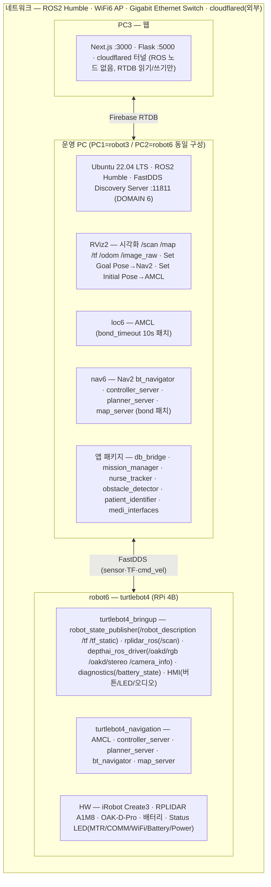

---

## 3. ROS 노드 그래프 (역할 + 통신 종류)

> 화살표: 실선 `-->` topic · 점선 `-.->` service · 굵은선 `==>` action. 색: §0 범례.

### 3.1 미션 오케스트레이션 — db_node ↔ mission_manager

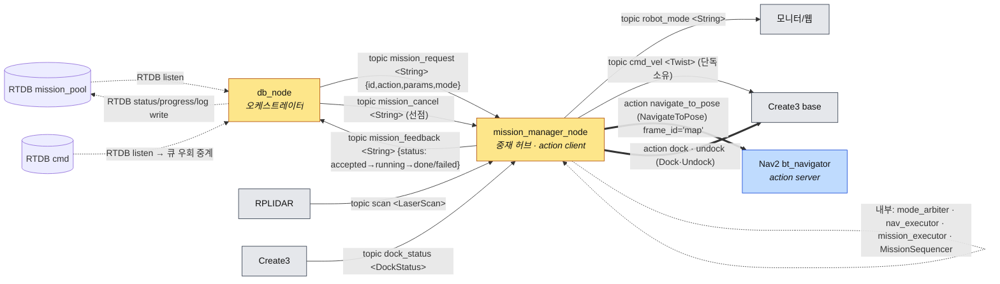

### 3.2 모드 중재 — mode_arbiter (REACTIVE 계약)

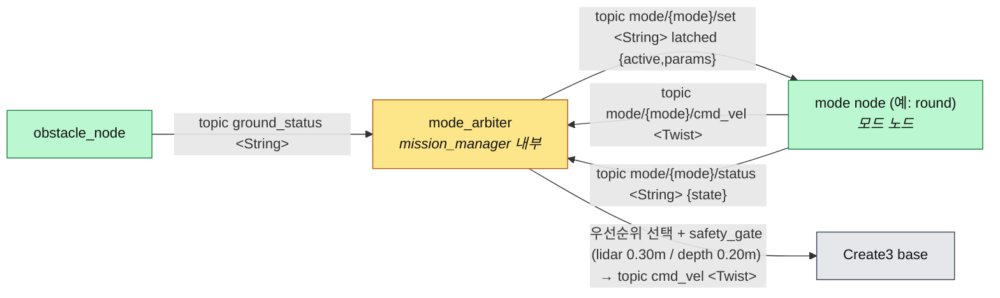

### 3.3 시나리오 A 인지 — identifier_node + db_bridge

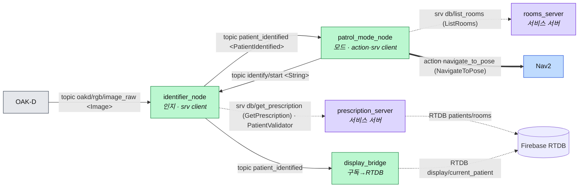

### 3.4 시나리오 B 추종 — nurse_tracker (round)

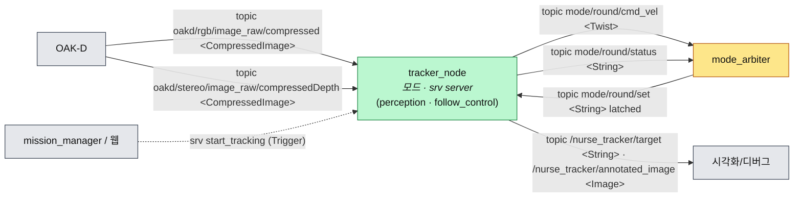

### 3.5 장애물 안전 — obstacle_detector

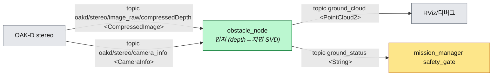

### 3.6 자율주행 · 하드웨어

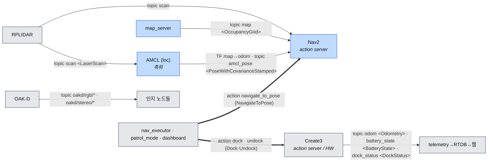

---

## 4. 상태머신

### 4.1 미션 라이프사이클 (db_node 오케스트레이션)


### 4.2 모드 중재 — 우선순위 선점/복귀 + safety_gate

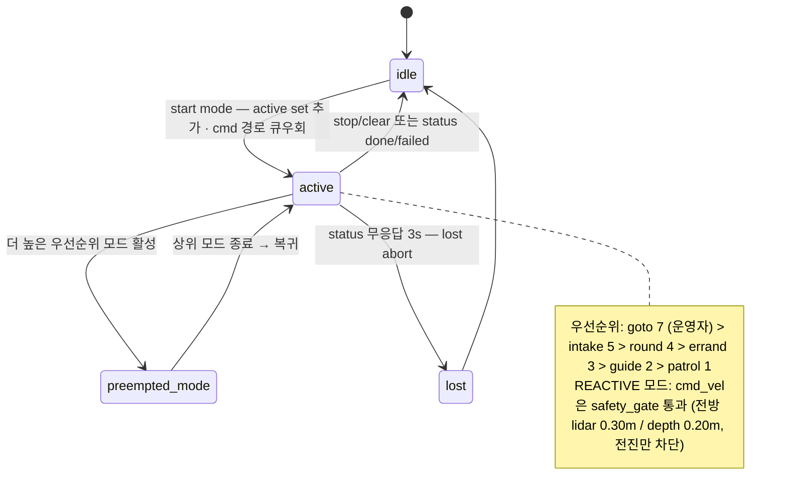

---

## 5. 워크플로우 (통신 종류 명시)

### 5.0 미션 파이프라인 시퀀스 (topic · service · action 구분)

```mermaid
sequenceDiagram
  autonumber
  participant U as 웹(브라우저)
  participant BE as Flask
  participant RT as RTDB
  participant DB as db_node
  participant MM as mission_manager
  participant N as Nav2/Create3

  U->>BE: POST 미션/모드
  BE->>RT: RTDB write (mission_pool 또는 cmd)
  RT-->>DB: RTDB listen 이벤트
  Note over DB: 미션=큐(우선순위→ts) · 모드=cmd 큐우회
  DB->>MM: topic mission_request &lt;String&gt;
  MM-->>DB: topic mission_feedback accepted
  Note over DB: 15s 시작 워치독 해제 · 완료 무제한
  MM->>N: action goal (navigate_to_pose / dock / undock)
  N-->>MM: action feedback (다회)
  N-->>MM: action result (succeeded/aborted)
  MM-->>DB: topic mission_feedback done|failed
  DB->>RT: RTDB log 아카이브 + pool 비움
  RT-->>BE: RTDB 변경 → SSE
  BE-->>U: 표시
  Note over DB,MM: 더 높은 우선순위 도착 시 DB→MM topic mission_cancel, 현재 폐기(드롭)
```

### 5.1 시나리오 A — 자율순찰 + QR신원 + 문진

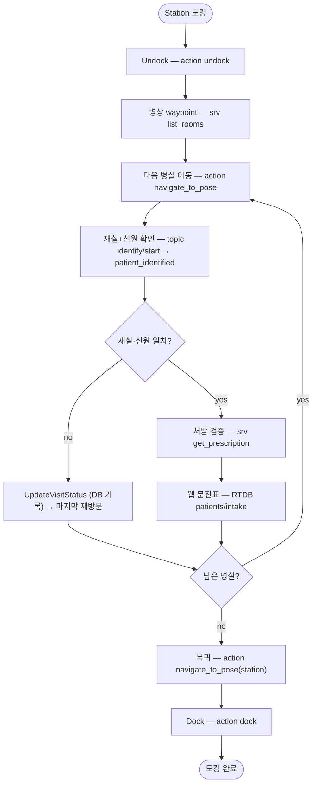

### 5.2 시나리오 B — 간호사 추종 + 약품 OCR

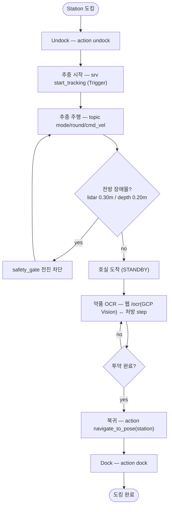

### 5.3 회진 풀스크린 모드 (웹 주도)

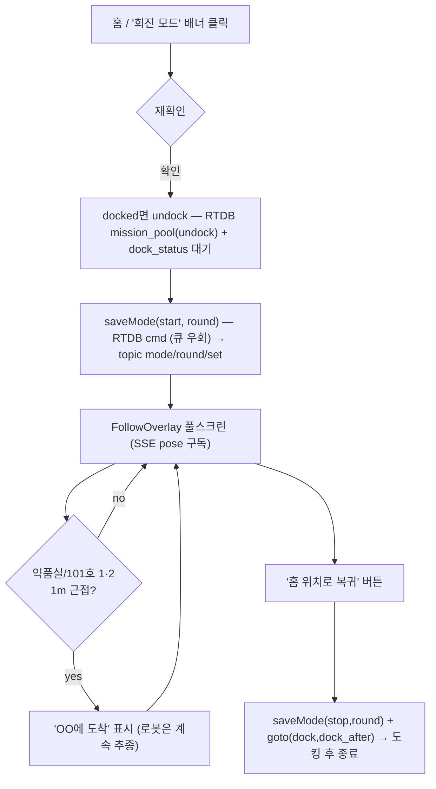

---

## 6. 인터페이스 · 노드 역할

### 6.1 노드 역할 표 (각 노드가 무슨 노드인가)

| 노드 | 패키지 | 역할 | ROS 통신 |
| --- | --- | --- | --- |
| `db_node` | db_bridge | 오케스트레이터(RTDB↔ROS) | **pub** mission_request·mission_cancel · **sub** mission_feedback · RTDB listen(mission_pool·cmd)/write(status·log) |
| `mission_manager_node` | mission_manager | 중재 허브 | **sub** mission_request·mission_cancel·scan · **pub** mission_feedback·cmd_vel·robot_mode · **action client** navigate_to_pose·dock·undock · pub mode/*/set · sub mode/*/cmd_vel·status |
| `prescription_server` | db_bridge | 서비스 서버 | **srv server** GetPrescription (RTDB read) |
| `rooms_server` | db_bridge | 서비스 서버 | **srv server** ListRooms (RTDB read) |
| `display_bridge` | db_bridge | 구독→RTDB 브리지 | **sub** patient_identified → RTDB display/current_patient |
| `identifier_node` | patient_identifier | 인지(시나리오A) | **sub** oakd/rgb/image_raw·identify/start · **pub** patient_identified · **srv client** GetPrescription(PatientValidator) |
| `patrol_mode_node` | mission_manager | 모드 노드(시나리오A) | **pub** identify/start·mode/patrol/status · **sub** patient_identified·mode/patrol/set · **action client** navigate_to_pose · **srv client** ListRooms |
| `tracker_node` | nurse_tracker | 모드 노드(시나리오B) | **sub** oakd rgb/compressed·stereo/compressedDepth·mode/round/set · **pub** mode/round/cmd_vel·status·/nurse_tracker/target·annotated_image · **srv server** start_tracking |
| `obstacle_node` | obstacle_detector | 인지(안전) | **sub** oakd stereo/compressedDepth·camera_info · **pub** ground_cloud·ground_status |
| `Nav2 bt_navigator` | nav2 | 자율주행 | **action server** navigate_to_pose |
| `AMCL` | nav2 | 측위 | **sub** scan · **pub** amcl_pose · TF(map→odom) |
| `map_server` | nav2 | 정적맵 | **pub** map |
| `Create3` | irobot_create | 베이스 HW | **action server** dock·undock · **pub** odom·battery_state·dock_status · **sub** cmd_vel |

### 6.2 토픽
| 토픽 | 타입 | pub → sub |
| --- | --- | --- |
| `/robot6/mission_request` | std_msgs/String | db_node → mission_manager_node |
| `/robot6/mission_feedback` | std_msgs/String | mission_manager_node → db_node |
| `/robot6/mission_cancel` | std_msgs/String | db_node → mission_manager_node (선점) |
| `/robot6/cmd_vel` | geometry_msgs/Twist | mission_manager_node(단독) → Create3 |
| `/robot6/robot_mode` | std_msgs/String | mission_manager_node → 모니터 |
| `/robot6/mode/{mode}/set` | std_msgs/String (latched) | mode_arbiter → 모드노드 |
| `/robot6/mode/{mode}/cmd_vel` | geometry_msgs/Twist | 모드노드 → mode_arbiter |
| `/robot6/mode/{mode}/status` | std_msgs/String | 모드노드 → mode_arbiter |
| `/robot6/identify/start` | std_msgs/String | patrol_mode_node → identifier_node |
| `/robot6/patient_identified` | medi_interfaces/PatientIdentified | identifier_node → patrol_mode_node, display_bridge |
| `/nurse_tracker/target` | std_msgs/String | tracker_node → 시각화 |
| `/nurse_tracker/annotated_image` | sensor_msgs/Image | tracker_node(perception) → 시각화 |
| `/obstacle_detector/ground_cloud` | sensor_msgs/PointCloud2 | obstacle_node → RViz |
| `/obstacle_detector/ground_status` | std_msgs/String | obstacle_node → safety_gate |
| `/robot6/scan` | sensor_msgs/LaserScan | RPLIDAR → amcl/nav2/mission_manager |
| `/robot6/odom` · `/robot6/battery_state` · `/robot6/dock_status` | nav_msgs/Odometry · sensor_msgs/BatteryState · irobot_create_msgs/DockStatus | Create3 → 구독자 |
| `/robot6/amcl_pose` · `/robot6/map` | geometry_msgs/PoseWithCovarianceStamped · nav_msgs/OccupancyGrid | AMCL/map_server → Nav2 |
| `/robot6/oakd/rgb/*` · `/robot6/oakd/stereo/*` | sensor_msgs/Image·CompressedImage·CameraInfo | OAK-D → 인지 |

### 6.3 서비스 (요청/응답)
| 서비스 | 타입 | server ← client |
| --- | --- | --- |
| `/robot6/db/get_prescription` | medi_interfaces/GetPrescription | prescription_server ← identifier_node(PatientValidator) |
| `/robot6/db/list_rooms` | medi_interfaces/ListRooms | rooms_server ← patrol_mode_node |
| `/robot6/start_tracking` | std_srvs/Trigger | tracker_node ← mission_manager/웹 |

### 6.4 액션 (goal·feedback·result)
| 액션 | 타입 | server ← client |
| --- | --- | --- |
| `/robot6/navigate_to_pose` | nav2_msgs/NavigateToPose | Nav2 bt_navigator ← nav_executor·patrol_mode·dashboard |
| `/robot6/dock` · `/robot6/undock` | irobot_create_msgs/action/Dock·Undock | Create3 ← nav_executor·mission_executor·dashboard |

### 6.5 Firebase RTDB 경로 (ROS 아님)
| 경로 | 용도 |
| --- | --- |
| `robot6/mission_pool` | 미션 큐(웹→로봇) + 상태(로봇→웹) — action·params·status·ts |
| `robot6/cmd` | **모드 명령(start/stop/clear, mode)** — db_node가 mission_request로 즉시 중계(큐 우회) |
| `robot6/mission_status` · `robot6/mission_log` | db_node 하트비트 · 종료 아카이브 |
| `patients/{pid}/{info,injections,intake,visits,vitals}` | 환자 데이터·문진·생체징후·약품 |
| `rooms` · `targets` | 병실 waypoint · goto 프리셋(ninety 좌표) |
| `intake_pending` · `display/current_patient` · `ocr/latest` · `{src}/alerts` · `telemetry` | 환자 자가문진·디스플레이·OCR·알림·텔레메트리 |

> **medi_interfaces 선정의·미결선**(integration_todoList 참고): srv `GetOcrResult·ScanMedicine·VerifyMedicine·ScanPatient·StartMedication·StartPatrol·MoveHome·UpdateVisitStatus`, msg `MedicineInfo·PatientInfo·RobotState·TargetBBox`.
> 빌트인(외부): `depthai_ros_driver`(OAK-D) · `rplidar_ros` · `turtlebot4_node` · `nav2_*` · `irobot_create_msgs`.
