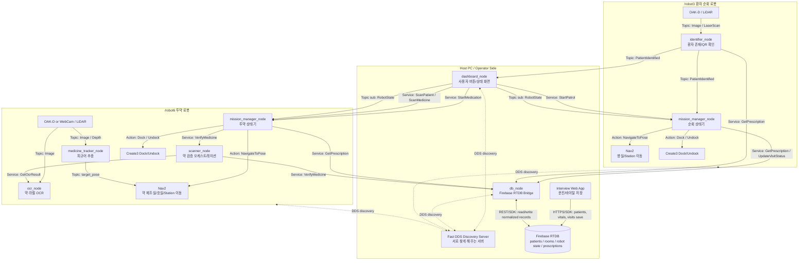
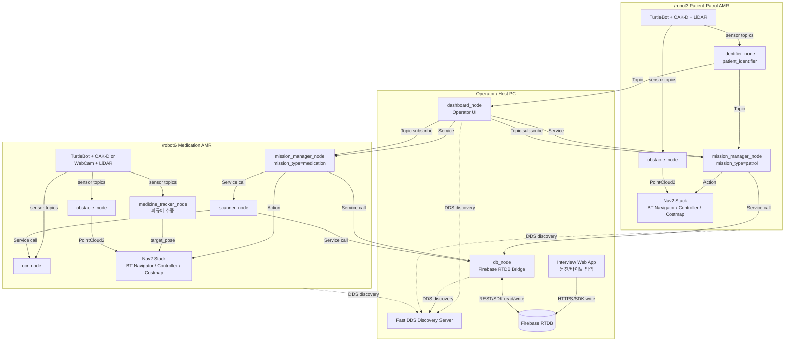
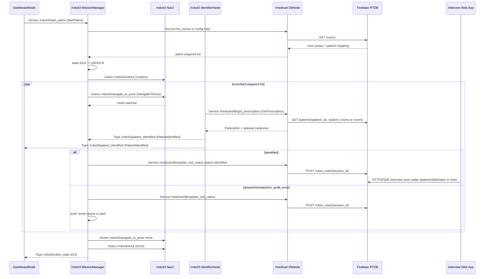
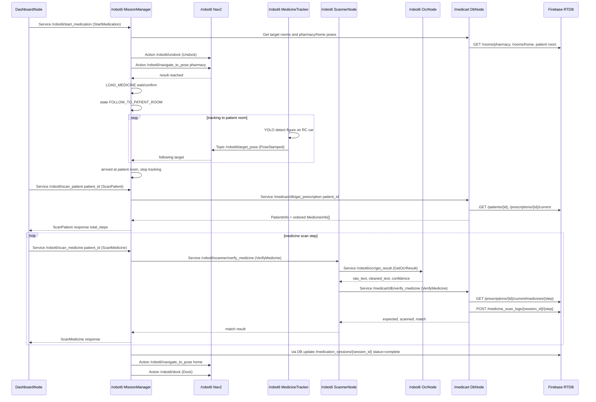
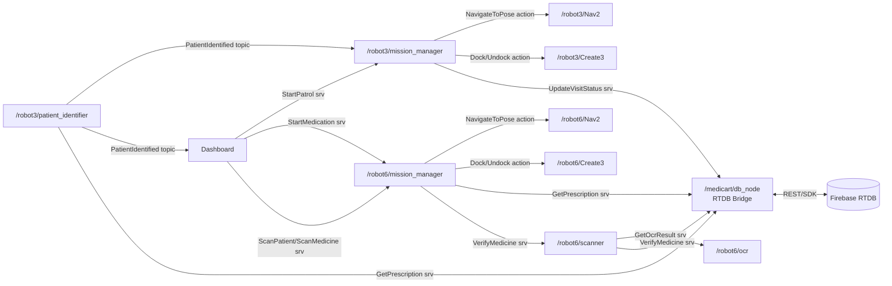

# MediCart Multi-Robot System Architecture

이 문서는 MediCart를 `/robot3` 환자 순회 AMR, `/robot6` 투약 AMR 두 대로 운영하기 위한 ROS2 시스템 아키텍처이다. 목표는 단순 업무 순서가 아니라, 어떤 노드가 어떤 런타임에서 생성되고, 어떤 ROS2 Topic / Service / Action 계약으로 통신하며, Firebase Realtime Database(RTDB)에 어떤 데이터가 저장되고 조회되는지 명확히 정의하는 것이다.

RTDB 기준 URL:

```text
https://medi-cart-ea39f-default-rtdb.asia-southeast1.firebasedatabase.app
```

이 문서의 DB 분석은 2026-06-07 기준으로 RTDB의 현재 공개 REST 구조를 확인한 결과를 반영한다. 현재 RTDB는 Firestore가 아니라 **Firebase Realtime Database**이다. 따라서 문서와 코드의 `Firestore` 표현은 모두 `RTDB` 또는 `Firebase Realtime Database`로 바뀌어야 한다.

## 0. How to Read This Document

이 문서에서 **시스템 아키텍처**는 "전체 시스템이 어떤 컴퓨터와 로봇에 나뉘어 올라가고, 각 노드가 어떤 책임을 갖는가"를 뜻한다.

이 문서에서 **인터페이스**는 "노드끼리 데이터를 주고받는 약속"이다. ROS2에서는 주로 아래 3가지 형태로 표현한다.

| Interface kind | 의미 | 예시 | 언제 쓰나 |
| --- | --- | --- | --- |
| Topic | 계속 흘러가는 데이터 방송 | `/robot3/patient_identified`, `/robot6/robot_state` | 센서값, 상태, 인식 결과처럼 계속 바뀌는 데이터 |
| Service | 요청하면 한 번 응답하는 호출 | `/robot6/scan_patient`, `/medicart/db/get_prescription` | 버튼 클릭, DB 조회, 스캔 검증처럼 결과가 필요한 작업 |
| Action | 오래 걸리는 작업을 시작하고 진행/결과를 받는 호출 | `/robot3/navigate_to_pose`, `/robot6/dock` | 자율주행, 도킹처럼 시간이 걸리고 취소/피드백이 필요한 작업 |

보는 순서는 다음이 가장 쉽다.

1. **One-Page Connected View**: 전체가 어떻게 이어지는지 한 번에 본다.
2. **Actual RTDB Contract**: 현재 DB에 무엇이 있고, 누가 무엇을 읽고 써야 하는지, 그리고 **검증 판단을 누가 하는지(`1.7`)** 본다.
3. **Implementation Reality Check**: 현재 패키지로 어디까지 되고, 무엇이 아직 비어 있는지 본다.
4. **Runtime Topology**: 어떤 노드가 어느 컴퓨터/로봇에서 떠야 하는지 본다.
5. **Node Interface Contract**: 각 노드가 어떤 Topic/Service/Action을 만들고 호출하는지 본다.
6. **Sequence Contracts**: 실제 시나리오가 시간순으로 어떻게 흘러가는지 본다.

## 0.1 One-Page Connected View

아래 그림이 이 문서의 최상위 목표 연결도이다. 단, 현재 repo에는 이 목표 연결을 모두 구현한 상태가 아니며, 구현 가능성은 `2. Implementation Reality Check`와 `9. Package/File Gaps`에서 따로 판정한다.



### How the Diagrams Connect

| 문서 위치 | 역할 | 위 전체 그림에서 보는 부분 |
| --- | --- | --- |
| `1. Actual RTDB Contract` | DB 계약 | RTDB에 어떤 경로가 있고 누가 읽고 쓰는지 |
| `2. Implementation Reality Check` | 구현 가능성 | 현재 패키지로 바로 되는지, 추가 구현이 필요한지 |
| `3. Runtime Topology` | 배치도 | Host PC, `/robot3`, `/robot6`가 어디에 있는지 |
| `4. Process and Node Construction` | 실행 구조 | 각 박스가 어떤 `console_scripts`와 `main()`에서 생성되는지 |
| `5. Node Interface Contract` | 인터페이스 명세 | 화살표 하나하나의 Topic/Service/Action 이름과 타입 |
| `6. Interface Data Model` | 데이터 형식 | 화살표로 오가는 message/srv/action 필드 |
| `8. Sequence Contracts` | 시간순 흐름 | 버튼을 누른 뒤 어떤 화살표가 어떤 순서로 실행되는지 |

## 1. Actual RTDB Contract

### 1.1 Current Root Keys

현재 RTDB 최상위에는 아래 키가 존재한다.

| RTDB path | 현재 의미 | 문서에 반영할 판단 |
| --- | --- | --- |
| `/patients` | 환자 기본정보, 문진 intake, 바이탈, 방문 기록 | 환자 식별과 문진 조회의 기본 데이터 |
| `/rooms` | 병실/장소 좌표와 일부 환자 배정 | Nav2 waypoint와 환자 병실 검증의 원천 후보 |
| `/robot3` | robot3 pose, battery, dock, scan, online, robot_mode 등 | 관제용 상태 데이터. 현재 repo에는 이를 DB에 쓰는 노드가 없음 |
| `/robot6` | robot6 pose, battery, dock, scan, mission_status, mission_log 등 | 관제용 상태/미션 데이터. 현재 repo에는 일부 ROS dashboard만 있고 RTDB write 노드는 없음 |
| `/ocr` | `latest/text`, `latest/ts` | OCR debug 또는 마지막 OCR 결과 저장소 |

중요한 차이:

- 현재 DB에는 문서의 `MedicineInfo[] medicines`로 바로 변환할 수 있는 구조화된 처방 목록이 없다.
- 현재 DB에는 일부 방의 `patient` 매핑만 있다. 환자별 `room`을 안정적으로 만들려면 `/patients/{patient_id}/room` 또는 `/patient_rooms/{patient_id}` 같은 역색인이 필요하다.
- 현재 DB에는 robot 상태가 이미 들어 있지만, 이 repo 안에는 `/robot3/*`, `/robot6/*`에 주기적으로 쓰는 RTDB writer node가 없다. 외부 bridge가 있거나 아직 구현되지 않은 상태로 봐야 한다.

### 1.2 Current `/rooms` Data Model

현재 `/rooms`는 장소 좌표를 담고 있다.

| RTDB path | Current fields | 사용 목적 |
| --- | --- | --- |
| `/rooms/101-A` | `x`, `y`, `yaw`, `patient` | 환자 침상 또는 병실 waypoint, 환자 배정 |
| `/rooms/101-B` | `x`, `y`, `yaw`, `patient` | 환자 침상 또는 병실 waypoint, 환자 배정 |
| `/rooms/102-A` | `x`, `y`, `yaw` | waypoint는 있으나 현재 patient 배정 없음 |
| `/rooms/102-B` | `x`, `y`, `yaw` | waypoint는 있으나 현재 patient 배정 없음 |
| `/rooms/home` | `x`, `y`, `yaw` | 복귀 지점 |
| `/rooms/nurse_station` | `x`, `y`, `yaw` | 간호 스테이션 |
| `/rooms/pharmacy` | `x`, `y`, `yaw` | 약 제조실/약품실 |

이 데이터로 가능한 것:

- `/robot3` 순회 미션의 waypoint list를 만들 수 있다.
- `/robot6` 투약 미션에서 `pharmacy`, 환자 병실, `home` 좌표를 가져올 수 있다.
- QR에서 읽은 `patient_id`와 현재 방문 중인 room이 맞는지 검증할 수 있다.

현재 부족한 것:

- 모든 병실에 `patient`가 있지 않다.
- `room_type`, `display_name`, `enabled`, `floor`, `map_frame`, `updated_ts` 같은 운영 메타데이터가 없다.
- ROS service로 `/rooms`를 조회하는 `GetRoomPose` 또는 `ListRooms` 인터페이스가 없다. 현재 `medi_interfaces`에는 이 service가 없으므로, room pose를 RTDB에서 쓰려면 service를 추가하거나 mission_manager가 별도 config YAML을 계속 사용해야 한다.

권장 추가 schema:

```text
/rooms/{room_id}
  display_name: string       # "101-A", "약품실"
  type: string               # bed | pharmacy | home | nurse_station
  x: number
  y: number
  yaw: number
  map_frame: string          # "map"
  patient_id: string         # 선택, 기존 patient보다 명확한 이름
  enabled: bool
  updated_ts: number
```

### 1.3 Current `/patients` Data Model

현재 `/patients/{patient_id}` 아래에는 다음 계열의 데이터가 있다.

| RTDB path | Current fields | 사용 목적 |
| --- | --- | --- |
| `/patients/{patient_id}/info` | 등록번호, 성명, 생년월일, 성별, 진료과, 주치의, 알레르기, 과거력 등 | 환자 기본정보 |
| `/patients/{patient_id}/intake` | 문진 앱이 저장한 주호소 등 | 환자 순회 후 문진 결과 |
| `/patients/{patient_id}/vitals` | 체온, 혈압, 맥박, 호흡, SpO2, 통증점수 등 | 관제/간호 알림 |
| `/patients/{patient_id}/visits` | 방문일, 바이탈, 간호 관찰사항, 보고 필요 등 | 방문 기록 |

이 데이터로 가능한 것:

- QR `patient_id`로 환자 기본정보를 조회할 수 있다.
- `PatientInfo.name`은 `/patients/{patient_id}/info/성명`에서 만들 수 있다.
- 문진 웹 앱은 `/patients/{patient_id}/intake` 또는 `/patients/{patient_id}/visits`에 저장할 수 있다.
- 통증점수, 보고 필요 등 간호 알림을 dashboard가 보여줄 수 있다.

현재 부족한 것:

- `PatientInfo.room`을 바로 만들 수 있는 필드가 환자 안에 없다. 현재는 `/rooms/*/patient`를 역검색해야 한다.
- 구조화된 처방 목록이 없다. `현재 복용약물(약명_용량_횟수)` 같은 문자열은 있으나, OCR 기반 순서 검증에는 부족하다.
- 환자별 투약 세션, 스캔 step, expected/scanned medicine log가 없다.

권장 추가 schema:

```text
/patients/{patient_id}
  room: string               # "101-A"
  active: bool

/patient_rooms/{patient_id}
  room: string               # 빠른 역조회용. /rooms와 중복되므로 db_bridge가 정합성 체크
  updated_ts: number
```

### 1.4 Required Prescription Schema

현재 문서의 `GetPrescription`, `ScanPatient`, `ScanMedicine`, `VerifyMedicine`는 `MedicineInfo[]`를 전제로 한다. 현재 RTDB에는 이 배열을 만들 수 있는 정규화된 경로가 없으므로 아래 중 하나가 추가되어야 한다.

권장안 A:

```text
/prescriptions/{patient_id}/current
  prescription_id: string
  patient_id: string
  room: string
  status: string             # active | completed | cancelled
  updated_ts: number
  medicines/{sequence_order}
    medicine_id: string
    name: string
    dosage: string
    expiry: string
    manufacturer: string
    sequence_order: number
    ocr_keywords: [string]
    barcode_or_label_id: string
```

권장안 B:

```text
/patients/{patient_id}/prescriptions/current
  medicines/{sequence_order}/...
```

이 문서에서는 **권장안 A**를 기준으로 작성한다. 이유는 투약 세션과 처방 변경 이력을 환자 기본정보와 분리할 수 있고, `db_bridge.get_prescription(patient_id)`가 `/prescriptions/{patient_id}/current`를 바로 읽을 수 있기 때문이다.

`GetPrescription` 응답 변환 규칙:

| ROS field | RTDB source |
| --- | --- |
| `PatientInfo.patient_id` | request `patient_id` |
| `PatientInfo.name` | `/patients/{patient_id}/info/성명` |
| `PatientInfo.room` | `/patients/{patient_id}/room` 또는 `/patient_rooms/{patient_id}/room` 또는 `/rooms/*/patient_id` 역검색 |
| `MedicineInfo[] medicines` | `/prescriptions/{patient_id}/current/medicines`, `sequence_order` 오름차순 |

### 1.5 Required Visit and Medication Logs

환자 순회 로봇(`/robot3`)은 환자 식별 결과를 기록해야 한다. 현재 `UpdateVisitStatus.srv`는 이미 존재하지만, DB에 쓰는 구현과 target path가 없다.

권장 schema:

```text
/robot_visits/{session_id}/{push_id}
  robot_id: string            # "robot3"
  room: string
  patient_id: string
  status: string              # identified | absent | mismatch | no_qr | db_error
  message: string
  ts: number

/patients/{patient_id}/visits/{push_id}
  source: string              # "robot3"
  room: string
  status: string
  ts: number
```

투약 로봇(`/robot6`)은 약 검증 결과를 기록해야 한다.

권장 schema:

```text
/medication_sessions/{session_id}
  robot_id: string            # "robot6"
  patient_id: string
  room: string
  status: string              # loading | delivering | scanning | complete | error
  current_step: number
  total_steps: number
  started_ts: number
  ended_ts: number

/medicine_scan_logs/{session_id}/{step_index}
  patient_id: string
  step_index: number
  expected_medicine_id: string
  expected_name: string
  scanned_text: string
  match: bool
  confidence: number
  ts: number
```

### 1.6 Read/Write Ownership

RTDB에 직접 접근하는 노드는 되도록 `db_node` 하나로 제한한다. 각 로봇 노드는 RTDB URL을 직접 알지 않고 ROS service를 통해 DB에 접근한다.

| Actor | DB write | DB read | 이유 |
| --- | --- | --- | --- |
| Interview Web App | `/patients/{patient_id}/intake`, `/patients/{patient_id}/vitals`, `/patients/{patient_id}/visits` | 환자 기본정보 일부 | 문진/간호 입력의 원천 |
| Admin/Seed Tool | `/rooms`, `/patients`, `/prescriptions` | 필요 시 전체 | 초기 데이터와 처방 등록 |
| `db_node` | `/robot_visits`, `/medication_sessions`, `/medicine_scan_logs`, 선택적으로 `/ocr/latest` | `/patients`, `/rooms`, `/prescriptions` | ROS와 RTDB 사이의 단일 bridge |
| `/robot3/mission_manager_node` | 직접 쓰지 않음. `UpdateVisitStatus` service 호출 | 직접 읽지 않음. `GetPrescription` 또는 room service 호출 | 로봇 로직이 DB 구조에 묶이지 않게 함 |
| `/robot3/identifier_node` | 직접 쓰지 않음 | `GetPrescription` service로 환자/병실 검증 | QR 식별 결과만 ROS topic으로 발행 |
| `/robot6/mission_manager_node` | 직접 쓰지 않음. scan/session service 호출 | `GetPrescription` service로 처방/병실 조회 | 투약 상태기 |
| `/robot6/scanner_node` | 직접 쓰지 않음. `VerifyMedicine` service 호출 | OCR 결과와 DB 검증 결과만 사용 | 약 검증 orchestration |
| `ocr_node` | 선택적으로 `/ocr/latest` debug write | 보통 DB read 없음 | 최신 OCR 상태 공유가 필요할 때만 |
| Robot telemetry bridge | `/robot3/*`, `/robot6/*` 상태 write | 없음 | 현재 repo에는 없음. 필요하면 별도 노드 추가 |
| `dashboard_node` | 직접 쓰지 않음 권장 | ROS topic/service 우선, 필요 시 `db_node` API | 관제 UI |

### 1.7 Validation Ownership

RTDB는 처방, 환자 방 같은 **원시 데이터(raw data)를 저장만** 한다. 어떤 값이 맞는지 틀린지를 가르는 **검증 판단(decision)은 RTDB가 아니라 ROS2 코드가 수행한다.** 즉 RTDB는 "정답지 보관함"이고, 채점은 코드가 한다.

이 시스템에는 검증이 두 종류 있고, **판단 주체와 위치가 서로 다르다.**

| 검증 종류 | 원시 데이터 (RTDB read) | 판단(채점) 주체 | 판단이 일어나는 위치 | 결과 |
| --- | --- | --- | --- | --- |
| 약 일치 (OCR ↔ 처방) | `/prescriptions/{id}/current/medicines/{step}` | `db_node` | `/medicart/db/verify_medicine` 내부 | `match: true/false` |
| 환자 방 일치 (QR ↔ 현재 방) | `/patients/{id}/room` 등 (env room) | `identifier_node`의 `PatientValidator` | ROS 노드 내부 | `identified / mismatch` |

판단을 이렇게 나눈 이유:

- **약 일치 판단은 `db_node`가 한다.** OCR로 읽은 텍스트가 기대 약과 맞는지 채점하려면 `/prescriptions`의 구조(약명, `ocr_keywords`, `sequence_order`)를 깊이 알아야 한다. 이 판단을 `db_node` 안에 두면, RTDB 스키마가 바뀌어도 로봇 코드는 바뀌지 않는다. `scanner_node`는 OCR 결과를 `db_node`에 넘겨 채점을 요청만 하고, 직접 대조하지 않는다.
- **환자 방 일치 판단은 `identifier_node`가 한다.** "지금 로봇이 어느 방에 있는가"는 RTDB가 모르는 **런타임 상황**이다. `db_node`는 환자의 등록된 방을 원시 데이터로 돌려줄 뿐이고, 그것을 현재 순회 중인 방과 비교하는 판단은 로봇 상황을 아는 `identifier_node`가 한다.

요약하면 **"원시 데이터는 RTDB에서, 판단은 ROS2 코드에서"** 이고, 그 코드가 `db_node`냐 로봇 노드냐는 *그 판단이 RTDB 스키마에 의존하는지, 로봇 런타임 상황에 의존하는지*로 갈린다.

## 2. Implementation Reality Check

현재 repo에 존재하는 패키지 기준으로 문서의 목표 구현 가능성을 판정하면 아래와 같다.

| Package | 현재 존재 | 현재 실제 구현 | 목표 구현 가능성 |
| --- | --- | --- | --- |
| `medi_interfaces` | 있음 | `StartPatrol`, `StartMedication`, `ScanPatient`, `ScanMedicine`, `GetPrescription`, `VerifyMedicine`, `UpdateVisitStatus`, `MoveHome` srv와 msg 존재 | 인터페이스 뼈대는 대부분 충분함. 다만 room pose 조회용 service는 없음 |
| `db_bridge` | 있음 | `db_node`는 시작 로그만 출력. `firebase_client.py`는 placeholder. Firestore라고 잘못 표기 | RTDB client, service server, package dependency 추가 필요 |
| `dashboard` | 있음 | `/robot6` Nav2, dock/undock, camera web UI, `/robot6/start_patrol` client 일부 구현 | robot3/robot6 양쪽 명령, medication scan UI, RTDB rooms 반영은 추가 구현 필요 |
| `mission_manager` | 있음 | 상태기와 `/robot6/start_patrol` service server만 있음. Nav2/action/DB/scan client 없음 | 목표 상태기는 구현 가능하지만 현재 end-to-end 불가 |
| `patient_identifier` | 있음 | YOLO/QR/DB validation flow가 비교적 구체적. 단 `/robot6/...`와 `/robot6/db/get_prescription` 하드코딩 | `/robot3` 순회에 쓰려면 namespace/service remap 수정 필요 |
| `scanner` | 있음 | `scanner_node` 시작 로그만 출력. `MedicineMatcher` 일부만 있음 | OCR service client, DB verify client, service server 구현 필요 |
| `ocr_detector` | 있음 | `ocr_node` 시작 로그만 출력. `OcrEngine` placeholder | 카메라 subscribe, OCR engine, `GetOcrResult` server 구현 필요 |
| `obstacle_detector` | 있음 | placeholder에 가까움 | costmap 연동하려면 PointCloud2 변환 구현 필요 |
| `nurse_tracker` | 있음 | placeholder에 가까움 | **현재 범위 포함.** `medicine_tracker`로 개명 권장. 약 제조실→환자 호실 피규어 추종 구현 필요 |
| `simulation` | 있음 | 별도 확인 필요 | 테스트/시뮬레이션 용도 |

핵심 결론:

- **현재 존재하는 패키지 이름만으로는 문서의 전체 구현이 바로 가능하지 않다.**
- 다만 필요한 주요 패키지와 ROS interface 파일은 대부분 이미 있다.
- 가장 큰 빈 곳은 `db_bridge`, `mission_manager`, `scanner`, `ocr_detector`의 실제 service/action 로직이다.
- DB에는 환자/방/로봇 상태 일부는 있지만, 투약 검증에 필요한 구조화된 처방 데이터가 없다.

### 2.1 Existing Interface Corrections

기존 문서에는 `StartMedication.srv`와 `UpdateVisitStatus.srv`가 없다고 적힌 부분이 있었지만, 현재 repo 기준으로는 둘 다 이미 존재한다.

정확한 상태:

| Interface | 현재 파일 존재 | 현재 server 구현 |
| --- | --- | --- |
| `StartMedication.srv` | 있음 | 없음 |
| `UpdateVisitStatus.srv` | 있음 | 없음 |
| `GetPrescription.srv` | 있음 | 없음 |
| `VerifyMedicine.srv` | 있음 | 없음 |
| `ScanPatient.srv` | 있음 | 없음 |
| `ScanMedicine.srv` | 있음 | 없음 |
| `GetOcrResult.srv` | 있음 | 없음 |

따라서 문서에는 "srv가 missing"이 아니라 **"srv는 있으나 server/client wiring과 실제 로직이 missing"**이라고 써야 한다.

### 2.2 Hardcoded Namespace Problems

현재 코드에는 `/robot6/...` 하드코딩이 많다.

| File | Current hardcoding | 문제 |
| --- | --- | --- |
| `mission_manager/mission_manager_node.py` | `START_PATROL_SERVICE = '/robot6/start_patrol'` | `/robot3` 순회 mission_manager로 바로 못 씀 |
| `patient_identifier/identifier_node.py` | `/robot6/oakd/image_raw`, `/robot6/oakd/depth_image`, `/robot6/patient_identified` | 문서의 `/robot3` 환자 순회와 불일치 |
| `patient_identifier/patient_validator.py` | `/robot6/db/get_prescription` | 문서의 공용 `/medicart/db/get_prescription`와 불일치 |
| `dashboard/dashboard_node.py` | `/robot6/start_patrol`, `/robot6/patient_identified` | robot3/robot6 분리 UI에 추가 수정 필요 |

권장 방향:

| 방식 | 예시 | 권장 |
| --- | --- | --- |
| ROS namespace remapping | Node namespace를 `/robot3`로 띄우고 topic은 `oakd/image_raw`처럼 상대 이름 사용 | 가장 권장 |
| parameterized absolute name | `robot_namespace=/robot3`, topic = `f'{robot_namespace}/oakd/image_raw'` | 가능 |

현업 관점에서는 launch에서 namespace를 주입하고 코드에서는 상대 이름을 쓰는 방식이 유지보수에 유리하다.

## 3. Runtime Topology



### Architecture Decisions

| 항목 | 결정 |
| --- | --- |
| Robot namespace | 환자 순회는 `/robot3`, 투약은 `/robot6` |
| DDS discovery | 두 로봇과 운영 PC는 Fast DDS Discovery Server에 붙는다 |
| DB kind | Firebase Firestore가 아니라 Firebase Realtime Database |
| DB bridge | 로봇별 중복 노드보다 운영 PC의 공용 `/medicart/db_node` 권장 |
| RTDB direct access | mission_manager/scanner/identifier는 직접 RTDB를 읽지 않고 `db_node` service를 호출 |
| Medication 이동 방식 | 약 제조실까지는 Nav2 자율주행. **약 제조실에서 환자 호실까지는 tracking(피규어 추종)** 으로 이동한다. RC카에 인형 피규어를 장착해 조종하면, robot6이 YOLO로 피규어를 사람으로 감지하고 일정 거리를 유지하며 추종한다 |
| Medication delivery following | **현재 범위 포함.** YOLO 기반 target 추종. `/robot6/medicine_tracker`(구 `nurse_tracker`)가 `/robot6/target_pose`를 발행하고 Nav2가 추종한다 |
| Command source | Dashboard가 operator-facing service를 호출하고, Nav2 action은 mission_manager만 호출 |
| High-rate sensor data | ROS topic이 원천. RTDB에는 관제용 요약 상태만 저장 권장 |

## 4. Process and Node Construction

ROS2 Python 패키지는 `setup.py`의 `console_scripts` entry point가 실행되고, 각 entry point의 `main()` 함수가 `rclpy.init()` 후 Node class를 생성한다.

| Runtime | Console script | Entry point | Created node class | ROS node name | Target namespace | Current implementation status |
| --- | --- | --- | --- | --- | --- | --- |
| Host PC | `dashboard_node` | `dashboard.dashboard_node:main` | `DashboardNode` | `dashboard_node` | root 또는 `/medicart` | robot6 Nav2/dock/camera UI 중심. multi-robot command 추가 필요 |
| Host PC | `db_node` | `db_bridge.db_node:main` | `DbNode` | `db_node` | `/medicart` 권장 | 시작 로그만 있음. RTDB service server 미구현 |
| `/robot3` | `mission_manager_node` | `mission_manager.mission_manager_node:main` | `MissionManagerNode` | `mission_manager_node` | `/robot3` | 현재 `/robot6/start_patrol` 하드코딩이라 수정 필요 |
| `/robot3` | `identifier_node` | `patient_identifier.identifier_node:main` | `IdentifierNode` | `patient_identifier_node` | `/robot3` | 현재 `/robot6` topic 하드코딩이라 수정 필요 |
| `/robot3` | `obstacle_node` | `obstacle_detector.obstacle_node:main` | `ObstacleNode` | `obstacle_node` | `/robot3` | placeholder 수준 |
| `/robot6` | `mission_manager_node` | `mission_manager.mission_manager_node:main` | `MissionManagerNode` | `mission_manager_node` | `/robot6` | medication service/action 로직 미구현 |
| `/robot6` | `ocr_node` | `ocr_detector.ocr_node:main` | `OcrNode` | `ocr_node` | `/robot6` | placeholder 수준 |
| `/robot6` | `scanner_node` | `scanner.scanner_node:main` | `ScannerNode` | `scanner_node` | `/robot6` | placeholder 수준 |
| `/robot6` | `medicine_tracker_node` | `medicine_tracker.tracker_node:main` | `MedicineTrackerNode` | `medicine_tracker_node` | `/robot6` | 구 `nurse_tracker`. 피규어 추종 구현 필요 |
| `/robot6` | `obstacle_node` | `obstacle_detector.obstacle_node:main` | `ObstacleNode` | `obstacle_node` | `/robot6` | placeholder 수준 |

## 5. Node Interface Contract

이 장은 목표 인터페이스 계약이다. `Current status` 열에서 현재 구현 여부를 함께 적는다.

### 5.1 DashboardNode

`DashboardNode.__init__()`에서 operator command client와 status subscription을 생성한다.

| Interface | ROS type | Direction | Target | Purpose | Current status |
| --- | --- | --- | --- | --- | --- |
| `/robot3/start_patrol` | `medi_interfaces/srv/StartPatrol` | Service client | `/robot3/mission_manager_node` | 환자 순회 시작 | 미구현 |
| `/robot6/start_medication` | `medi_interfaces/srv/StartMedication` | Service client | `/robot6/mission_manager_node` | 투약 미션 시작 | 미구현 |
| `/robot6/scan_patient` | `medi_interfaces/srv/ScanPatient` | Service client | `/robot6/mission_manager_node` | 선택 환자 처방 로드 | 미구현 |
| `/robot6/scan_medicine` | `medi_interfaces/srv/ScanMedicine` | Service client | `/robot6/mission_manager_node` | 약 스캔 검증 | 미구현 |
| `/robot3/move_home` | `medi_interfaces/srv/MoveHome` | Service client | `/robot3/mission_manager_node` | 순회 로봇 복귀 | 미구현 |
| `/robot6/move_home` | `medi_interfaces/srv/MoveHome` | Service client | `/robot6/mission_manager_node` | 투약 로봇 복귀 | 미구현 |
| `/robot3/emergency_stop` | `std_msgs/msg/Bool` | Topic pub | `/robot3/mission_manager_node` | 비상 정지 | 미구현 |
| `/robot6/emergency_stop` | `std_msgs/msg/Bool` | Topic pub | `/robot6/mission_manager_node` | 비상 정지 | 미구현 |
| `/robot3/robot_state` | `medi_interfaces/msg/RobotState` | Topic sub | `/robot3/mission_manager_node` | 상태 표시 | 미구현 |
| `/robot6/robot_state` | `medi_interfaces/msg/RobotState` | Topic sub | `/robot6/mission_manager_node` | 상태 표시 | 미구현 |
| `/robot3/patient_identified` | `medi_interfaces/msg/PatientIdentified` | Topic sub | `/robot3/identifier_node` | 순회 결과 표시 | 미구현 |
| `/robot6/navigate_to_pose` | `nav2_msgs/action/NavigateToPose` | Action client | `/robot6` Nav2 | 현재 dashboard 직접 이동 UI | 구현됨 |
| `/robot6/dock`, `/robot6/undock` | `irobot_create_msgs/action/*` | Action client | `/robot6` Create3 | 현재 dashboard 직접 dock UI | 구현됨 |

현재 dashboard는 `/robot6` 직접 제어 기능이 가장 많이 구현되어 있다. 목표 아키텍처에서는 dashboard가 직접 Nav2를 호출하기보다 mission_manager가 Nav2 action을 호출하는 쪽이 더 일관적이다.

### 5.2 DbNode

`DbNode`는 RTDB URL을 parameter 또는 환경변수로 받고, ROS service server를 제공한다.

권장 parameter:

```text
database_url = https://medi-cart-ea39f-default-rtdb.asia-southeast1.firebasedatabase.app
namespace = /medicart
```

| Interface | ROS type | Direction | RTDB read/write | Purpose | Current status |
| --- | --- | --- | --- | --- | --- |
| `/medicart/db/get_prescription` | `GetPrescription` | Service server | read `/patients`, `/patient_rooms` or `/rooms`, `/prescriptions` | 환자 정보와 처방 목록 조회 | 미구현 |
| `/medicart/db/verify_medicine` | `VerifyMedicine` | Service server | read `/prescriptions`, write `/medicine_scan_logs` optional | OCR text와 현재 step 처방 대조 | 미구현 |
| `/medicart/db/update_visit_status` | `UpdateVisitStatus` | Service server | write `/robot_visits`, `/patients/{patient_id}/visits` | 순회 결과 기록 | 미구현 |
| `/medicart/db/list_rooms` | new service 필요 | Service server | read `/rooms` | RTDB room waypoint 목록 제공 | interface 없음 |
| `/medicart/db/get_room_pose` | new service 필요 | Service server | read `/rooms/{room_id}` | 특정 waypoint 조회 | interface 없음 |

현재 `db_bridge`는 `Firestore`라고 적혀 있지만 실제 URL은 RTDB다. 구현 시 `firebase_client.py`, `db_node.py`, `setup.py`, `package.xml`, `README.md` 설명을 모두 RTDB 기준으로 바꿔야 한다.

### 5.3 MissionManagerNode for `/robot3`

`MissionManagerNode.__init__()`에서 patrol 상태기, dashboard service server, Nav2/Create3 action client, DB client를 생성한다.

| Interface | ROS type | Direction | Peer | Purpose | Current status |
| --- | --- | --- | --- | --- | --- |
| `/robot3/start_patrol` | `StartPatrol` | Service server | Dashboard | 미션 시작 | 미구현. 현재 `/robot6/start_patrol`만 있음 |
| `/robot3/move_home` | `MoveHome` | Service server | Dashboard | station 복귀 요청 | 미구현 |
| `/robot3/cancel_mission` | `std_srvs/srv/Trigger` | Service server | Dashboard | 미션 취소 | 미구현 |
| `/robot3/emergency_stop` | `std_msgs/msg/Bool` | Topic sub | Dashboard | 즉시 정지 | 미구현 |
| `/robot3/patient_identified` | `PatientIdentified` | Topic sub | IdentifierNode | 환자 확인 결과 수신 | 미구현 |
| `/robot3/robot_state` | `RobotState` | Topic pub | Dashboard | 상태 발행 | 미구현 |
| `/robot3/navigate_to_pose` | `nav2_msgs/action/NavigateToPose` | Action client | Nav2 | 병실/스테이션 이동 | 미구현 |
| `/robot3/undock` | `irobot_create_msgs/action/Undock` | Action client | Create3 | 도킹 해제 | 미구현 |
| `/robot3/dock` | `irobot_create_msgs/action/Dock` | Action client | Create3 | 도킹 | 미구현 |
| `/medicart/db/get_prescription` | `GetPrescription` | Service client | DbNode | QR 환자 병실 검증 | 미구현 |
| `/medicart/db/update_visit_status` | `UpdateVisitStatus` | Service client | DbNode | 부재/불일치/확인 상태 기록 | 미구현 |

State transition:

```text
IDLE -> UNDOCK -> PATROL -> IDENTIFY -> INTERVIEW -> NEXT_ROOM
NEXT_ROOM -> PATROL      # 다음 환자
NEXT_ROOM -> RETURN      # 모든 환자 완료
RETURN -> DOCK -> IDLE
```

DB usage:

- 순회 시작 시 `/rooms`에서 `type=bed`이고 `enabled=true`인 waypoint를 가져온다. 현재 service가 없으므로 `ListRooms` 추가 또는 YAML waypoint 사용이 필요하다.
- 각 room 도착 후 `identifier_node`의 `PatientIdentified`를 기다린다.
- `identified`, `absent`, `mismatch`, `no_qr`, `db_error` 결과를 `/medicart/db/update_visit_status`로 기록한다.

### 5.4 IdentifierNode for `/robot3`

`IdentifierNode.__init__()`에서 sensor subscription, result publisher, DB validation client를 생성한다.

| Interface | ROS type | Direction | Peer | Purpose | Current status |
| --- | --- | --- | --- | --- | --- |
| `/robot3/oakd/image_raw` | `sensor_msgs/msg/Image` | Topic sub | OAK-D driver | RGB frame | 현재 `/robot6/oakd/image_raw`로 하드코딩 |
| `/robot3/oakd/depth_image` | `sensor_msgs/msg/Image` | Topic sub | OAK-D driver | depth frame | 현재 `/robot6/oakd/depth_image`로 하드코딩 |
| `/robot3/patient_identified` | `PatientIdentified` | Topic pub | MissionManager, Dashboard | 식별 결과 | 현재 `/robot6/patient_identified`로 하드코딩 |
| `/medicart/db/get_prescription` | `GetPrescription` | Service client | DbNode | QR 환자와 병실 검증 | 현재 `/robot6/db/get_prescription`로 하드코딩 |

Pipeline:

```text
_on_image()
  -> cache latest RGB frame

_run_pipeline()
  -> PersonDetector.detect(frame)
  -> QrScanner.scan(frame_provider)
  -> PatientValidator.validate(patient_id, current_room)
  -> _publish(PatientIdentified)
```

DB validation detail (판단 주체는 `1.7 Validation Ownership` 참고):

1. **`identifier_node`(QrScanner)**가 QR payload에서 `patient_id`와 `room`을 읽는다.
2. **`identifier_node`(PatientValidator)**가 `/medicart/db/get_prescription`을 호출한다.
3. **`db_node`**는 `/patients/{patient_id}/info/성명`과 환자 room을 RTDB에서 **조회만** 한다 (원시 데이터 반환, 판단 없음).
4. room 조회 시 `db_node`는 우선순위를 둔다.
   - 1순위: `/patients/{patient_id}/room`
   - 2순위: `/patient_rooms/{patient_id}/room`
   - 3순위: `/rooms/*/patient_id` 또는 기존 `/rooms/*/patient` 역검색
5. **`identifier_node`(PatientValidator)**가 현재 방문 중인 room과 `db_node`가 돌려준 DB room을 **비교·판단**한다. 같으면 `identified`, 다르면 `mismatch`를 발행한다. (이 비교가 ROS 노드에서 일어나는 이유는 "현재 방"이 RTDB가 모르는 런타임 정보이기 때문 — `1.7` 참고)

### 5.5 MissionManagerNode for `/robot6`

`MissionManagerNode.__init__()`에서 medication 상태기, dashboard service server, Nav2/Create3 action client, scanner/DB client를 생성한다.

| Interface | ROS type | Direction | Peer | Purpose | Current status |
| --- | --- | --- | --- | --- | --- |
| `/robot6/start_medication` | `StartMedication` | Service server | Dashboard | 투약 미션 시작 | srv 있음, server 없음 |
| `/robot6/scan_patient` | `ScanPatient` | Service server | Dashboard | 선택 환자 처방 세션 시작 | srv 있음, server 없음 |
| `/robot6/scan_medicine` | `ScanMedicine` | Service server | Dashboard | 현재 step 약 검증 | srv 있음, server 없음 |
| `/robot6/move_home` | `MoveHome` | Service server | Dashboard | station 복귀 요청 | srv 있음, server 없음 |
| `/robot6/cancel_mission` | `std_srvs/srv/Trigger` | Service server | Dashboard | 미션 취소 | 미구현 |
| `/robot6/emergency_stop` | `std_msgs/msg/Bool` | Topic sub | Dashboard | 즉시 정지 | 미구현 |
| `/robot6/robot_state` | `RobotState` | Topic pub | Dashboard | 상태 발행 | 미구현 |
| `/robot6/navigate_to_pose` | `NavigateToPose` | Action client | Nav2 | 약 제조실/환자 호실/station 이동 | dashboard에는 구현, mission_manager에는 미구현 |
| `/robot6/undock` | `Undock` | Action client | Create3 | 도킹 해제 | dashboard에는 구현, mission_manager에는 미구현 |
| `/robot6/dock` | `Dock` | Action client | Create3 | 도킹 | dashboard에는 구현, mission_manager에는 미구현 |
| `/medicart/db/get_prescription` | `GetPrescription` | Service client | DbNode | 처방 목록 조회 | 미구현 |
| `/robot6/scanner/verify_medicine` | `VerifyMedicine` | Service client | ScannerNode | OCR 기반 약 검증 | 미구현 |

권장 state transition:

```text
IDLE -> UNDOCK -> MOVE_TO_PHARMACY -> LOAD_MEDICINE -> FOLLOW_TO_PATIENT_ROOM
FOLLOW_TO_PATIENT_ROOM -> SCAN -> RETURN -> DOCK -> IDLE
```

현재 repo의 `MEDICATION_FLOW`는 `MOVE`, `FOLLOW`, `SCAN` 상태를 포함한다. 이 시스템에서는 약 제조실까지는 Nav2 자율주행(`MOVE_TO_PHARMACY`)이고, **약 제조실에서 환자 호실까지는 피규어 추종(`FOLLOW_TO_PATIENT_ROOM`)** 이다. 따라서 `FOLLOW`는 추후 확장이 아니라 **현재 구현 대상**이며, `MOVE_TO_PHARMACY`, `LOAD_MEDICINE`, `FOLLOW_TO_PATIENT_ROOM`를 명시하는 것이 정확하다. `FOLLOW_TO_PATIENT_ROOM` 상태에서만 `medicine_tracker_node`의 `/robot6/target_pose` 발행이 활성화되고, 침대 도착 시 비활성화된다.

DB usage:

- `start_medication` 시 target patient가 정해져 있다면 `/medicart/db/get_prescription`으로 patient room과 medicines를 가져온다.
- `pharmacy`, `home`, patient room pose는 `/rooms`에서 가져와야 한다. 현재 room pose service가 없으므로 추가 필요하다.
- scan 중에는 `PrescriptionSession.current_step`을 유지한다.
- scan 결과는 `/medicine_scan_logs/{session_id}/{step_index}`에 남기는 것이 좋다.

### 5.6 ScannerNode and OcrNode for `/robot6`

| Node | Interface | ROS type | Direction | Peer | Purpose | Current status |
| --- | --- | --- | --- | --- | --- | --- |
| ScannerNode | `/robot6/scanner/verify_medicine` | `VerifyMedicine` | Service server | MissionManager | 현재 투약 step 검증 | 미구현 |
| ScannerNode | `/robot6/ocr/get_result` | `GetOcrResult` | Service client | OcrNode | 최신 프레임 OCR 요청 | 미구현 |
| ScannerNode | `/medicart/db/verify_medicine` | `VerifyMedicine` | Service client | DbNode | 처방과 OCR 결과 대조 | 미구현 |
| OcrNode | `/robot6/oakd/image_raw` 또는 `/robot6/webcam/image_raw` | `sensor_msgs/msg/Image` | Topic sub | Camera driver | 약 라벨 이미지 | 미구현 |
| OcrNode | `/robot6/ocr/get_result` | `GetOcrResult` | Service server | ScannerNode | OCR 결과 반환 | 미구현 |
| OcrNode or DbNode | `/ocr/latest` | RTDB write | Firebase RTDB | debug 최신 OCR 결과 | repo 안에는 구현 없음 |

Verification pipeline (판단 주체는 `1.7 Validation Ownership` 참고):

```text
Dashboard.scan_medicine(patient_id)
  -> /robot6/scan_medicine
  -> MissionManager calls /robot6/scanner/verify_medicine
  -> ScannerNode calls /robot6/ocr/get_result        # OcrNode가 글자 읽기(인식만)
  -> ScannerNode calls /medicart/db/verify_medicine  # ScannerNode는 채점을 요청만 함
  -> DbNode reads /prescriptions/{patient_id}/current/medicines/{step_index}  # 원시 데이터
  -> DbNode가 expected 약 vs scanned_text를 대조·채점 (match 판단은 여기서 일어남)
  -> DbNode optionally writes /medicine_scan_logs/{session_id}/{step_index}
  -> MissionManager advances PrescriptionSession.current_step on match
```

위 흐름에서 OCR(인식), 채점(판단), 진행(상태 전이)이 분리되어 있다. `OcrNode`는 글자를 읽기만 하고, `ScannerNode`는 채점을 `db_node`에 요청만 하며, 실제 약 일치 **판단은 `db_node`가** `/prescriptions` 구조를 보고 수행한다.

### 5.6b MedicineTrackerNode for `/robot6`

`/robot6`이 약 제조실에서 환자 호실로 이동할 때는 Nav2 목적지 주행이 아니라 **피규어 추종(tracking)** 으로 이동한다. RC카에 장착한 인형 피규어를 조종하면, `medicine_tracker_node`가 YOLO로 피규어를 사람(person)으로 감지하고, 일정 거리를 유지하도록 `/robot6/target_pose`를 계속 갱신해 발행한다. 실제 주행과 장애물 회피는 Nav2가 담당한다.

> 패키지 이름은 현재 `nurse_tracker`이지만, 실제 용도가 투약 배송 추종이므로 `medicine_tracker`로 변경하는 것을 권장한다.

| Interface | ROS type | Direction | Peer | Purpose | Current status |
| --- | --- | --- | --- | --- | --- |
| `/robot6/oakd/image_raw` | `sensor_msgs/msg/Image` | Topic sub | OAK-D | 피규어 감지용 RGB | 미구현 |
| `/robot6/oakd/depth_image` | `sensor_msgs/msg/Image` | Topic sub | OAK-D | 피규어까지 거리 측정 | 미구현 |
| `/robot6/target_pose` | `geometry_msgs/msg/PoseStamped` | Topic pub | Nav2 | 추종 목표 pose | 미구현 |
| `/robot6/tracked_target` | `medi_interfaces/msg/TargetBBox` | Topic pub | Dashboard(debug) | 감지 결과 시각화 | 미구현 |
| `/robot6/robot_state` | `medi_interfaces/msg/RobotState` | Topic sub | MissionManager | `FOLLOW_TO_PATIENT_ROOM`일 때만 추종 활성화 | 미구현 |

Tracking pipeline:

```text
_on_image()
  -> cache latest RGB + depth frame

_run_tracking()  # robot_state == FOLLOW_TO_PATIENT_ROOM 일 때만 동작
  -> PersonDetector.detect(frame)        # YOLO person 클래스로 피규어 감지
  -> compute depth + bbox center         # 피규어까지 거리/좌우 위치
  -> if depth > target_distance: 추종 목표 갱신
     else: 정지(목표 거리 도달)
  -> publish PoseStamped to /robot6/target_pose
  -> publish TargetBBox to /robot6/tracked_target (debug)
```

설계 결정:

- **제어 출력 방식**: `medicine_tracker_node`는 `cmd_vel`을 직접 발행하지 않고 `/robot6/target_pose`만 갱신한다. Nav2가 이 pose를 추종하므로 costmap 기반 장애물 회피를 그대로 활용한다.
- **목표 거리 유지**: 피규어 뒤 일정 거리(예: 0.8m)를 유지한다. 목표 거리, 정지 임계, 발행 주기(예: 2~5Hz), 목표 변화 임계값은 launch parameter로 노출해 현장 튜닝한다. 동적 타겟이므로 목표를 너무 자주 갱신하면 Nav2 경로 재계획이 출렁일 수 있다.
- **타겟 분실 처리**: 피규어가 화면에서 사라지면 마지막 위치에서 정지하거나 대기한다. 함부로 직진하지 않는다.
- **활성화 범위**: mission_manager 상태기가 `FOLLOW_TO_PATIENT_ROOM` 상태일 때만 추종을 활성화한다. 가장 단순한 구현은 `medicine_tracker_node`가 `/robot6/robot_state`를 구독해 해당 상태에서만 `target_pose`를 발행하는 것이다.

### 5.7 ObstacleNode for Both Robots

| Namespace | Interface | ROS type | Direction | Peer | Purpose | Current status |
| --- | --- | --- | --- | --- | --- | --- |
| `/robot3` | `/robot3/oakd/image_raw` | `sensor_msgs/msg/Image` | Topic sub | OAK-D | vision input | 미구현 |
| `/robot3` | `/robot3/oakd/camera_info` | `sensor_msgs/msg/CameraInfo` | Topic sub | OAK-D | projection info | 미구현 |
| `/robot3` | `/robot3/vision_obstacles` | `sensor_msgs/msg/PointCloud2` | Topic pub | Nav2 costmap | 장애물 입력 | 미구현 |
| `/robot6` | `/robot6/oakd/image_raw` | `sensor_msgs/msg/Image` | Topic sub | OAK-D | vision input | 미구현 |
| `/robot6` | `/robot6/oakd/camera_info` | `sensor_msgs/msg/CameraInfo` | Topic sub | OAK-D | projection info | 미구현 |
| `/robot6` | `/robot6/vision_obstacles` | `sensor_msgs/msg/PointCloud2` | Topic pub | Nav2 costmap | 장애물 입력 | 미구현 |

## 6. Interface Data Model

### Message Types

| Type | Fields | Used by |
| --- | --- | --- |
| `RobotState` | `Header header`, `string state`, `float32 battery`, `int32 error_code`, `string error_message`, `string detail_json` | MissionManager -> Dashboard |
| `PatientIdentified` | `Header header`, `string patient_id`, `string patient_name`, `string room`, `bool is_present`, `bool is_identified`, `string status` | Identifier -> MissionManager/Dashboard |
| `PatientInfo` | `string patient_id`, `string name`, `string room` | DB responses |
| `MedicineInfo` | `string medicine_id`, `string name`, `string dosage`, `string expiry`, `string manufacturer`, `int32 sequence_order` | prescription/scanning |
| `TargetBBox` | `Header header`, `float32[4] bbox`, `float32 confidence`, `int32 tracking_id`, `float32 depth`, `Point spatial_coordinates` | `/robot6` medicine delivery tracking (current). `medicine_tracker_node`가 피규어 감지 결과를 표현 |

### Service Types

| Service type | Request | Response | Used for | Current file |
| --- | --- | --- | --- | --- |
| `StartPatrol` | empty | `bool success`, `string message` | `/robot3/start_patrol` | exists |
| `StartMedication` | empty | `bool success`, `string message` | `/robot6/start_medication` | exists |
| `MoveHome` | empty | `bool success`, `string message` | station 복귀 | exists |
| `ScanPatient` | `string patient_id` | `bool success`, `PatientInfo patient`, `MedicineInfo[] medicines`, `int32 total_steps`, `string message` | 처방 세션 시작 | exists |
| `ScanMedicine` | `string patient_id` | `bool success`, `bool match`, `int32 step_index`, `int32 total_steps`, `MedicineInfo scanned_medicine`, `MedicineInfo expected_medicine`, `string message` | 약 검증 | exists |
| `GetPrescription` | `string patient_id` | `bool success`, `PatientInfo patient`, `MedicineInfo[] medicines`, `string message` | DB 처방 조회 | exists |
| `VerifyMedicine` | `string patient_id`, `int32 step_index`, `string scanned_text` | `bool success`, `bool match`, `MedicineInfo expected`, `MedicineInfo scanned`, `string message` | OCR/DB 약 대조 | exists |
| `GetOcrResult` | empty | `bool success`, `string raw_text`, `string cleaned_text`, `float32 confidence`, `string message` | OCR 결과 | exists |
| `UpdateVisitStatus` | `string patient_id`, `string room`, `string status`, `string session_id` | `bool success`, `string message` | 순회 결과 기록 | exists |

`UpdateVisitStatus.srv`에는 `robot_id` field가 없다. 따라서 robot id는 service namespace, `session_id` convention, 또는 `DbNode` parameter로 결정해야 한다.

### Missing But Useful Service Types

RTDB의 `/rooms`를 ROS에서 공식적으로 쓰려면 아래 interface가 추가되는 것이 좋다.

| Proposed service | Request | Response | Reason |
| --- | --- | --- | --- |
| `ListRooms` | optional filter fields | room id, pose, patient mapping list | patrol waypoint와 dashboard room list |
| `GetRoomPose` | `string room_id` | `bool success`, `Pose2D` or x/y/yaw fields | mission_manager가 pharmacy/home/patient room pose 조회 |

현재 `medi_interfaces`에는 `Pose2D` 기반 custom response가 없으므로, 새 srv를 만들거나 `geometry_msgs/PoseStamped`를 포함하는 방식으로 설계해야 한다.

### Action Types

| Action name | ROS action type | Client | Server | Goal |
| --- | --- | --- | --- | --- |
| `/robot3/navigate_to_pose` | `nav2_msgs/action/NavigateToPose` | `/robot3/mission_manager_node` | `/robot3` Nav2 | 병실, 침대 앞, station pose |
| `/robot6/navigate_to_pose` | `nav2_msgs/action/NavigateToPose` | `/robot6/mission_manager_node` | `/robot6` Nav2 | 약 제조실, 환자 호실, station pose |
| `/robot3/undock` | `irobot_create_msgs/action/Undock` | `/robot3/mission_manager_node` | `/robot3` Create3 | empty |
| `/robot3/dock` | `irobot_create_msgs/action/Dock` | `/robot3/mission_manager_node` | `/robot3` Create3 | empty |
| `/robot6/undock` | `irobot_create_msgs/action/Undock` | `/robot6/mission_manager_node` | `/robot6` Create3 | empty |
| `/robot6/dock` | `irobot_create_msgs/action/Dock` | `/robot6/mission_manager_node` | `/robot6` Create3 | empty |

## 7. Required DB Additions

현재 DB만으로 가능한 기능과 불가능한 기능을 나누면 아래와 같다.

| Feature | Current DB only | 추가로 필요한 DB |
| --- | --- | --- |
| 환자 기본정보 조회 | 가능. `/patients/{patient_id}/info` | `room` 필드가 있으면 더 안정적 |
| QR 환자 병실 검증 | 부분 가능. `/rooms/*/patient` 역검색 필요 | `/patients/{id}/room` 또는 `/patient_rooms/{id}/room` |
| 병실/약품실/home 좌표 조회 | 가능. `/rooms`에 좌표 있음 | `type`, `enabled`, `map_frame`, `display_name` 권장 |
| 환자 순회 결과 저장 | target path 없음 | `/robot_visits`, `/patients/{id}/visits` write convention |
| 처방 목록 조회 | 불가 | `/prescriptions/{patient_id}/current/medicines` |
| OCR 약 순서 검증 | 불가 | `sequence_order`, `ocr_keywords`, `medicine_id` 포함 처방 schema |
| 투약 세션 상태 저장 | 부분 가능. `/robot6/mission_status` 있음 | `/medication_sessions/{session_id}` |
| 스캔 로그 저장 | 불가 | `/medicine_scan_logs/{session_id}/{step_index}` |
| robot telemetry dashboard | DB에는 값 있음 | repo 내부 RTDB writer node 필요 |

최소 추가 DB schema:

```text
/patient_rooms/{patient_id}/room

/prescriptions/{patient_id}/current/medicines/{sequence_order}
  medicine_id
  name
  dosage
  expiry
  manufacturer
  sequence_order
  ocr_keywords

/robot_visits/{session_id}/{push_id}
  robot_id
  room
  patient_id
  status
  message
  ts

/medication_sessions/{session_id}
  robot_id
  patient_id
  room
  status
  current_step
  total_steps
  started_ts
  ended_ts

/medicine_scan_logs/{session_id}/{step_index}
  patient_id
  expected_medicine_id
  expected_name
  scanned_text
  match
  confidence
  ts
```

## 8. Sequence Contracts

### 8.1 `/robot3` Patient Patrol



현재 차이:

- `list_rooms` service가 없다.
- `/robot3/start_patrol` server가 없다.
- `identifier_node`가 `/robot6` 하드코딩이다.
- `db_node` service server가 없다.

### 8.2 `/robot6` Medication Delivery and Scan



현재 차이:

- `/robot6/start_medication`, `/robot6/scan_patient`, `/robot6/scan_medicine` server가 없다.
- `/prescriptions` DB 경로가 없다.
- `scanner_node`, `ocr_node`는 placeholder다.
- `medicine_tracker_node`(구 `nurse_tracker`)의 피규어 추종과 `/robot6/target_pose` 발행이 미구현이다.
- dashboard의 현재 구현은 `/robot6` Nav2 직접 제어 중심이다.

### 8.3 Current Implemented Flow Today

현재 repo에서 상대적으로 실제에 가까운 flow는 아래이다.

```text
Dashboard web UI
  -> HTTP /api/goals
  -> dashboard_node ActionClient
  -> /robot6/navigate_to_pose
  -> /robot6 Nav2

Dashboard web UI
  -> HTTP /api/commands dock/undock
  -> dashboard_node ActionClient
  -> /robot6/dock or /robot6/undock

Dashboard web UI
  <- SSE
  <- /robot6 compressed RGB/depth topics
  <- /robot6/amcl_pose
```

환자 순회/투약 검증/RTDB 연동은 아직 end-to-end 구현 전이다.

## 9. Package/File Gaps for This Architecture

| Gap | Needed file/package | Reason |
| --- | --- | --- |
| RTDB implementation | `db_bridge/firebase_client.py`, `db_bridge/db_node.py` | RTDB REST/SDK 연결, service server 구현 |
| DB package metadata | `db_bridge/package.xml`, `db_bridge/setup.py`, `db_bridge/README.md` | Firestore 표현 제거, RTDB URL parameter와 dependency 명시 |
| Room query interface | `medi_interfaces/srv/ListRooms.srv`, `GetRoomPose.srv` 또는 waypoint YAML 유지 | `/rooms`를 mission_manager가 쓰려면 ROS interface 필요 |
| Multi-robot bringup | `medi_bringup/launch/robot3_patrol.launch.py`, `robot6_medication.launch.py`, `multi_robot.launch.py` | namespace, parameters, Nav2, sensors, mission nodes 통합 |
| Nav2 config | `medi_bringup/config/robot3/nav2_params.yaml`, `robot6/nav2_params.yaml` | robot별 costmap, topic remap, AMCL |
| Waypoints | RTDB `/rooms` 또는 `medi_bringup/config/patrol_waypoints.yaml`, `medication_waypoints.yaml` | 병실/침대/약 제조실/station pose |
| Discovery | `scripts/start_discovery_server.sh`, `scripts/setup_robot_discovery.sh` | Fast DDS Discovery Server 운영 |
| Mission service servers | `mission_manager/mission_manager_node.py` | `StartMedication`, `ScanPatient`, `ScanMedicine`, `MoveHome` server 구현 |
| Mission action clients | `mission_manager/mission_manager_node.py` | Nav2, Dock, Undock action client 구현 |
| Robot state publishing | `mission_manager/mission_manager_node.py` | `/robot3/robot_state`, `/robot6/robot_state` |
| Scanner/OCR implementation | `scanner_node.py`, `ocr_node.py`, `ocr_engine.py` | 투약 검증 실제 동작 |
| Medicine tracking implementation | `medicine_tracker/tracker_node.py`(구 `nurse_tracker`) | 약 제조실→환자 호실 피규어 추종, `/robot6/target_pose` 발행 |
| Hardcoded namespace removal | all nodes using `/robot6/...` | `/robot3`, `/robot6` 동시 운용 |
| RTDB robot telemetry writer | new `robot_rtdb_bridge` or extend `db_bridge` | `/robot3/*`, `/robot6/*`를 현재 repo 안에서 쓰려면 필요 |
| DB seed/migration | `scripts/seed_rtdb.py` or admin web | `/prescriptions`, `/patient_rooms`, log paths 추가 |

## 10. Easy Implementation Plan

아래 순서로 구현하면 가장 덜 꼬인다.

1. **DB schema 먼저 보강**
   - `/patient_rooms`
   - `/prescriptions/{patient_id}/current/medicines`
   - `/robot_visits`
   - `/medication_sessions`
   - `/medicine_scan_logs`

2. **`db_bridge`를 RTDB service server로 구현**
   - `database_url` parameter 추가
   - `GetPrescription`, `VerifyMedicine`, `UpdateVisitStatus` server 구현
   - `/patients`, `/rooms`, `/prescriptions`를 `PatientInfo`, `MedicineInfo`로 변환

3. **namespace 하드코딩 제거**
   - `/robot6/...` 절대 이름을 상대 topic 또는 parameter로 변경
   - `identifier_node`를 `/robot3`에서 재사용 가능하게 수정
   - `patient_validator` service를 `/medicart/db/get_prescription`로 변경

4. **`mission_manager`를 실제 orchestration 노드로 확장**
   - `/robot3/start_patrol`, `/robot6/start_medication` server 구현
   - Nav2/Dock/Undock action client 구현
   - `RobotState` publisher 구현
   - `ScanPatient`, `ScanMedicine`, `MoveHome` server 구현

5. **`scanner`와 `ocr_detector` 구현**
   - `ocr_node`: camera subscribe, OCR engine, `GetOcrResult` service
   - `scanner_node`: `VerifyMedicine` service server, OCR client, DB verify client

5b. **`medicine_tracker` 구현 (구 `nurse_tracker`)**
   - camera/depth subscribe, YOLO person 감지로 피규어 추적
   - `/robot6/target_pose` 발행, Nav2 추종 연동
   - `/robot6/robot_state` 구독해 `FOLLOW_TO_PATIENT_ROOM`에서만 활성화

6. **dashboard를 목표 아키텍처에 맞게 정리**
   - 직접 Nav2 제어는 debug/manual mode로 유지
   - 운영 버튼은 mission_manager service를 호출
   - 환자/방/투약 step 표시를 RTDB 또는 DB service 기반으로 표시

7. **bringup/launch 추가**
   - robot3, robot6 namespace launch
   - DB URL, mission_type, camera topic, action names parameter 주입

## 11. Final Target Graph


