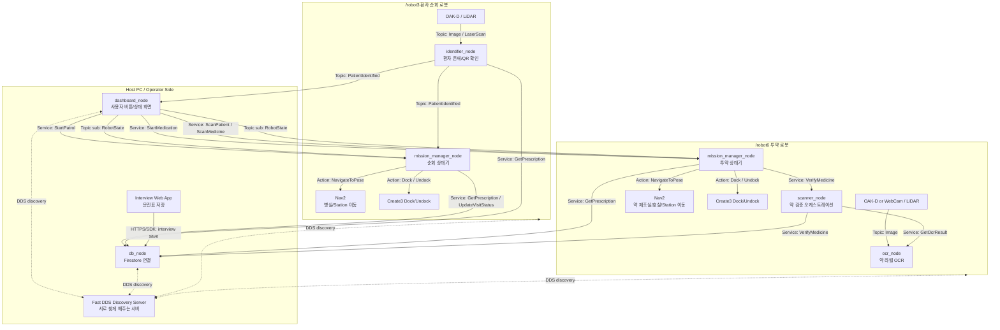
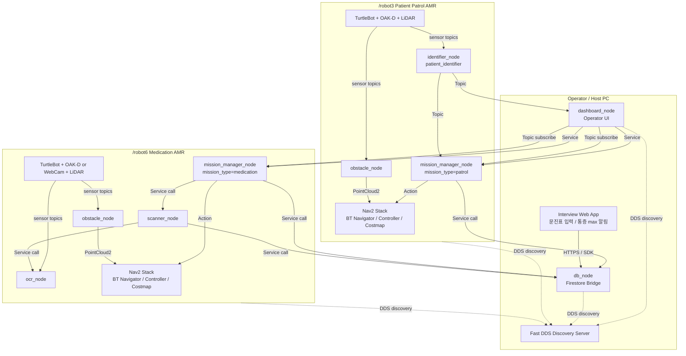
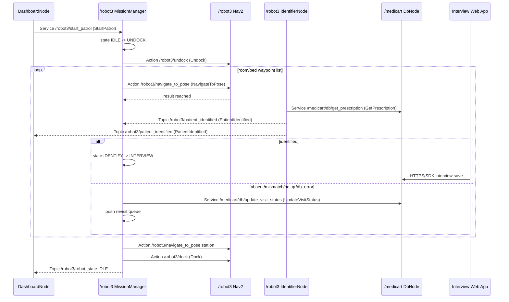
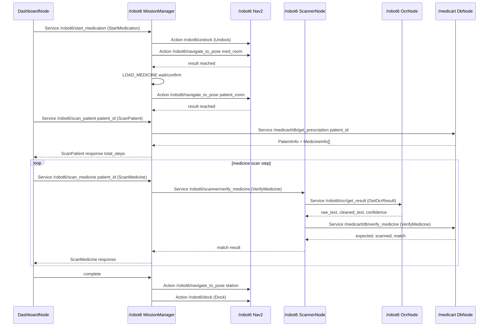
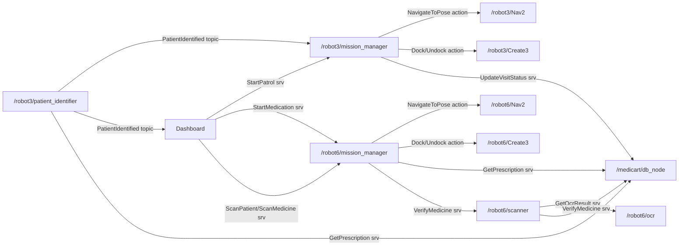

# MediCart Multi-Robot System Architecture

이 문서는 MediCart를 `/robot3` 환자 순회 AMR, `/robot6` 간호사 투약 AMR 두 대로 운영하기 위한 ROS2 시스템 아키텍처이다. 목표는 단순 업무 순서가 아니라, 어떤 노드가 어떤 런타임에서 생성되고 어떤 ROS2 Topic / Service / Action 계약으로 통신하는지 명확히 정의하는 것이다.

## 0. How to Read This Document

이 문서에서 **시스템 아키텍처**는 "전체 시스템이 어떤 컴퓨터와 로봇에 나뉘어 올라가고, 각 노드가 어떤 책임을 갖는가"를 뜻한다.

이 문서에서 **인터페이스**는 "노드끼리 데이터를 주고받는 약속"이다. ROS2에서는 주로 아래 3가지 형태로 표현한다.

| Interface kind | 의미 | 예시 | 언제 쓰나 |
| --- | --- | --- | --- |
| Topic | 계속 흘러가는 데이터 방송 | `/robot3/patient_identified`, `/robot6/robot_state` | 센서값, 상태, 인식 결과처럼 계속 바뀌는 데이터 |
| Service | 요청하면 한 번 응답하는 호출 | `/robot6/scan_patient`, `/medicart/db/get_prescription` | 버튼 클릭, DB 조회, 스캔 검증처럼 결과가 필요한 작업 |
| Action | 오래 걸리는 작업을 시작하고 진행/결과를 받는 호출 | `/robot3/navigate_to_pose`, `/robot6/dock` | 자율주행, 도킹처럼 시간이 걸리고 취소/피드백이 필요한 작업 |

보는 순서는 다음이 가장 쉽다.

1. **One-Page Connected View**: 전체가 어떻게 이어지는지 한 번에 본다.
2. **Runtime Topology**: 어떤 노드가 어느 컴퓨터/로봇에서 떠야 하는지 본다.
3. **Process and Node Construction**: 어떤 `main()` 함수가 어떤 ROS 노드를 만드는지 본다.
4. **Node Interface Contract**: 각 노드가 어떤 Topic/Service/Action을 만들고 호출하는지 본다.
5. **Sequence Contracts**: 실제 시나리오가 시간순으로 어떻게 흘러가는지 본다.

## 0.1 One-Page Connected View

아래 그림이 이 문서의 최상위 연결도이다. 뒤에 나오는 여러 다이어그램과 표는 이 그림의 각 박스를 더 자세히 풀어쓴 것이다.



### How the Diagrams Connect

| 문서 위치 | 역할 | 위 전체 그림에서 보는 부분 |
| --- | --- | --- |
| `1. Runtime Topology` | 배치도 | Host PC, `/robot3`, `/robot6`가 어디에 있는지 |
| `2. Process and Node Construction` | 실행 구조 | 각 박스가 어떤 `console_scripts`와 `main()`에서 생성되는지 |
| `3. Node Interface Contract` | 인터페이스 명세 | 화살표 하나하나의 Topic/Service/Action 이름과 타입 |
| `4. Interface Data Model` | 데이터 형식 | 화살표로 오가는 message/srv/action 필드 |
| `5. Sequence Contracts` | 시간순 흐름 | 버튼을 누른 뒤 어떤 화살표가 어떤 순서로 실행되는지 |
| `7. Final Target Graph` | 발표용 축약본 | 핵심 계약만 줄여서 보여주는 마지막 요약 |

## 1. Runtime Topology



### Architecture Decisions

| 항목 | 결정 |
| --- | --- |
| Robot namespace | 환자 순회는 `/robot3`, 투약은 `/robot6` |
| DDS discovery | 두 로봇과 운영 PC는 Fast DDS Discovery Server에 붙는다 |
| DB bridge | 로봇별 중복 노드보다 운영 PC의 공용 `db_node` 권장 |
| Medication 이동 방식 | 현재는 약 제조실과 환자 호실까지 모두 Nav2 자율주행 |
| Nurse following | 현재 범위 제외. 추후 `/robot6/nurse_tracker`와 `/robot6/target_pose`를 추가 |
| Command source | Dashboard가 operator-facing service를 호출하고, Nav2 action은 mission_manager만 호출 |

## 2. Process and Node Construction

ROS2 Python 패키지는 `setup.py`의 `console_scripts` entry point가 실행되고, 각 entry point의 `main()` 함수가 `rclpy.init()` 후 Node class를 생성한다.

| Runtime | Console script | Entry point | Created node class | ROS node name | Namespace | Mission |
| --- | --- | --- | --- | --- | --- | --- |
| Host PC | `dashboard_node` | `dashboard.dashboard_node:main` | `DashboardNode` | `dashboard_node` | root 또는 `/medicart` | operator UI |
| Host PC | `db_node` | `db_bridge.db_node:main` | `DbNode` | `db_node` | `/medicart` 권장 | shared DB |
| `/robot3` | `mission_manager_node` | `mission_manager.mission_manager_node:main` | `MissionManagerNode` | `mission_manager_node` | `/robot3` | patrol |
| `/robot3` | `identifier_node` | `patient_identifier.identifier_node:main` | `IdentifierNode` | `patient_identifier_node` | `/robot3` | patient identification |
| `/robot3` | `obstacle_node` | `obstacle_detector.obstacle_node:main` | `ObstacleNode` | `obstacle_node` | `/robot3` | vision obstacle |
| `/robot6` | `mission_manager_node` | `mission_manager.mission_manager_node:main` | `MissionManagerNode` | `mission_manager_node` | `/robot6` | medication |
| `/robot6` | `ocr_node` | `ocr_detector.ocr_node:main` | `OcrNode` | `ocr_node` | `/robot6` | OCR |
| `/robot6` | `scanner_node` | `scanner.scanner_node:main` | `ScannerNode` | `scanner_node` | `/robot6` | prescription verification |
| `/robot6` | `obstacle_node` | `obstacle_detector.obstacle_node:main` | `ObstacleNode` | `obstacle_node` | `/robot6` | vision obstacle |

### Required Code Direction

현재 코드에는 `/robot6/...` 하드코딩이 많다. 두 로봇 운영을 위해 모든 topic/service/action 이름은 아래 둘 중 하나로 바뀌어야 한다.

| 방식 | 예시 | 권장 |
| --- | --- | --- |
| ROS namespace remapping | Node namespace를 `/robot3`로 띄우고 topic은 `oakd/image_raw`처럼 상대 이름 사용 | 권장 |
| parameterized absolute name | `robot_namespace=/robot3`, topic = `f'{robot_namespace}/oakd/image_raw'` | 가능 |

현업 관점에서는 launch에서 namespace를 주입하고 코드에서는 상대 이름을 쓰는 방식이 유지보수에 유리하다.

## 3. Node Interface Contract

### 3.1 DashboardNode

`DashboardNode.__init__()`에서 operator command client와 status subscription을 생성한다.

| Interface | ROS type | Direction | Target | Purpose |
| --- | --- | --- | --- | --- |
| `/robot3/start_patrol` | `medi_interfaces/srv/StartPatrol` | Service client | `/robot3/mission_manager_node` | 환자 순회 시작 |
| `/robot6/start_medication` | `medi_interfaces/srv/StartMedication` | Service client | `/robot6/mission_manager_node` | 투약 미션 시작 |
| `/robot6/scan_patient` | `medi_interfaces/srv/ScanPatient` | Service client | `/robot6/mission_manager_node` | 선택 환자 처방 로드 |
| `/robot6/scan_medicine` | `medi_interfaces/srv/ScanMedicine` | Service client | `/robot6/mission_manager_node` | 약 스캔 검증 |
| `/robot3/move_home` | `medi_interfaces/srv/MoveHome` | Service client | `/robot3/mission_manager_node` | 순회 로봇 복귀 |
| `/robot6/move_home` | `medi_interfaces/srv/MoveHome` | Service client | `/robot6/mission_manager_node` | 투약 로봇 복귀 |
| `/robot3/emergency_stop` | `std_msgs/msg/Bool` | Topic pub | `/robot3/mission_manager_node` | 비상 정지 |
| `/robot6/emergency_stop` | `std_msgs/msg/Bool` | Topic pub | `/robot6/mission_manager_node` | 비상 정지 |
| `/robot3/robot_state` | `medi_interfaces/msg/RobotState` | Topic sub | `/robot3/mission_manager_node` | 상태 표시 |
| `/robot6/robot_state` | `medi_interfaces/msg/RobotState` | Topic sub | `/robot6/mission_manager_node` | 상태 표시 |
| `/robot3/patient_identified` | `medi_interfaces/msg/PatientIdentified` | Topic sub | `/robot3/identifier_node` | 순회 결과 표시 |

> 현재 repo에는 `StartMedication.srv`가 없다. 자율주행 투약 미션으로 설계가 바뀌었으므로 `StartTracking.srv` 이름을 계속 쓰기보다 `StartMedication.srv` 또는 `StartDelivery.srv`를 추가하는 것이 명확하다.

### 3.2 MissionManagerNode for `/robot3`

`MissionManagerNode.__init__()`에서 patrol 상태기, dashboard service server, Nav2/Create3 action client, DB client를 생성한다.

| Interface | ROS type | Direction | Peer | Purpose |
| --- | --- | --- | --- | --- |
| `/robot3/start_patrol` | `StartPatrol` | Service server | Dashboard | 미션 시작 |
| `/robot3/move_home` | `MoveHome` | Service server | Dashboard | station 복귀 요청 |
| `/robot3/cancel_mission` | `std_srvs/srv/Trigger` | Service server | Dashboard | 미션 취소 |
| `/robot3/emergency_stop` | `std_msgs/msg/Bool` | Topic sub | Dashboard | 즉시 정지 |
| `/robot3/patient_identified` | `PatientIdentified` | Topic sub | IdentifierNode | 환자 확인 결과 수신 |
| `/robot3/robot_state` | `RobotState` | Topic pub | Dashboard | 상태 발행 |
| `/robot3/navigate_to_pose` | `nav2_msgs/action/NavigateToPose` | Action client | Nav2 | 병실/스테이션 이동 |
| `/robot3/undock` | `irobot_create_msgs/action/Undock` | Action client | Create3 | 도킹 해제 |
| `/robot3/dock` | `irobot_create_msgs/action/Dock` | Action client | Create3 | 도킹 |
| `/medicart/db/get_prescription` | `GetPrescription` | Service client | DbNode | QR 환자 병실 검증 |
| `/medicart/db/update_visit_status` | `UpdateVisitStatus` | Service client | DbNode | 부재/불일치/확인 상태 기록 |

State transition:

```text
IDLE -> UNDOCK -> PATROL -> IDENTIFY -> INTERVIEW -> NEXT_ROOM
NEXT_ROOM -> PATROL      # 다음 환자
NEXT_ROOM -> RETURN      # 모든 환자 완료
RETURN -> DOCK -> IDLE
```

### 3.3 IdentifierNode for `/robot3`

`IdentifierNode.__init__()`에서 sensor subscription, result publisher, DB validation client를 생성한다.

| Interface | ROS type | Direction | Peer | Purpose |
| --- | --- | --- | --- | --- |
| `/robot3/oakd/image_raw` | `sensor_msgs/msg/Image` | Topic sub | OAK-D driver | RGB frame |
| `/robot3/oakd/depth_image` | `sensor_msgs/msg/Image` | Topic sub | OAK-D driver | depth frame |
| `/robot3/patient_identified` | `PatientIdentified` | Topic pub | MissionManager, Dashboard | 식별 결과 |
| `/medicart/db/get_prescription` | `GetPrescription` | Service client | DbNode | QR 환자와 병실 검증 |

Pipeline:

```text
_on_image()
  -> cache latest RGB frame

_run_pipeline()
  -> PersonDetector.detect(frame)
  -> QrScanner.scan(frame_provider)
  -> PatientValidator.validate(patient_id, current_room)
  -> _publish(PatientIdentified)
```

### 3.4 MissionManagerNode for `/robot6`

`MissionManagerNode.__init__()`에서 medication 상태기, dashboard service server, Nav2/Create3 action client, scanner/DB client를 생성한다.

| Interface | ROS type | Direction | Peer | Purpose |
| --- | --- | --- | --- | --- |
| `/robot6/start_medication` | `StartMedication` | Service server | Dashboard | 투약 미션 시작 |
| `/robot6/scan_patient` | `ScanPatient` | Service server | Dashboard | 선택 환자 처방 세션 시작 |
| `/robot6/scan_medicine` | `ScanMedicine` | Service server | Dashboard | 현재 step 약 검증 |
| `/robot6/move_home` | `MoveHome` | Service server | Dashboard | station 복귀 요청 |
| `/robot6/cancel_mission` | `std_srvs/srv/Trigger` | Service server | Dashboard | 미션 취소 |
| `/robot6/emergency_stop` | `std_msgs/msg/Bool` | Topic sub | Dashboard | 즉시 정지 |
| `/robot6/robot_state` | `RobotState` | Topic pub | Dashboard | 상태 발행 |
| `/robot6/navigate_to_pose` | `NavigateToPose` | Action client | Nav2 | 약 제조실/환자 호실/station 이동 |
| `/robot6/undock` | `Undock` | Action client | Create3 | 도킹 해제 |
| `/robot6/dock` | `Dock` | Action client | Create3 | 도킹 |
| `/medicart/db/get_prescription` | `GetPrescription` | Service client | DbNode | 처방 목록 조회 |
| `/robot6/scanner/verify_medicine` | `VerifyMedicine` | Service client | ScannerNode | OCR 기반 약 검증 |

State transition:

```text
IDLE -> UNDOCK -> MOVE_TO_MED_ROOM -> LOAD_MEDICINE -> MOVE_TO_PATIENT_ROOM
MOVE_TO_PATIENT_ROOM -> SCAN -> RETURN -> DOCK -> IDLE
```

> 현재 repo의 `MEDICATION_FLOW`는 `FOLLOW` 상태를 포함한다. 지금 요구사항에서는 자율주행이므로 `FOLLOW` 대신 `MOVE_TO_MED_ROOM`, `LOAD_MEDICINE`, `MOVE_TO_PATIENT_ROOM` 상태로 바꾸는 것이 더 정확하다.

### 3.5 ScannerNode and OcrNode for `/robot6`

| Node | Interface | ROS type | Direction | Peer | Purpose |
| --- | --- | --- | --- | --- | --- |
| ScannerNode | `/robot6/scanner/verify_medicine` | `VerifyMedicine` | Service server | MissionManager | 현재 투약 step 검증 |
| ScannerNode | `/robot6/ocr/get_result` | `GetOcrResult` | Service client | OcrNode | 최신 프레임 OCR 요청 |
| ScannerNode | `/medicart/db/verify_medicine` | `VerifyMedicine` | Service client | DbNode | 처방과 OCR 결과 대조 |
| OcrNode | `/robot6/oakd/image_raw` 또는 `/robot6/webcam/image_raw` | `sensor_msgs/msg/Image` | Topic sub | Camera driver | 약 라벨 이미지 |
| OcrNode | `/robot6/ocr/get_result` | `GetOcrResult` | Service server | ScannerNode | OCR 결과 반환 |

Verification pipeline:

```text
Dashboard.scan_medicine(patient_id)
  -> /robot6/scan_medicine
  -> MissionManager calls /robot6/scanner/verify_medicine
  -> ScannerNode calls /robot6/ocr/get_result
  -> ScannerNode calls /medicart/db/verify_medicine
  -> MissionManager advances PrescriptionSession.current_step on match
```

### 3.6 ObstacleNode for Both Robots

| Namespace | Interface | ROS type | Direction | Peer | Purpose |
| --- | --- | --- | --- | --- | --- |
| `/robot3` | `/robot3/oakd/image_raw` | `sensor_msgs/msg/Image` | Topic sub | OAK-D | vision input |
| `/robot3` | `/robot3/oakd/camera_info` | `sensor_msgs/msg/CameraInfo` | Topic sub | OAK-D | projection info |
| `/robot3` | `/robot3/vision_obstacles` | `sensor_msgs/msg/PointCloud2` | Topic pub | Nav2 costmap | 장애물 입력 |
| `/robot6` | `/robot6/oakd/image_raw` | `sensor_msgs/msg/Image` | Topic sub | OAK-D | vision input |
| `/robot6` | `/robot6/oakd/camera_info` | `sensor_msgs/msg/CameraInfo` | Topic sub | OAK-D | projection info |
| `/robot6` | `/robot6/vision_obstacles` | `sensor_msgs/msg/PointCloud2` | Topic pub | Nav2 costmap | 장애물 입력 |

## 4. Interface Data Model

### Message Types

| Type | Fields | Used by |
| --- | --- | --- |
| `RobotState` | `Header header`, `string state`, `float32 battery`, `int32 error_code`, `string error_message`, `string detail_json` | MissionManager -> Dashboard |
| `PatientIdentified` | `Header header`, `string patient_id`, `string patient_name`, `string room`, `bool is_present`, `bool is_identified`, `string status` | Identifier -> MissionManager/Dashboard |
| `PatientInfo` | `string patient_id`, `string name`, `string room` | DB responses |
| `MedicineInfo` | `string medicine_id`, `string name`, `string dosage`, `string expiry`, `string manufacturer`, `int32 sequence_order` | prescription/scanning |
| `TargetBBox` | `Header header`, `float32[4] bbox`, `float32 confidence`, `int32 tracking_id`, `float32 depth`, `Point spatial_coordinates` | future nurse tracking |

### Service Types

| Service type | Request | Response | Used for |
| --- | --- | --- | --- |
| `StartPatrol` | empty | `bool success`, `string message` | `/robot3/start_patrol` |
| `StartMedication` | empty or mission target ids | `bool success`, `string message` | `/robot6/start_medication`, currently missing |
| `MoveHome` | empty | `bool success`, `string message` | station 복귀 |
| `ScanPatient` | `string patient_id` | `bool success`, `PatientInfo patient`, `MedicineInfo[] medicines`, `int32 total_steps`, `string message` | 처방 세션 시작 |
| `ScanMedicine` | `string patient_id` | `bool success`, `bool match`, `int32 step_index`, `int32 total_steps`, `MedicineInfo scanned_medicine`, `MedicineInfo expected_medicine`, `string message` | 약 검증 |
| `GetPrescription` | `string patient_id` | `bool success`, `PatientInfo patient`, `MedicineInfo[] medicines`, `string message` | DB 처방 조회 |
| `VerifyMedicine` | `string patient_id`, `int32 step_index`, `string scanned_text` | `bool success`, `bool match`, `MedicineInfo expected`, `MedicineInfo scanned`, `string message` | OCR/DB 약 대조 |
| `GetOcrResult` | empty | `bool success`, `string raw_text`, `string cleaned_text`, `float32 confidence`, `string message` | OCR 결과 |
| `UpdateVisitStatus` | `string patient_id`, `string room`, `string status`, `string robot_id`, `string session_id` | `bool success`, `string message` | 현재 missing, 순회 결과 기록 |

### Action Types

| Action name | ROS action type | Client | Server | Goal |
| --- | --- | --- | --- | --- |
| `/robot3/navigate_to_pose` | `nav2_msgs/action/NavigateToPose` | `/robot3/mission_manager_node` | `/robot3` Nav2 | 병실, 침대 앞, station pose |
| `/robot6/navigate_to_pose` | `nav2_msgs/action/NavigateToPose` | `/robot6/mission_manager_node` | `/robot6` Nav2 | 약 제조실, 환자 호실, station pose |
| `/robot3/undock` | `irobot_create_msgs/action/Undock` | `/robot3/mission_manager_node` | `/robot3` Create3 | empty |
| `/robot3/dock` | `irobot_create_msgs/action/Dock` | `/robot3/mission_manager_node` | `/robot3` Create3 | empty |
| `/robot6/undock` | `irobot_create_msgs/action/Undock` | `/robot6/mission_manager_node` | `/robot6` Create3 | empty |
| `/robot6/dock` | `irobot_create_msgs/action/Dock` | `/robot6/mission_manager_node` | `/robot6` Create3 | empty |

## 5. Sequence Contracts

### 5.1 `/robot3` Patient Patrol



### 5.2 `/robot6` Medication Delivery and Scan



## 6. Package/File Gaps for This Architecture

| Gap | Needed file/package | Reason |
| --- | --- | --- |
| Multi-robot bringup | `medi_bringup/launch/robot3_patrol.launch.py`, `robot6_medication.launch.py`, `multi_robot.launch.py` | namespace, parameters, Nav2, sensors, mission nodes 통합 |
| Nav2 config | `medi_bringup/config/robot3/nav2_params.yaml`, `robot6/nav2_params.yaml` | robot별 costmap, topic remap, AMCL |
| Waypoints | `medi_bringup/config/patrol_waypoints.yaml`, `medication_waypoints.yaml` | 병실/침대/약 제조실/station pose |
| Discovery | `scripts/start_discovery_server.sh`, `scripts/setup_robot_discovery.sh` | Fast DDS Discovery Server 운영 |
| Start medication service | `medi_interfaces/srv/StartMedication.srv` | 자율주행 투약 미션 이름 정합성 |
| Visit status service | `medi_interfaces/srv/UpdateVisitStatus.srv` | 부재/불일치/재방문 상태 DB 기록 |
| DB implementation | `db_bridge/firebase_client.py`, `db_bridge/db_node.py` | Firestore 실제 연결과 service server |
| Scanner/OCR implementation | `scanner_node.py`, `ocr_node.py` | 투약 검증 실제 동작 |
| Hardcoded namespace removal | all nodes using `/robot6/...` | `/robot3`, `/robot6` 동시 운용 |

## 7. Final Target Graph


