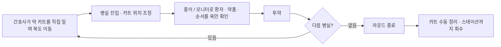
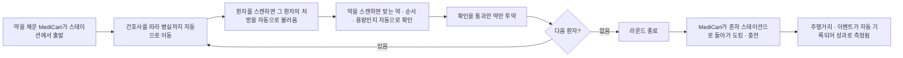
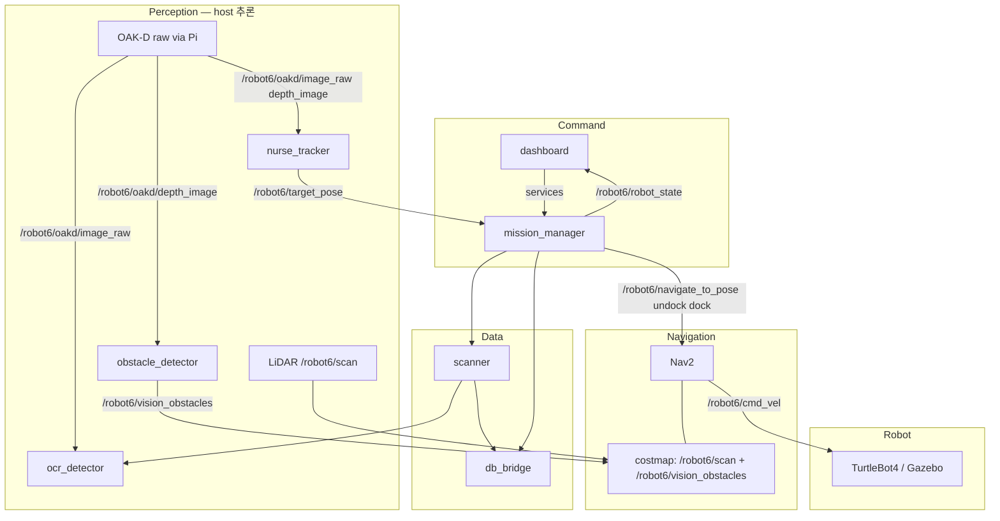
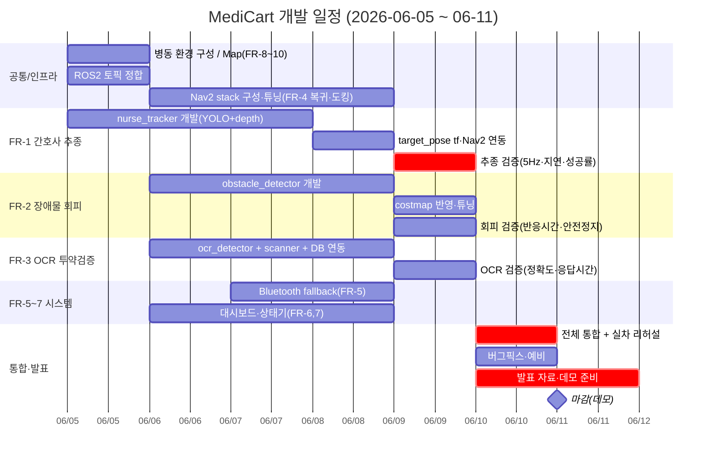

> MediCart는 약이 채워진 카트가 간호사를 따라다니며 투약 라운드를 돕고, 라운드가 끝나면 혼자 자율주행으로 스테이션에 복귀하는 운영 보조 시스템입니다. 간호사의 반복적인 이동·운반 노동을 줄여 환자 직접 대응 시간을 늘리고, 동시에 투약 단계의 오류를 시스템이 이중으로 검증합니다
> 

!IMG_2666.jpeg

---

# 1. Business Requirements

## 1.1 사업 대상

**입원환자 수 대비 간호인력이 부족한 모든 병원**

| **병원 종류** | **간호사 1인당 평균 환자 수** | **비고** | **출처** |
| --- | --- | --- | --- |
| 상급종합병원 | 16.3명 | 실제 근무조(3교대) 기준 | 한겨레 (2023) |
| 종합병원 | 10~20명 | 규모에 따라 차이 | 대한간호협회 TF (2025) |
| 요양병원 | 30~40명 (최대 50명) | 간호조무사 비중 높음 | 보사 (2025) |
- 대학·종합병원: 병동이 넓고 동선이 길어 간호사의 이동 노동이 큼
- 요양병원: 고령·거동 불편 환자 비중이 높아 순회·투약 빈도가 높음
- 중·대형 병원 공통: 간호사 1인당 담당 환자 수가 많아 기존 인력의 효율화가 핵심 과제

---

## 1.2 문제 정의

### 문제 1 — 간호사의 업무 부담 + 간호 인력 충원의 어려움

병실 순회·물품 운반·카트 이동 등 비간호 반복 이동 노동이 환자 직접 간호 시간을 잠식한다.
동시에 신규 채용과 기존 인력 유지가 모두 어려워, 결국 기존 인력의 효율화가 현실적 대안이다.

| 지표 | 수치 | 의미 | 출처 |
| --- | --- | --- | --- |
| 면허자 중 활동 간호사 비율 | **약 54%** | 면허 절반 가까이가 현장 이탈 | 대한간호협회/HIRA 2025 현황 보도 |
| 지역 간 간호사 밀도 격차 | **140배** | 인력 분포의 극심한 불균형 | 대한간호협회/HIRA 2025 현황 보도 |
| 전국 65세 이상 인구 비율 | **20.3%** | 입원·돌봄 수요 급증 | 통계청 2025 고령자 통계 |
| 간호사 1인 일일 이동·운반 시간 | **60분/인/일** | 직접 간호로 전환 가능한 소모 시간 | 현장 관찰 가정값 (PoC 보정) |

---

### 문제 2 — 간호사 투약 실수로 인한 의료 사고

투약 단계(환자 식별 → 약품 식별 → 투약 순서·용량)에서 발생하는 투약 오류는 환자 안전을 위협한다. 특히 오류 대부분이 간호사가 약을 환자에게 투여하는 마지막 단계에서 환자에게 도달한다.

| 지표 | 수치 | 출처 |
| --- | --- | --- |
| 전 세계 의료 위해 중 **투약 관련 비중** | **약 50%** (예방 가능 위해의 절반) | WHO, *Medication Without Harm* |
| 투약 오류의 **연간 글로벌 비용** | **약 420억 달러** (전 세계 의료비의 ~1%) | WHO, 2017 |
| 투약 **단계별 오류 발생 위치** | 처방 39% / **투약(간호) 38%** | Bates et al., ADE Prevention Study |

---

## 1.3 간호사 워크플로우 As-Is → To-Be

투약 라운드 1회를 기준으로 워크플로우 개선을 비교한다.

### As-is

_users_766e17e4-10ef-4e40-b867-1dfc9e5d9235_generated_6938bff3-2f52-42b4-b446-2c7b78b3c3bd_generated_video.mp4

!image.png



### To-be

_users_766e17e4-10ef-4e40-b867-1dfc9e5d9235_generated_8ec9bbdd-44cf-4f4b-9331-7937729bdf0b_generated_video.mp4

!image.png


    

---

## 1.4 솔루션 가치

MediCart 도입으로 기대하는 세 가지 비즈니스 가치.

| # | 가치 | 메커니즘 |
| --- | --- | --- |
| 1 | **간호사 업무 과중 완화** | 약이 채워진 카트가 따라다니고 스스로 복귀 → **반복 이동·운반·카트 회수 노동 제거** |
| 2 | **의료 사고 감소** | OCR + 처방 DB 기반 투약 검증으로 환자/약품/순서·용량 오류 사전 차단 |
| 3 | **(병원측) 사업 확장 가능성** | 회수된 인력 여유로 환자 수용력 확대, 동일 인력으로 병동 확장 운영 가능 |

### 핵심 경제 가치

> 150병상·1개 병동, 간호인력 12명, 1인당 20분/일(60→40분) 절감 가정.
> 

| 핵심 지표 | 값 |
| --- | --- |
| 연간 절감시간 | **약 1,460h/년** (12명 × 20분 × 365일) |
| 연간 환산가치 | **약 4천만원/년** |
| 투자 회수기간 | **약 1.5~2년** |

---

## 1.5 핵심 KPI — MediCart 주행 거리

운영성과의 핵심 측정 지표로 **MediCart의 누적/일일 주행 거리**를 제시한다. 주행 거리는 "간호사가 직접 걷지 않은 거리"를 대리(proxy)하므로, 절감 노동을 가장 직접적으로 환산한다.

| 관점 | KPI | 측정 방식 | As-Is | To-Be |
| --- | --- | --- | --- | --- |
| **핵심** | **MediCart 주행 거리** | 로봇 odometry 로그(km/일) | 0 km | 간호사 보행거리 **20%+ 흡수** |
| 효율 | 이동·운반 시간 | 관찰 + AMR 로그 | 60분/인/일 | 40분 이하 |
| 품질 | 투약 검증 정확도 | scanner 매칭 로그 | 수기 의존 | 95% 이상 |
| 안전 | 위험 정지 이벤트 | 센서 로그 | - | 중대사고 0건 |
| 인력 | 피로도(NASA-TLX) | 설문 | 65점 | 55점 이하 |

---

## 1.6. 기술적 확장성

MediCart 에 로봇팔을 결합하면 투약 전까지의 과정을 end-to-end로 자동화 가능

- **현재:** 약은 사람이 미리 카트에 채워두고, 카트는 운반만 자동화.
- **확장:** AMR + 로봇팔이 결합되면, 처방 세션에 따라 **환자별로 투약할 약을 골라 옮겨 담는 과정**까지 자동화 가능. 즉 조제대에서 카트로, 카트에서 환자별 트레이로 약을 분배하는 작업을 로봇이 수행.
- **의미:** 투약 준비 단계 전체를 자동화하는 **투약 라인 솔루션**으로 확장

---

# Part 2. System Requirements

시스템은 세 가지 핵심 기능을 중심으로 정의: **Following**, **Obstacle Avoiding**, **OCR**.

## 2.1 기능 요구사항

핵심 3대 기능(추종·회피·OCR)을 중심으로 FR-1~7을 정의한다. 각 요구사항은 **입력 → 처리 절차 → 출력**과 성능 기준(NFR)을 함께 명세한다.

### 2.1.1 실시간 인지·제어 (Perception)

host에서 추론하는 실시간 모델군. 입출력은 ROS2 토픽/메시지 타입으로 명시한다.

| ID         | 기능 (모듈)                                           | 입력                                                 | 처리 절차                                                                                                                                                                | 출력                                                                              | 주기·지연 (NFR)                          |
| ---------- | ------------------------------------------------- | -------------------------------------------------- | -------------------------------------------------------------------------------------------------------------------------------------------------------------------- | ------------------------------------------------------------------------------- | ------------------------------------ |
| **FR-1 ⭐** | 간호사 추종 (`nurse_tracker`)<br/>OCL로 동일 대상 지속 추적     | `/oakd/image_raw` (RGB)<br/>`/oakd/depth_image`    | 1. yolo11n으로 person bbox 추출<br/>2. bbox → DepthAI Tracker → spatial coords<br/>3. spatial coords → map 좌표계 tf<br/>4. `target_pose` → Nav2 `bt_navigator` goal update | `/target_pose`<br/>(`geometry_msgs/PoseStamped`, map)                           | 5Hz↑ / 지연 <200ms<br/>(NFR-1, 2)      |
| **FR-2 ⭐** | 장애물 회피 (`obstacle_detector`)<br/>costmap 등록 영역 추론 | `/oakd/depth_image`<br/>(확장 시 RGB monocular depth) | 1. depth 이미지 수신<br/>2. xyz height filter 적용<br/>3. PointCloud2 변환<br/>4. Nav2 local costmap 반영                                                                       | `/vision_obstacles`<br/>(`sensor_msgs/PointCloud2`)                             | 5Hz↑ / costmap 반영 <300ms<br/>(NFR-3) |
| **FR-3 ⭐** | OCR 투약 검증 (`ocr_detector` + `scanner`)            | `/oakd/image_raw` (RGB)<br/>+ DB 처방 데이터            | 1. 약품 라벨 OCR 추출<br/>2. OCR 결과 ↔ DB 처방 교차검증<br/>3. Success/Fail 반환<br/>4. Success 시 다음 `medicine_index`로 진행                                                           | `/ocr_result`<br/>(`raw_text`, `refined_text`, `confidence`)<br/>+ Success/Fail | 스캔 1건 <1.5s<br/>(NFR-5)              |

### 2.1.2 내비게이션·자율주행 (AMR Controller)

| ID | 기능 | 입력 | 처리 절차 | 출력 | 비고 |
| --- | --- | --- | --- | --- | --- |
| **FR-4** | SLAM 자율주행·자동 복귀·도킹 | 사전 제작 map, station 좌표<br/>`/scan`, `/target_pose` | 1. 사전 map·station 좌표 세팅<br/>2. 관리자 MoveHome 또는 미션 완료 트리거<br/>3. Nav2 `navigate_to_pose`로 station 복귀<br/>4. Create3 `dock` 액션으로 도킹·충전 | `/cmd_vel`<br/>(`geometry_msgs/Twist`) | 도킹/언도킹은 nav2가 아닌 TurtleBot4(Create3) `dock`/`undock` 액션 |

**사용 Nav2 패키지** — FR-1 추종·FR-4 복귀·순찰에 공통 사용:

| 패키지(서버) | 플러그인 | 역할 |
| --- | --- | --- |
| `nav2_map_server` | — | 사전 제작 병동 map(`/map`) 로드·서빙 |
| `nav2_amcl` | — | LiDAR `/scan` + map 기반 위치추정 |
| `nav2_costmap_2d` | static/obstacle/inflation layer | `/scan` + `/vision_obstacles` 융합 costmap |
| `nav2_planner` | `NavfnPlanner` | 전역 경로 계획 |
| `nav2_controller` | `DWB` 또는 `RPP` | 경로 추종 → `/cmd_vel` 생성 |
| `nav2_behaviors` | spin / backup / wait | 경로 막힘·정체 시 복구 행동 |
| `nav2_bt_navigator` | — | Behavior Tree로 추종/복귀 흐름 제어 |
| `nav2_velocity_smoother` | — | 속도 명령 평활화(급가감속 방지) |
| `nav2_lifecycle_manager` | — | 위 노드 lifecycle 일괄 관리 |

### 2.1.3 보조·안전 인지

| ID | 기능 (모듈) | 입력 | 처리·역할 | 출력 |
| --- | --- | --- | --- | --- |
| **FR-5** | Bluetooth 거리 측정 (`bluetooth_depth_checker`) | BLE 비콘 RSSI / 신호 패킷<br/>(nurse 비콘 ↔ AMR 수신기) | 비콘 신호로 간호사-카트 거리 추정<br/>→ `nurse_tracker` **fallback**으로 추종 대상 미놓침 보장 | `/nurse_distance`<br/>(추정 거리 m + 방향) |
| (확장) | 순찰 위험 탐지 (`patrol_hazard_detector`) | `/oakd/image_raw` 또는 `/oakd/depth_image` | 병원 내부 순찰 중 위험 대상(쓰러짐, 비인가 구역 진입 등) 탐지 | `/hazard_event`<br/>(위험 유형 + `target_pose` + confidence) |

### 2.1.4 데이터 (Database)

`db_bridge`가 ROS2(`mission_manager`/`scanner`) ↔ Firebase를 중계한다. 스캔 시 처방을 조회해 FR-3 교차검증에 제공하고, 투약·주행 로그를 기록한다.

| 컬렉션/테이블 | 입력(쓰기 주체) | 주요 필드 | 출력(읽기 주체·용도) |
| --- | --- | --- | --- |
| `patients` | 사전 등록 | 환자 식별자, 호실, 기본정보 | scanner — 환자 식별 |
| `prescriptions` | 사전 등록 | 약품, 복용 순서(`medicine_index`), 용량 | FR-3 OCR 교차검증 |
| `medication_logs` | scanner / mission_manager | 스캔 결과, OCR confidence, 성공/실패, timestamp | 대시보드 — 투약 이력 |
| `robot_logs` | mission_manager | 주행거리(odometry), 미션 상태, 안전 이벤트 | 대시보드·KPI — 주행거리 |

### 2.1.5 운영 대시보드·미션 상태기

| ID       | 기능             | 입력(운영자/시스템)            | 처리·표시                                                                                             | 출력                                                                    |
| -------- | -------------- | ---------------------- | ------------------------------------------------------------------------------------------------- | --------------------------------------------------------------------- |
| **FR-6** | 운영자 대시보드 (GUI) | 운영자 조작, `/robot_state` | 1. 미션 시작/중단<br/>2. MoveHome(스테이션 복귀)<br/>3. 로봇 상태(위치·배터리·주행거리) 표시<br/>4. 환자·처방전 정보 표시<br/>5. 비상정지 | `mission_manager` services 호출<br/>비상정지 시 `/cmd_vel` 정지(<100ms, NFR-6) |
| **FR-7** | 미션 상태기·처방 세션   | 대시보드 명령, FR-1~5 이벤트    | 미션 라이프사이클 상태 전이 관리                                                                                | 상태: `IDLE→UNDOCK→FOLLOW→SCAN→RETURN→DOCK`                             |

### 2.1.6 운영 환경·맵 사전 구축 (PoC 전제 조건)

TurtleBot4가 실제로 주행할 **병동 환경(호실 구분·복도·스테이션)** 과 그 환경의 **SLAM 맵·좌표**는 추종·회피·복귀 기능의 전제 조건이므로 요구사항에 포함한다.

| ID | 항목 | 입력·구성 | 처리·산출물 | 비고 |
| --- | --- | --- | --- | --- |
| **FR-8** | 병동 환경 구성 | 복도 + 호실 구획(벽/파티션), 스테이션, 장애물 배치 | 호실별 공간 구분 및 주행 가능 통로 확보 | 추종·회피·복귀 시나리오를 모두 검증 가능한 레이아웃 |
| **FR-9** | SLAM 맵 사전 구축 | TurtleBot4 `/scan` + odometry, SLAM(Cartographer/slam_toolbox) | 병동 occupancy grid `map`(`.pgm`+`.yaml`) 저장 | `nav2_map_server`가 로드 (FR-4 전제) |
| **FR-10** | 좌표·POI 등록 | 구축된 map | station(도킹) 좌표, 각 호실·순찰 waypoint 등록 | FR-4 복귀·순찰 목표로 사용 |

**병동 환경 구성 요건(개략)**

| 항목     | 요구 수준                             | 근거                     |
| ------ | --------------------------------- | ---------------------- |
| 호실 구분  | 복도에서 분기되는 호실 ≥ 2개, 벽/파티션으로 구획     | 호실 이동·도착·스캔 시나리오 검증    |
| 통로 폭   | TurtleBot4 폭(약 34cm) + 회피 여유 ≥ 2배 | 추종/회피 주행 공간 확보         |
| 장애물 배치 | 통로 내 정적·동적 장애물(상자, 사람 등) 배치       | FR-2 회피 동작 검증          |
| 스테이션   | 복귀·도킹 가능한 지점 마련                   | FR-4 복귀·도킹 검증          |
| 표면·대비  | 무광·뚜렷한 경계 (반사·역광 최소화)             | depth 깨짐 방지(NFR-3 안정성) |
| 조명     | 일정한 실내 조도                         | OCR·비전 추론 안정성          |

### 미션 흐름

```
Station 도킹 → Undock → Following → 호실 도착
  → scan_patient → scan_medicine(반복) → Return(단독 자율주행) → Dock → 완료
```

---

## 2.2. 비기능 요구사항

MediCart의 핵심 기능(추종·회피·OCR)은 **실시간으로 모델을 추론·학습(OCL)하며 사람을 따라가는** 시스템이다. 즉 카트가 움직이는 속도와 모델의 추론 주기가 직접 맞물려 있어 **지연(latency)과 처리율(throughput)이 곧 안전성과 직결**된다. 모델이 한 프레임 늦으면 추종 대상을 놓치거나 장애물에 늦게 반응하므로, **속도는 부가 지표가 아니라 1순위 요구사항**이다.

### 2.2.1 실시간성 (최우선)

| ID      | 항목                        | 요구 수준                                 | 근거                                                   |
| ------- | ------------------------- | ------------------------------------- | ---------------------------------------------------- |
| NFR-1 ⭐ | nurse_tracker 추론 주기       | **5Hz 이상** (목표 5~10Hz)                | 보행속도(약 1.2 m/s)에서 대상을 놓치지 않으려면 프레임 간 이동거리를 작게 유지해야 함 |
| NFR-2 ⭐ | target_pose end-to-end 지연 | **< 200ms** (이미지 수신 → Nav2 goal 갱신)   | 지연이 크면 카트가 과거 위치로 향해 흔들림·이탈 발생                       |
| NFR-3 ⭐ | obstacle_detector 반영 주기   | **5Hz 이상**, costmap 반영 지연 **< 300ms** | 장애물 출현 시 정지/회피까지의 반응 시간 확보                           |
| NFR-4   | OCL 온라인 업데이트 지연           | 추론 루프를 막지 않는 **비동기 갱신** (< 1 프레임 영향)  | 학습 때문에 추종 추론이 끊기면 안 됨                                |
| NFR-5   | OCR 검증 응답                 | 스캔 1건당 **< 1.5s**                     | 투약 흐름이 끊기지 않을 정도의 체감 속도                              |
| NFR-6   | 비상정지 반응                   | 입력 → 정지 명령 **< 100ms**                | 안전 최우선                                               |

### 2.2.2 기타 비기능 요구사항

| ID     | 항목    | 요구 수준                                                                         |
| ------ | ----- | ----------------------------------------------------------------------------- |
| NFR-7  | 가용성   | 라운드 1회(약 30분) 중 추종 세션 무중단, fallback(Bluetooth) 자동 전환                          |
| NFR-8  | 안정성   | 추종 실패·통신 두절 시 안전 정지(fail-safe)로 수렴                                            |
| NFR-9  | 확장성   | 동일 출력 I/F 유지하여 Depth→Pure Vision 추론기 교체 가능                                    |
| NFR-10 | 자원 제약 | host GPU 1대에서 tracker+obstacle+ocr 동시 추론이 실시간 주기 내 동작                         |
| NFR-11 | 환경 제약 | 호실 구분·복도·스테이션이 갖춰진 병동 환경(FR-8) 기준 정적·실내 환경에서 동작 보장. 통로 폭·조명 등 구성 요건(2.1.6) 충족 시 추종·회피·복귀 정상 수행 |

> ⭐ 표시는 실시간 성능 요구사항으로, 미달 시 추종/회피의 안전성이 보장되지 않으므로 PoC 검증의 1차 합격 기준으로 둔다.

## 2.3. 시스템 아키텍처



---

## 2.4 개발 전략

개발 스코프를 **단일 시스템**으로 통합하여, depth 기반으로 동작을 빠르게 검증한 뒤 동일한 출력 인터페이스를 유지한 채 OCL·Pure Vision 추론기로 고도화한다. (Following/Obstacle/OCR을 하나의 비전 파이프라인으로 수렴)

| 영역 | 구현 방식 | 패키지 |
| --- | --- | --- |
| Following | OAK-D RGB(YOLO person) + Depth spatial 추정 → **OCL 추적기로 고도화** (동일 출력 I/F 유지) | `nurse_tracker` |
| Obstacle Avoiding | Depth 이미지 → height filter → PointCloud2 → Nav2 costmap → **Pure Vision(RGB) monocular depth 추론으로 확장** | `obstacle_detector` |
| OCR | RGB 프레임 OCR + 처방 DB 텍스트 매칭 | `ocr_detector`, `scanner` |

!image.png

---

### Why Pure Vision?

1. **광학 간섭에 강함**: Depth camera 는 빛번짐·반사·역광에서 깊이값이 깨지거나 구멍이 생긴다. RGB 기반 추론은 사람의 눈처럼 장면 맥락으로 깊이를 해석하므로 이런 광학 오작동에 훨씬 강건하다.
2. **하드웨어 단순화·비용 절감**: 스테레오/ToF 모듈 없이 저가의 일반 RGB 카메라로 동작 → BOM 절감, 카트 소형·경량화, 유지보수 부품 감소.
3. **확장성**: 깊이가 모델로 들어가면 추종·회피·라벨 인식을 하나의 비전 파이프라인으로 통합·고도화하기 쉽다. 

> **Reference: Tesla FSD**
Tesla는 자율주행에서 레이더·초음파 센서를 제거하고 카메라(비전)만으로 깊이·속도·거리를 추정하는 방향으로 전환함. 보정·충돌·고장 지점을 없애고, 실제 사람처럼 영상으로 환경을 파악한다는 접근.
> 

---

## 2.5 개발 일정 (Gantt)

프로젝트 마감은 **2026-06-11(목)**. 남은 약 1주를 기능별 **개발 → 검증** 단위로 배분한다. 핵심 3대 기능(추종·회피·OCR)을 병행 개발하고, 마지막 이틀을 통합·실차 리허설과 발표/데모 준비에 확보한다.



**기간 배분 요약**

| 단계 | 기간 | 비고 |
| --- | --- | --- |
| 핵심 3기능 개발 | 06-05 ~ 06-08 | FR-1·FR-2·FR-3 병행 개발 |
| 기능별 검증 | 06-09 | 비기능 요구사항(NFR ⭐) 실측 합격 기준 확인 |
| 통합·실차 리허설 | 06-10 | end-to-end 미션 흐름 검증 + 버그픽스 |
| 발표·데모 준비 | 06-10 ~ 06-11 | 데모 마감 |

---

## 부록: 출처 및 가정

| 구분 | 내용 |
| --- | --- |
| 투약 사고 | WHO *Medication Without Harm*(위해의 50%, 연 420억 달러); AHRQ PSNet(투약 단계 오류율 8~25%); Bates et al. ADE Study(단계별 분포); KOPS 2020–2024 이차자료(국내 위해 0.7%) |
| 인력 지표 | 대한간호협회/HIRA 2025 전국 간호사 현황(활동 약 54%, 지역격차 140배) |
| 외부 통계 | 통계청 2025 고령자 통계(65세 이상 20.3%) |
| 사업성 가정 | 150병상, 일 간호인력 12명, 20분/인/일 절감 → 연 1,460h, 회수 1.5~2년 |
| 업계 사례 | Tesla Vision — 레이더/초음파 제거, 카메라 단독 깊이 추정 |
| 검증 방법 | 8주 PoC에서 시간·주행거리·추종 성공률·안전 이벤트·만족도 실측 후 ROI 재계산 |

> ※ 모든 수치는 사업성 검토용 기준 가정이며, PoC 후 병원별 실측값으로 보정한다.
>
