# [WIP] System Architecture

# 1. Main Flow

```
[Station 도킹 상태]
    │
    ▼
Undock (/robot6/undock action)
    │
    ▼
간호사 Following (Object Tracking)
    │  nurse_tracker → /robot6/target_pose → MissionManager → Nav2 goal 갱신
    │
    ▼
목적지 호실 도착
    │
    ▼
환자 스캔 + 순차 약품 스캔 (OCR / 처방 순서 검증)
    │  scan_patient → DB 처방 조회 → 투약 순서 세션 시작
    │  scan_medicine (반복) → OCR → current_step 약과 일치/순서 오류 확인
    │
    ▼
완료 명령 → Station 복귀 (Nav2 NavigateToPose)
    │  MissionManager → navigate_to_pose(station_pose)
    │
    ▼
Dock (/robot6/dock action)
    │
    ▼
[Station 도킹 완료]
```

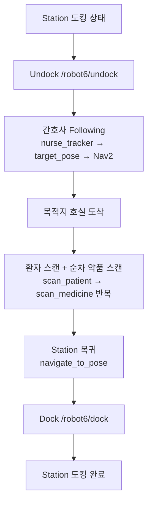

- **Following Mode**
    
    ```
    dashboard
      │  service: /robot6/start_tracking
      ▼
    mission_manager
      │  state → UNDOCK
      │  action: /robot6/undock
      │  undock 완료 → state → FOLLOW
      │  service: /robot6/reset_tracker → nurse_tracker
      │
      ├─ [매 프레임]
      │    OAK-D (raw images via Raspberry Pi)
      │      ├──→ nurse_tracker (호스트 YOLO + tracking + spatial + tf2)
      │      │      → /robot6/target_pose
      │      └──→ obstacle_detector (depth → PointCloud2)
      │             → /robot6/vision_obstacles → Nav2 costmap
      │
      ├─ [1~5Hz Goal 갱신]
      │    mission_manager
      │      │  subscribe /robot6/target_pose
      │      │  cancelTask() → goToPose(target_pose)
      │      └──→ Nav2 → costmap 참조 → /robot6/cmd_vel → TurtleBot4
      │
      └─ [상태]
           /robot6/robot_state (FOLLOW) → dashboard
    ```
    
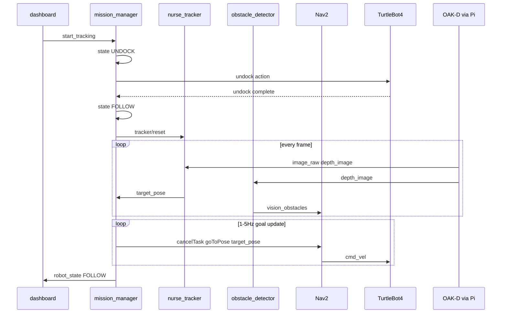

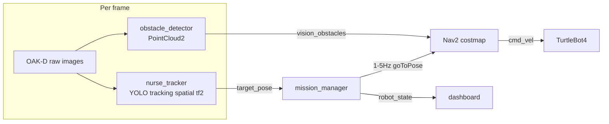

- **Scan Patient**
    
    ```
    dashboard
      │  service: /robot6/scan_patient (patient_id)
      ▼
    mission_manager
      │  service: /robot6/db/get_prescription → db_bridge
      │  prescription session 시작 (current_step=0, ordered medicines[] 저장)
      └──→ ScanPatient response (patient, medicines[], total_steps) → dashboard
    ```
    
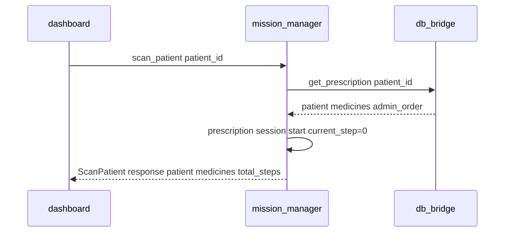

    `medicines[]` 배열 순서 = 투약 순서 (`admin_order` 오름차순). dashboard는 전체 처방 목록과 진행 상태 표시.
    
- **Scan Medicine** (약 1개 스캔마다 반복)
    
    ```
    dashboard
      │  service: /robot6/scan_medicine (patient_id)
      ▼
    mission_manager
      │  state → SCAN
      │  expected = session.medicines[current_step]
      │  service: /robot6/scanner/verify_medicine → scanner
      │
      scanner
        │  service: /robot6/ocr/get_result → ocr_detector
        │  ← cleaned_text
        │  expected vs cleaned_text 비교 (또는 db verify with step_index)
        │
        ├─ match   → current_step++ → ScanMedicine response (step_index, total_steps)
        └─ mismatch → error message (순서/약품 불일치) → dashboard
      │
      ├─ match   → /robot6/robot_state (success) → dashboard
      └─ mismatch → /robot6/robot_state (warning/error) → dashboard
    ```
    
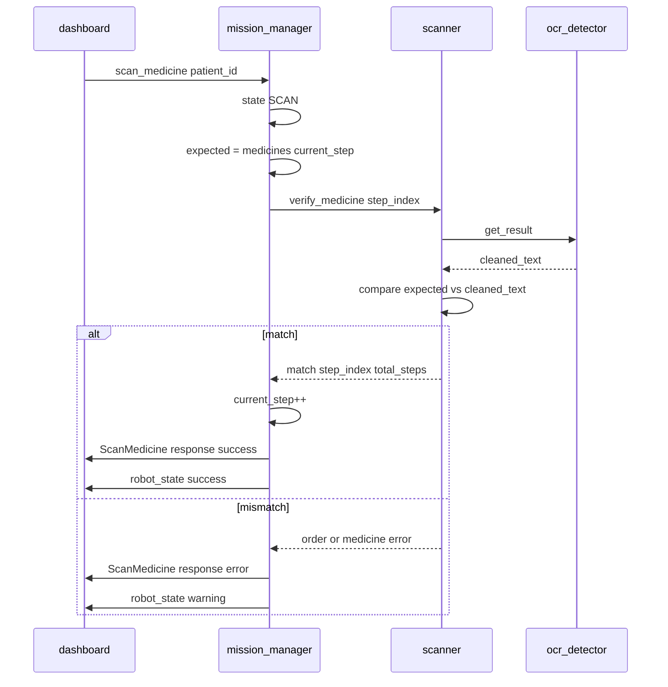

    `scan_medicine`은 **현재 step의 expected 약**과만 비교. 다른 순서 약을 스캔하면 mismatch/error.
    
- **Return Home**
    
    ```
    dashboard
      │  service: /robot6/move_home
      ▼
    mission_manager
      │  state → RETURN
      │  action: /robot6/navigate_to_pose(station_pose) → Nav2
      │  Nav2 → /robot6/cmd_vel → TurtleBot4
      │  goal_reached → state → DOCK
      │  action: /robot6/dock
      │  dock 완료 → state → IDLE
      └──> /robot6/robot_state (IDLE) → dashboard
    ```
    
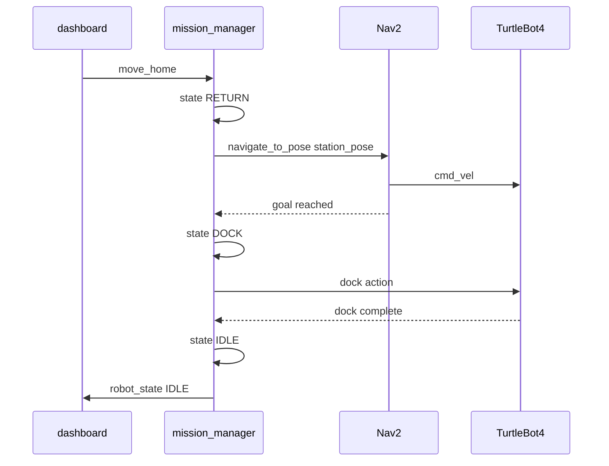

- **Emergency Stop**
    
    ```
    dashboard
      │  topic: /robot6/emergency_stop (true)
      ▼
    mission_manager
      │  nav.cancelTask()
      │  publish /robot6/cmd_vel = Twist(0)
      │  state → IDLE
      ▼
    TurtleBot4 정지
    ```
    
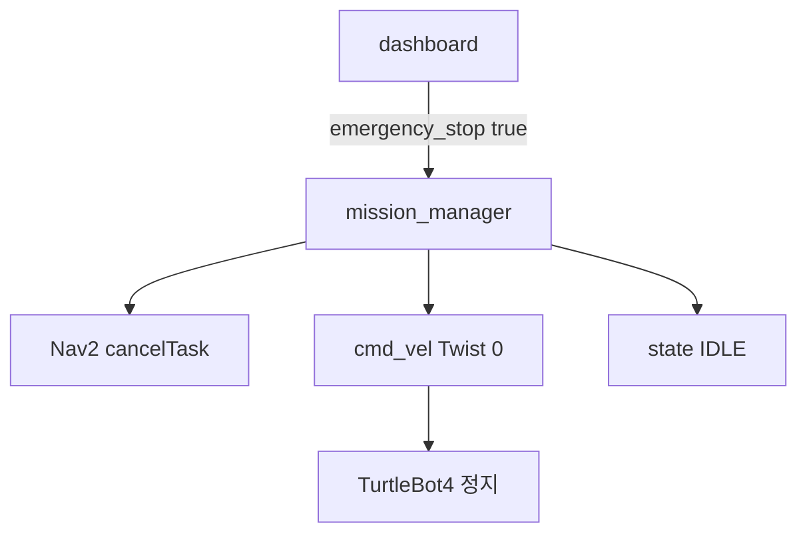

- 참고: Oakd Pro → Rasberry Pi → Host PC 통신 흐름
    
    ```
    OAK-D Pro ──USB──> Raspberry Pi (depthai_ros_driver)
                          │
                          │  /robot6/oakd/image_raw  (RGB)
                          │  /robot6/oakd/depth_image (Depth)
                          │
                          │  * OAK-D VPU 추론 사용 안 함
                          │  * 카메라 raw 데이터만 발행
                          ▼
                       호스트 PC (Wi-Fi / Ethernet)
                          │
                          ├── nurse_tracker    (YOLO 추론 + tracking)
                          ├── obstacle_detector (depth → PointCloud2)
                          └── ocr_detector     (OCR 추론)
    ```
    
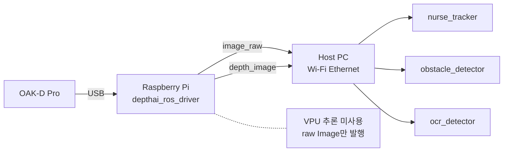

# 2. System Architecture

```
┌─────────────────────────────────────────────────────────────────┐
│  COMMAND LAYER                                                  │
│  dashboard ─── service ──> mission_manager                      │
└──────────────────────────────────────┬──────────────────────────┘
                                       │ Nav2 goal
┌──────────────────────────────────────▼──────────────────────────┐
│  PERCEPTION LAYER (전부 호스트에서 추론)                            │
│                                                                 │
│  OAK-D (raw only)                                               │
│  ├─ /robot6/oakd/image_raw ──> nurse_tracker > /target_pose     │
│  ├─ /robot6/oakd/depth_image > nurse_tracker (spatial 계산)      │
│  ├─ /robot6/oakd/depth_image > obstacle_detector → /vision_obs  │
│  └─ /robot6/oakd/image_raw ──> ocr_detector (service)           │
│                                                                 │
│  LiDAR: /robot6/scan                                            │
└──────────────────────────────────────┬──────────────────────────┘
                                       │
┌──────────────────────────────────────▼──────────────────────────┐
│  NAV2 (단일 cmd_vel 소스)                                         │
│                                                                 │
│  mission_manager > NavigateToPose(goal) > bt_navigator          │
│  costmap: /robot6/scan + /robot6/vision_obstacles               │
│           (내장 ObstacleLayer, yaml 설정만으로 수용)                │
│  > planner > controller > /robot6/cmd_vel                       │
└──────────────────────────────────────┬──────────────────────────┘
                                       │ /robot6/cmd_vel
┌──────────────────────────────────────▼──────────────────────────┐
│  ROBOT: TurtleBot4 (실제) / Gazebo (시뮬레이션)                    │
└─────────────────────────────────────────────────────────────────┘

┌─────────────────────────────────────────────────────────────────┐
│  DATA LAYER (수직 독립)                                           │
│  db_bridge (Firebase) <-> scanner, mission_manager              │
└─────────────────────────────────────────────────────────────────┘
```

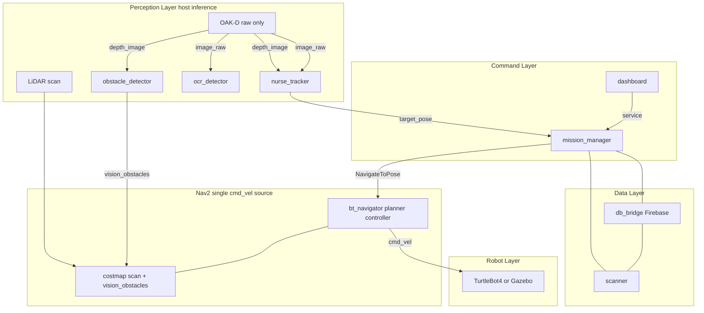

# 3. ROS2 Packages

```
# ~/MediCart

medicart_ws/
└── src/
    │ ----------- 일반 pkg -----------
    ├── dashboard/
    ├── mission_manager/
    ├── nurse_tracker/          # Scope 1 — 간호사 추적 (YOLO + host tracking)
    ├── nurse_tracker_ocl/      # Scope 2 — OCL 기반 고도화 (병렬 개발)
    ├── obstacle_detector/      # 장애물 검출 (depth → PointCloud2)
    ├── ocr_detector/           # OCR 검출 (약품 텍스트 인식)
    ├── scanner/                # 약품 검증 (OCR 결과 + DB 대조)
    ├── db_bridge/              # Firebase 연동
    ├── medi_bringup/           # launch + config 통합
    ├── simulation/             # Gazebo
    │
    │ ------ 커스텀 인터페이스 pkg ------
    └── medi_interfaces/       
```

- 참고) 패키지별 세부 구조
    
    ```
    dashboard/
    ├── package.xml
    ├── setup.py
    ├── setup.cfg
    ├── resource/
    │   └── dashboard
    ├── dashboard/
    │   ├── __init__.py
    │   ├── dashboard_node.py
    │   └── gui_panel.py
    ├── test/
    └── README.md
    ```
    
    ```
    mission_manager/
    ├── package.xml
    ├── setup.py
    ├── setup.cfg
    ├── resource/
    │   └── mission_manager
    ├── mission_manager/
    │   ├── __init__.py
    │   ├── mission_manager_node.py
    │   ├── state_machine.py
    │   └── prescription_session.py
    ├── test/
    └── README.md
    ```
    
    ```
    nurse_tracker/
    ├── package.xml
    ├── setup.py
    ├── setup.cfg
    ├── resource/
    │   └── nurse_tracker
    ├── nurse_tracker/
    │   ├── __init__.py
    │   ├── tracker_node.py         # 메인 노드 (YOLO + tracking + tf2)
    │   ├── yolo_detector.py        # YOLO 추론 (host GPU/CPU)
    │   ├── host_tracker.py         # 호스트 기반 object tracking (DeepSORT 등)
    │   ├── spatial_estimator.py    # depth image → 3D 좌표 계산
    │   └── spatial_transform.py    # tf2 camera→map 변환
    ├── models/
    │   └── yolov8n.pt              # pretrained weights
    ├── test/
    └── README.md
    ```
    
    ```
    nurse_tracker_ocl/              # Scope 2, nurse_tracker와 동일 출력 인터페이스
    ├── package.xml
    ├── setup.py
    ├── setup.cfg
    ├── resource/
    │   └── nurse_tracker_ocl
    ├── nurse_tracker_ocl/
    │   ├── __init__.py
    │   ├── ocl_tracker_node.py
    │   ├── feature_extractor.py
    │   ├── memory_manager.py
    │   ├── spatial_estimator.py
    │   └── spatial_transform.py
    ├── test/
    └── README.md
    ```
    
    ```
    obstacle_detector/
    ├── package.xml
    ├── setup.py
    ├── setup.cfg
    ├── resource/
    │   └── obstacle_detector
    ├── obstacle_detector/
    │   ├── __init__.py
    │   ├── obstacle_node.py        # depth → PointCloud2 변환 + 필터
    │   └── height_filter.py        # z축 passthrough 필터
    ├── test/
    └── README.md
    ```
    
    ```
    ocr_detector/
    ├── package.xml
    ├── setup.py
    ├── setup.cfg
    ├── resource/
    │   └── ocr_detector
    ├── ocr_detector/
    │   ├── __init__.py
    │   ├── ocr_node.py             # OCR 서비스 서버
    │   ├── ocr_engine.py           # OCR 추론 (Tesseract / PaddleOCR 등)
    │   └── text_cleaner.py         # 줄바꿈 제거, 공백 정리
    ├── test/
    └── README.md
    ```
    
    ```
    scanner/
    ├── package.xml
    ├── setup.py
    ├── setup.cfg
    ├── resource/
    │   └── scanner
    ├── scanner/
    │   ├── __init__.py
    │   ├── scanner_node.py
    │   └── medicine_matcher.py
    ├── test/
    └── README.md
    ```
    
    ```
    db_bridge/
    ├── package.xml
    ├── setup.py
    ├── setup.cfg
    ├── resource/
    │   └── db_bridge
    ├── db_bridge/
    │   ├── __init__.py
    │   ├── db_node.py
    │   ├── firebase_client.py      # Firebase Firestore 연동
    │   └── models.py
    ├── test/
    └── README.md
    ```
    
    ```
    medi_bringup/
    ├── package.xml
    ├── setup.py
    ├── setup.cfg
    ├── resource/
    │   └── medi_bringup
    ├── launch/
    │   ├── robot.launch.py
    │   ├── localization.launch.py
    │   ├── nav2.launch.py
    │   ├── perception.launch.py    # tracker + obstacle_detector + ocr_detector
    │   ├── rviz.launch.py
    │   └── simulation.launch.py
    ├── config/
    │   ├── nav2_params.yaml        # costmap 설정 포함
    │   ├── bt_nav.xml
    │   ├── nurse_tracker.yaml
    │   └── ocl_nurse_tracker.yaml
    ├── medi_bringup/
    │   └── __init__.py
    └── README.md
    ```
    
    > alias와의 대응:
    > 
    > - `robot-loc` → `ros2 launch medi_bringup localization.launch.py`
    > - `robot-nav` → `ros2 launch medi_bringup nav2.launch.py`
    > - `robot-view` → `ros2 launch medi_bringup rviz.launch.py`
    > - localization과 nav2는 별도 launch (동시에 띄워야 함)
- medi_bringup/
    
    ```python
    # medi_bringup/launch/localization.launch.py
    def generate_launch_description():
        return LaunchDescription([
            IncludeLaunchDescription(
                PythonLaunchDescriptionSource(
                    '.../turtlebot4_navigation/launch/localization.launch.py'
                ),
                launch_arguments={
                    'namespace': '/robot6',
                    'map': LaunchConfiguration('map'),
                }.items()
            ),
        ])
    
    # medi_bringup/launch/nav2.launch.py
    def generate_launch_description():
        return LaunchDescription([
            IncludeLaunchDescription(
                PythonLaunchDescriptionSource(
                    '.../turtlebot4_navigation/launch/nav2.launch.py'
                ),
                launch_arguments={
                    'namespace': '/robot6',
                    'params_file': '.../medi_bringup/config/nav2_params.yaml',
                }.items()
            ),
        ])
    ```
    
    ```bash
    # 터미널 1: localization
    ros2 launch medi_bringup localization.launch.py map:=/path/to/map.yaml
    
    # 터미널 2: nav2
    ros2 launch medi_bringup nav2.launch.py
    
    # 터미널 3: perception
    ros2 launch medi_bringup perception.launch.py tracker:=nurse
    
    # 터미널 4: rviz
    ros2 launch medi_bringup rviz.launch.py
    ```
    

# 4. ROS2 Interfaces

```
medi_interfaces/
- msg/
	- RobotState.msg
	- Obstacle.msg
	- ObstacleArray.msg
	- MedicineInfo.msg
	- PatientInfo.msg
	- TargetBbox.msg
- srv/
	- MoveHome.srv
	- StartTracking.srv
	- ScanPatient.srv
	- ScanMedicine.srv
	- GetOcrResult.srv
	- GetPrescription.srv
	- VerifyMedicine.srv 
```

## 4.1. 패키지별 인터페이스 alc

- dashboard
    
    
    | 방향 | 인터페이스 | 타입 | 설명 |
    | --- | --- | --- | --- |
    | OUT | Service → `/robot6/start_tracking` | `medi_interfaces/srv/StartTracking` | 간호사 추적 시작 |
    | OUT | Service → `/robot6/move_home` | `medi_interfaces/srv/MoveHome` | 스테이션 복귀 |
    | OUT | Service → `/robot6/scan_patient` | `medi_interfaces/srv/ScanPatient` | 환자 정보 조회 |
    | OUT | Service → `/robot6/scan_medicine` | `medi_interfaces/srv/ScanMedicine` | 약품 스캔 및 검증 |
    | OUT | Service → `/robot6/cancel_mission` | `std_srvs/Trigger` | 미션 취소 |
    | OUT | Topic → `/robot6/emergency_stop` | `std_msgs/Bool` | 긴급 정지 |
    | IN | Topic ← `/robot6/robot_state` | `medi_interfaces/msg/RobotState` | 로봇 상태 |
- mission_manager
    - 상태 전이: `IDLE → UNDOCK → FOLLOW → SCAN → RETURN → DOCK → IDLE`
    - **Prescription session** (`prescription_session.py`): `scan_patient` 성공 시 `ordered medicines[]` + `current_step=0` 저장. `scan_medicine`마다 `medicines[current_step]`과 OCR 결과 비교, match 시 step 증가.
    - **Following 모드 동작**
        
        ```
        while state == FOLLOW:
            target_pose = latest from /robot6/target_pose
            if target_pose is valid:
                nav.cancelTask()
                nav.goToPose(target_pose)
                sleep(0.2~1.0s)
            else:
                # target lost → 대기 or recovery
        ```
        
    
    | 방향 | 인터페이스 | 타입 | 설명 |
    | --- | --- | --- | --- |
    | IN | Service Server `/robot6/start_tracking` | `medi_interfaces/srv/StartTracking` | 추적 시작 |
    | IN | Service Server `/robot6/move_home` | `medi_interfaces/srv/MoveHome` | 복귀 명령 |
    | IN | Service Server `/robot6/scan_patient` | `medi_interfaces/srv/ScanPatient` | 환자 스캔 + 처방 세션 시작 |
    | IN | Service Server `/robot6/scan_medicine` | `medi_interfaces/srv/ScanMedicine` | 순차 약품 스캔 검증 |
    | IN | Service Server `/robot6/cancel_mission` | `std_srvs/Trigger` | 미션 취소 |
    | IN | Topic `/robot6/target_pose` | `geometry_msgs/PoseStamped` | 추적 목표 위치 |
    | IN | Topic `/robot6/emergency_stop` | `std_msgs/Bool` | 긴급 정지 |
    | OUT | Action Client `/robot6/navigate_to_pose` | `nav2_msgs/action/NavigateToPose` | Nav2 이동 |
    | OUT | Action Client `/robot6/undock`, `/robot6/dock` | irobot_create_msgs | 도킹 |
    | OUT | Service Client `/robot6/tracker/reset` | `std_srvs/Trigger` | 트래커 리셋 |
    | OUT | Topic `/robot6/robot_state` | `medi_interfaces/msg/RobotState` | 상태 브로드캐스트 |
- nurse_tracker, nurse_tracker_ocl
    - nurse_tracker: 호스트에서 YOLO 추론 + tracking + depth 기반 spatial 계산 + tf2 변환.
    - nurse_tracker_ocl: OCL + Feature memory + ReID. nurse_tracker와 동일 출력 인터페이스
    - launch arg `tracker:=nurse` / `tracker:=ocl`로 선택. downstream 변경 없음.
    - **ROS param** (노드 내부, srv 아님): `target_class=person`, `follow_distance=1.0` (m)
    - **single-target policy**: YOLO가 여러 person bbox를 검출해도 tracker 내부에서 1개만 선택(reset 직후 lock-on). 외부 label/id 지정 불필요.
    - **내부 파이프라인**
        
        ```
        /robot6/oakd/image_raw
                │
                ▼
          yolo_detector.py (호스트 YOLO 추론, person class)
                │  bbox 리스트 (복수 가능)
                ▼
          host_tracker.py (single-target 선택 + DeepSORT 등 tracking)
                │  tracked bbox 1개
                ▼
          spatial_estimator.py
                │  bbox + /robot6/oakd/depth_image → 3D 좌표 (camera frame)
                ▼
          spatial_transform.py (tf2: camera_optical_frame → map)
                │
                ▼
          /robot6/target_pose (PoseStamped, frame: map)
        ```
        
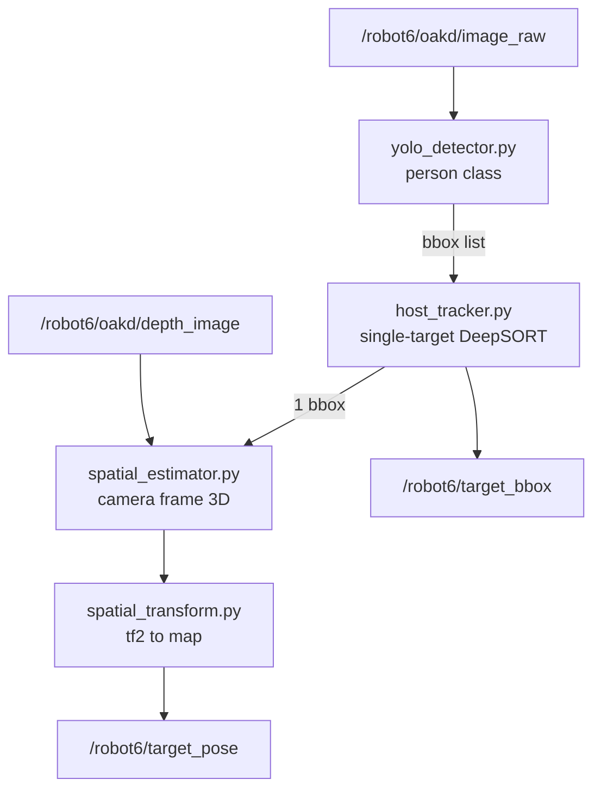

    
    | 방향 | 인터페이스 | 타입 | 설명 |
    | --- | --- | --- | --- |
    | IN | `/robot6/oakd/image_raw` | `sensor_msgs/Image` | RGB 이미지 |
    | IN | `/robot6/oakd/depth_image` | `sensor_msgs/Image` | Depth 이미지 |
    | IN | Service Server `/robot6/tracker/reset` | `std_srvs/Trigger` | 트래커 리셋 |
    | OUT | `/robot6/target_pose` | `geometry_msgs/PoseStamped` | map frame 목표 pose |
    | OUT | `/robot6/target_bbox` | `medi_interfaces/msg/TargetBBox` | 추적 바운딩박스 |
- obstacle_detector
    - depth 이미지 → 높이 필터 → PointCloud2 → Nav2 costmap이 자동 수용.
    - **내부 파이프라인**
        
        ```
        /robot6/oakd/depth_image (16UC1)
                │
                ▼
          depth_image_proc/point_cloud_xyz (ROS2 기본 패키지)
            params: range_min=0.3, range_max=3.0
                │
                ▼
          /robot6/oakd/depth/points (PointCloud2, raw)
                │
                ▼
          height_filter.py (z축 passthrough: 0.1~1.5m)
                │
                ▼
          /robot6/vision_obstacles (PointCloud2, filtered)
                │
                ▼
          Nav2 costmap (내장 ObstacleLayer가 yaml 설정으로 구독)
        ```
        
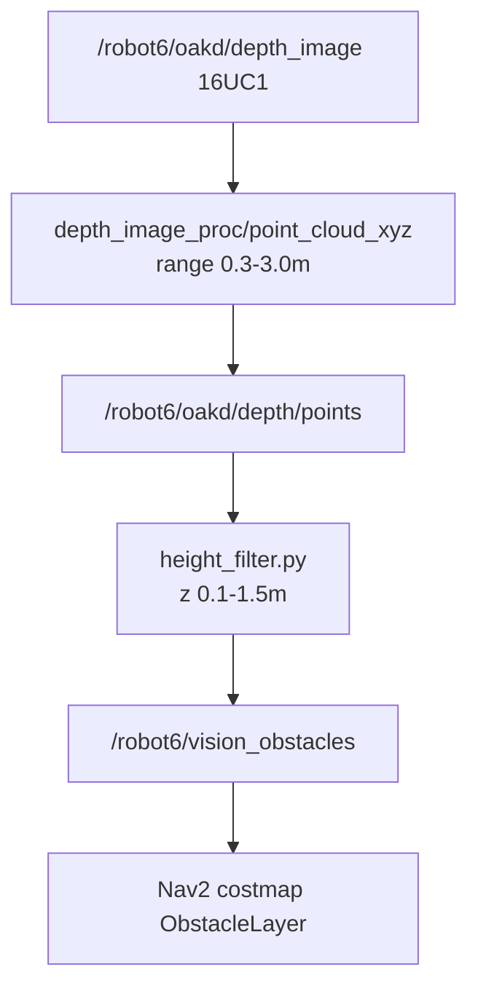

        
    
    | 방향 | 인터페이스 | 타입 | 설명 |
    | --- | --- | --- | --- |
    | IN | `/robot6/oakd/depth_image` | `sensor_msgs/Image` | Depth |
    | IN | `/robot6/oakd/camera_info` | `sensor_msgs/CameraInfo` | Camera Info |
    | OUT | `/robot6/vision_obstacles` | `sensor_msgs/PointCloud2` | 필터링된 장애물 |
- ocr_detector
    - OCR 서비스 서버. scanner가 호출하면 현재 프레임에서 텍스트 인식.
    
    | 방향 | 인터페이스 | 타입 | 설명 |
    | --- | --- | --- | --- |
    | IN | `/robot6/oakd/image_raw` | `sensor_msgs/Image` | RGB 이미지 |
    | OUT | Service Server `/robot6/ocr/get_result` | `medi_interfaces/srv/GetOcrResult` | OCR 수행 |
- scanner
    - 약품 스캔 검증. MissionManager → scanner → ocr_detector + db_bridge.
    
    | 방향 | 인터페이스 | 타입 | 설명 |
    | --- | --- | --- | --- |
    | IN | Service Server `/robot6/scanner/verify_medicine` | `medi_interfaces/srv/VerifyMedicine` | step_index 기준 약품 검증 (OCR + expected 비교) |
    | OUT | Service Client `/robot6/ocr/get_result` | `medi_interfaces/srv/GetOcrResult` | OCR 요청 |
    | OUT | Service Client `/robot6/db/verify_medicine` | `medi_interfaces/srv/VerifyMedicine` | DB step_index 검증 (선택) |
- db_bridge
    - Firebase (Firestore) 연동. Scope 1부터 구축.
    
    | 방향 | 인터페이스 | 타입 | 설명 |
    | --- | --- | --- | --- |
    | IN | Service Server `/robot6/db/get_prescription` | `medi_interfaces/srv/GetPrescription` | 처방전 조회 (medicines[] admin_order 순) |
    | IN | Service Server `/robot6/db/verify_medicine` | `medi_interfaces/srv/VerifyMedicine` | step_index 약품 매칭 검증 |

## 4.3 Topic 정의

| Topic | 타입 | Publisher | Subscriber |
| --- | --- | --- | --- |
| `/robot6/oakd/image_raw` | `sensor_msgs/Image` | depthai_ros_driver | nurse_tracker, ocr_detector |
| `/robot6/oakd/depth_image` | `sensor_msgs/Image` | depthai_ros_driver | nurse_tracker, obstacle_detector |
| `/robot6/oakd/camera_info` | `sensor_msgs/CameraInfo` | depthai_ros_driver | obstacle_detector |
| `/robot6/scan` | `sensor_msgs/LaserScan` | rplidar_ros | Nav2 (amcl, costmap) |
| `/robot6/odom` | `nav_msgs/Odometry` | turtlebot4_node | Nav2 |
| `/tf` | `tf2_msgs/TFMessage` | turtlebot4_node, Nav2 | 전체 |
| `/robot6/target_pose` | `geometry_msgs/PoseStamped` | nurse_tracker | mission_manager |
| `/robot6/target_bbox` | `medi_interfaces/TargetBBox` | nurse_tracker | dashboard |
| `/robot6/vision_obstacles` | `sensor_msgs/PointCloud2` | obstacle_detector | Nav2 costmap |
| `/robot6/cmd_vel` | `geometry_msgs/Twist` | Nav2 | TurtleBot4 |
| `/robot6/emergency_stop` | `std_msgs/Bool` | dashboard | mission_manager |
| `/robot6/robot_state` | `medi_interfaces/RobotState` | mission_manager | dashboard |
| `/robot6/map` | `nav_msgs/OccupancyGrid` | Nav2 (map_server) | Nav2 (amcl, costmap) |
- medi_interfaces/msg/TargetBBox.msg
    
    ```
    std_msgs/Header header
    float32[4] bbox                    # [x, y, w, h] normalized 0~1
    float32 confidence
    int32 tracking_id
    float32 depth
    geometry_msgs/Point spatial_coordinates   # camera frame
    ```
    
- medi_interfaces/msg/RobotState.msg
    
    ```
    std_msgs/Header header
    string state          # IDLE, UNDOCK, FOLLOW, SCAN, RETURN, DOCK, ERROR
    float32 battery
    int32 error_code
    string error_message
    string detail_json
    ```
    
- medi_interfaces/msg/Obstacle.msg
    
    ```
    std_msgs/Header header
    float32[4]       bbox
    float32          depth
    float32          confidence
    string           label
    geometry_msgs/Point position
    ```
    
- medi_interfaces/msg/ObstacleArray.msg
    
    ```
    std_msgs/Header     header
    Obstacle[]          obstacles
    ```
    
- medi_interfaces/msg/MedicineInfo.msg
    
    ```
    string   medicine_id
    string   name
    string   dosage
    string   expiry
    string   manufacturer
    int32    sequence_order    # 투약 순서 (0-based, prescriptions.admin_order)
    ```
    
- medi_interfaces/msg/PatientInfo.msg
    
    ```
    string           patient_id
    string           name
    string           room
    ```
    
    처방 약 목록은 `ScanPatient`/`GetPrescription` 응답의 `MedicineInfo[] medicines`로 전달.
    

## 4.4 Service 정의

- medi_interfaces/srv/StartTracking.srv
    
    ```yaml
    # Request (empty — reset 후 tracker가 person 1명 자동 lock-on)
    ---
    # Response
    bool   success
    string message
    ```
    
    `follow_distance` 등 추적 파라미터는 tracker 노드 ROS param으로 설정.
    
- medi_interfaces/srv/ScanPatient.srv
    
    ```yaml
    # Request
    string patient_id
    ---
    # Response
    bool   success
    medi_interfaces/PatientInfo patient
    medi_interfaces/MedicineInfo[] medicines   # admin_order 순
    int32  total_steps
    string message
    ```
    
    성공 시 mission_manager prescription session 시작 (`current_step=0`).
    
- medi_interfaces/srv/ScanMedicine.srv
    
    ```yaml
    # Request
    string patient_id
    ---
    # Response
    bool success
    bool match
    int32 step_index       # 검증한 step (0-based)
    int32 total_steps
    MedicineInfo scanned_medicine
    MedicineInfo expected_medicine
    string message         # mismatch 시 순서/약품 오류 설명
    ```
    
    session의 `current_step` 약과 OCR 결과만 비교. match 시 step 증가.
    
- medi_interfaces/srv/GetOcrResult.srv
    
    ```yaml
    # Request (empty - 현재 프레임 사용)
    ---
    # Response
    bool success
    string raw_text
    string cleaned_text
    float32 confidence
    string message
    ```
    
- medi_interfaces/srv/GetPrescription.srv
    
    ```yaml
    # Request
    string patient_id
    ---
    # Response
    bool success
    PatientInfo patient
    MedicineInfo[] medicines    # admin_order 오름차순
    string message
    ```
    
    mission_manager → db_bridge 내부 호출 전용. operator는 `ScanPatient` 사용.
    
- medi_interfaces/srv/VerifyMedicine.srv
    
    ```yaml
    # Request
    string patient_id
    int32 step_index
    string scanned_text
    ---
    # Response
    bool success
    bool match
    MedicineInfo expected
    MedicineInfo scanned
    string message
    ```
    
- medi_interfaces/srv/MoveHome.srv
    
    ```yaml
    # Request (empty — station_pose는 mission_manager 파라미터에서 사용)
    ---
    # Response
    bool success
    string message
    ```
- std_srvs/Trigger
    
    ```yaml
    # Request: (empty)
    ---
    # Response
    bool   success
    string message
    ```
    
    - /robot6/cancel_mission
    - /robot6/tracker/reset

## 4.5. Action 정의

<aside>
ℹ️

- service: dashboard ↔ mission_manager
- action: mission_manager ↔ Nav2 / Create3
</aside>

- nav2_msgs/action/NavigateToPose.action
    - /robot6/navigate_to_pose
    
    ```yaml
    # Goal
    geometry_msgs/PoseStamped pose
    string behavior_tree
    ---
    # Feedback
    geometry_msgs/PoseStamped current_pose
    float32 distance_remaining
    builtin_interfaces/Duration navigation_time
    ---
    # Result: (empty)
    ```
    
- irobot_create_msgs/action/Undock
    - /robot6/undock
    
    ```yaml
    # Goal: (empty)
    ---
    # Feedback: (empty)
    ---
    # Result
    bool is_docked
    ```
    
- irobot_create_msgs/action/Dock
    - /robot6/dock
    
    ```yaml
    # Goal: (empty)
    ---
    # Feedback: (empty)
    ---
    # Result
    bool is_docked
    ```

## 4.6. Builtin / External Package Interfaces

MediCart가 직접 정의하지 않고 외부 ROS2 패키지에서 제공하는 인터페이스. §4.3 Topic 표의 publisher/subscriber 관계에 더해, 각 타입에서 MediCart가 실제로 사용하는 필드를 정리한다.

### depthai_ros_driver (OAK-D Pro, Raspberry Pi)

| Topic | 타입 | MediCart 사용 필드 |
| --- | --- | --- |
| `/robot6/oakd/image_raw` | `sensor_msgs/Image` | `header` (timestamp, frame_id), `encoding`, `width`, `height`, `step`, `data` — RGB 프레임. nurse_tracker, ocr_detector가 구독 |
| `/robot6/oakd/depth_image` | `sensor_msgs/Image` | `encoding=16UC1`, `data` — depth 값(mm). nurse_tracker(spatial), obstacle_detector가 구독 |
| `/robot6/oakd/camera_info` | `sensor_msgs/CameraInfo` | `K` (intrinsics 3×3), `D` (distortion), `width`, `height` — depth→point cloud 변환에 사용 |

label, tracking_id, bbox는 DepthAI 경계를 넘지 않음. host tracker(YOLO/OCL)가 Image에서 생성하며 per-frame 출력은 `target_bbox` + `target_pose`.

### rplidar_ros

| Topic | 타입 | MediCart 사용 필드 |
| --- | --- | --- |
| `/robot6/scan` | `sensor_msgs/LaserScan` | `angle_min`, `angle_max`, `angle_increment`, `range_min`, `range_max`, `ranges[]` — Nav2 AMCL 및 costmap 장애물 레이어 |

### turtlebot4_node

| Topic | 타입 | MediCart 사용 필드 |
| --- | --- | --- |
| `/robot6/odom` | `nav_msgs/Odometry` | `header`, `pose.pose` (position, orientation), `twist.twist` — Nav2 localization/제어 |
| `/tf`, `/tf_static` | `tf2_msgs/TFMessage` | `transforms[]` — base_link ↔ sensor frame 변환. nurse_tracker spatial_transform, Nav2 전체 |

### Nav2

| Interface | 타입 | MediCart 사용 필드 |
| --- | --- | --- |
| `/robot6/navigate_to_pose` | `nav2_msgs/action/NavigateToPose` | Goal: `pose` (PoseStamped, frame=map). Feedback: `current_pose`, `distance_remaining`, `navigation_time`. Result: (empty) |
| `/robot6/map` | `nav_msgs/OccupancyGrid` | `info.resolution`, `info.width`, `info.height`, `info.origin`, `data[]` — 정적 맵 |
| `/robot6/cmd_vel` | `geometry_msgs/Twist` | `linear.x`, `angular.z` — Nav2가 유일한 cmd_vel 발행자. mission_manager는 emergency_stop 시 `Twist(0)` 직접 발행 |

Nav2 costmap은 `/robot6/scan` (LaserScan)과 `/robot6/vision_obstacles` (PointCloud2)를 내장 ObstacleLayer yaml 설정으로 구독.

### irobot_create_msgs (TurtleBot4 Create3)

| Action | 타입 | MediCart 사용 필드 |
| --- | --- | --- |
| `/robot6/undock` | `irobot_create_msgs/action/Undock` | Goal/Feedback: (empty). Result: `is_docked` |
| `/robot6/dock` | `irobot_create_msgs/action/Dock` | Goal/Feedback: (empty). Result: `is_docked` |

### std_srvs

| Service | 타입 | MediCart 사용 필드 |
| --- | --- | --- |
| `/robot6/cancel_mission` | `std_srvs/Trigger` | Request: (empty). Response: `success`, `message` |
| `/robot6/tracker/reset` | `std_srvs/Trigger` | Request: (empty). Response: `success`, `message` — mission_manager가 undock 후 nurse_tracker 리셋 |


# 5. DB Schema

> Firebase (Firestore) 사용. Scope 1부터 연동하여 인프라 선구축.
아래 SQL은 데이터 모델 정의용이며, Firestore에서는 컬렉션/문서 구조로 매핑.
> 

```sql
CREATE TABLE patients (
    patient_id   VARCHAR(20) PRIMARY KEY,
    name         VARCHAR(100) NOT NULL,
    room         VARCHAR(20),
    birth_date   DATE,
    created_at   TIMESTAMP DEFAULT NOW()
);

CREATE TABLE medicines (
    medicine_id  VARCHAR(50) PRIMARY KEY,
    name         VARCHAR(200) NOT NULL,
    dosage       VARCHAR(100),
    manufacturer VARCHAR(200),
    expiry_date  DATE
);

CREATE TABLE prescriptions (
    prescription_id  VARCHAR(50) PRIMARY KEY,
    patient_id       VARCHAR(20) REFERENCES patients(patient_id),
    medicine_id      VARCHAR(50) REFERENCES medicines(medicine_id),
    admin_order      INTEGER NOT NULL,           -- 투약 순서 (0-based)
    dose_amount      VARCHAR(100),
    frequency        VARCHAR(100),
    start_date       DATE,
    end_date         DATE,
    prescribed_by    VARCHAR(100),
    created_at       TIMESTAMP DEFAULT NOW()
);

CREATE TABLE medication_logs (
    log_id           SERIAL PRIMARY KEY,
    patient_id       VARCHAR(20) REFERENCES patients(patient_id),
    medicine_id      VARCHAR(50) REFERENCES medicines(medicine_id),
    prescription_id  VARCHAR(50) REFERENCES prescriptions(prescription_id),
    administered_by  VARCHAR(100),
    administered_at  TIMESTAMP NOT NULL,
    status           VARCHAR(20),
    robot_session_id VARCHAR(100),
    notes            TEXT
);
```