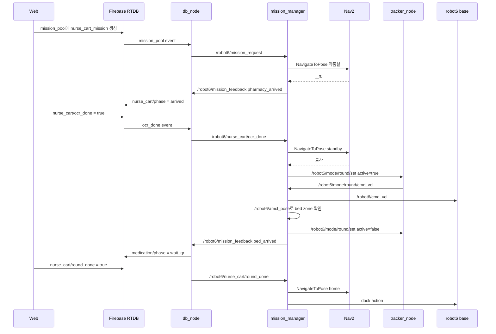
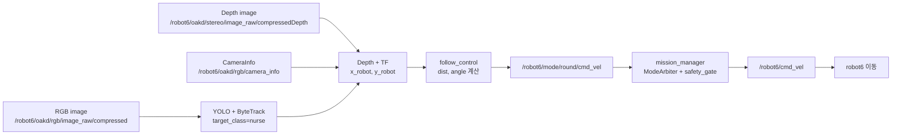

# ROBOT6 Nurse Tracking Architecture

이 문서는 ROBOT6의 투약 모드에서 **간호사 추적이 실제로 어떻게 동작하는지**를 팀원이 바로 이해할 수 있도록 정리한 문서입니다.

기준은 `sunghyun` 브랜치에 올린 ROBOT6 medication tracking flow 구현입니다.

가장 중요한 결론부터 말하면:

> 현재 간호사 추적은 **Nav2 goal 추적 방식이 아니라, YOLO로 간호사를 보고 아주 작은 `cmd_vel`을 계속 보내는 방식**입니다.

Nav2는 여전히 씁니다. 하지만 Nav2는 간호사를 따라가는 데 쓰는 것이 아니라, 아래처럼 **정해진 장소로 이동할 때만** 씁니다.

- 도킹 해제 후 약품실 이동
- OCR 완료 후 약품실 입구 대기 지점 이동
- 투약/회진 완료 후 도킹 스테이션 복귀
- 마지막 dock

간호사를 따라가는 순간에는 Nav2 goal을 찍지 않습니다. 그때는 로봇이 카메라로 간호사를 보고, "앞으로 조금 가라", "왼쪽으로 조금 돌아라" 같은 속도 명령을 직접 보냅니다.

---

## 1. 아주 쉬운 비유

ROBOT6를 아주 단순하게 보면 이렇게 나눌 수 있습니다.

| 역할 | 실제 구성 요소 | 쉬운 설명 |
|---|---|---|
| 눈 | OAK-D RGB + Depth camera | 앞에 누가 있는지 보는 눈 |
| 사람 찾기 | YOLO + ByteTrack | 화면 속에서 `nurse`를 찾는 기능 |
| 거리 재기 | Depth image | nurse가 몇 m 앞에 있는지 재는 기능 |
| 따라갈지 계산 | `follow_control.py` | 너무 멀면 조금 전진, 옆에 있으면 조금 회전 |
| 속도 명령 만들기 | `tracker_node.py` | `/robot6/mode/round/cmd_vel` 발행 |
| 최종 허가 | `mission_manager` + `ModeArbiter` | 지금 움직여도 되는지 판단하는 교통정리 |
| 바퀴에 전달 | `/robot6/cmd_vel` | 실제 로봇이 움직이는 최종 속도 명령 |
| 상태 공유 | Firebase RTDB + web | 웹에서 현재 단계 표시 |

간단히 말하면:

```text
카메라가 nurse를 봄
→ YOLO가 nurse 박스를 찾음
→ depth로 nurse까지 거리 계산
→ 로봇 기준 x/y 좌표로 바꿈
→ 너무 멀면 앞으로 아주 조금 감
→ 옆으로 치우쳐 있으면 아주 조금 회전
→ 침대 앞 zone에 들어오면 추적 정지
```

---

## 2. 전체 시나리오에서 추적이 시작되는 위치

투약 모드 전체 흐름은 아래와 같습니다.

```text
웹 투약 모드 시작
→ Firebase RTDB mission_pool에 nurse_cart_mission 생성
→ db_node가 ROS /robot6/mission_request로 전달
→ mission_manager가 nurse_cart_sequencer 시작
→ Nav2로 약품실 이동
→ 약품실 도착 후 OCR 대기
→ 웹에서 OCR 완료
→ Nav2로 약품실 입구 대기 지점 이동
→ 여기서 간호사 추적 시작
→ 침대 앞 zone 진입
→ 간호사 추적 자동 정지
→ 웹/QR 확인 대기
→ 완료/복귀 버튼
→ Nav2로 홈 이동
→ dock
```

중요한 부분은 이것입니다.

```text
OCR 완료 후 약품실 입구까지는 Nav2
약품실 입구 이후 간호사를 따라갈 때는 cmd_vel
침대 앞 zone 진입 후 다시 추적 정지
복귀할 때는 다시 Nav2
```

---

## 3. 현재 추적 방식 한 줄 요약

현재 방식:

```text
YOLO로 nurse를 찾고, depth로 거리와 방향을 계산한 뒤, Nav2 goal이 아니라 /robot6/cmd_vel 속도 명령으로 직접 조금씩 따라간다.
```

아닌 것:

```text
간호사 위치를 Nav2 goal로 계속 찍어서 따라가는 방식이 아니다.
```

---

## 4. main에서 가져온 방식과 현재 방식의 차이

main에서 가져온 기본 방식도 간호사 추적 자체는 원래 Nav2 goal이 아니라 `cmd_vel` 기반이었습니다.

하지만 main 방식은 속도가 더 빠르고, 침대 앞 자동 정지가 없었습니다.

| 항목 | main에서 가져온 기본 방식 | 현재 방식 |
|---|---|---|
| 간호사 추적 방식 | `round` 모드, direct `cmd_vel` | 그대로 `round` 모드, direct `cmd_vel` |
| 추적에 Nav2 사용 여부 | 사용 안 함 | 사용 안 함 |
| 약품실/대기점/복귀 이동 | Nav2 사용 | Nav2 사용 |
| 추적 시작 시점 | OCR 완료 후 standby 도착 | 동일 |
| 추적 종료 시점 | 웹/트리거 `round_done`을 눌러야 종료 | 침대 앞 zone에 들어가면 자동 종료 |
| 침대 앞 zone 감지 | 없음 | `/robot6/amcl_pose`로 감지 |
| 유지 거리 | 기본 `0.40m` | `0.30m` |
| 거리 deadband | 기본 `0.15m` | `0.12m` |
| 최대 선속도 | 기본 `0.22m/s` | `0.05m/s` |
| 최대 각속도 | 기본 `0.60rad/s` | `0.25rad/s` |
| 회전만 하는 각도 기준 | 기본 약 `0.35rad` | `0.45rad` |
| 웹 표시 단계 | OCR/추적/복귀 중심 | `bed_arrived`, `wait_qr`, `returning` 추가 |
| DB 기록 | 약품실 도착 중심 | 추적 시작, 침대 도착, QR 대기, 복귀까지 기록 |

쉽게 말하면:

```text
main 방식:
  "간호사를 보면 따라가라. 멈추는 건 사람이 버튼 눌러라."

현재 방식:
  "간호사를 아주 천천히 따라가라. 로봇이 침대 앞 네모 구역에 들어가면 자동으로 멈춰라."
```

---

## 5. Nav2를 쓰는 부분과 안 쓰는 부분

### 5.1 Nav2를 쓰는 부분

Nav2는 정해진 좌표로 갈 때 씁니다.

| 단계 | 사용 방식 | 액션 |
|---|---|---|
| 약품실 이동 | Nav2 goal | `/robot6/navigate_to_pose` |
| 약품실 입구 standby 이동 | Nav2 goal | `/robot6/navigate_to_pose` |
| 홈/도킹 스테이션 이동 | Nav2 goal | `/robot6/navigate_to_pose` |
| 도킹 해제 | Create3 action | `/robot6/undock` |
| 도킹 | Create3 action | `/robot6/dock` |

좌표 기본값은 `nurse_cart_sequencer.py`에 있습니다.

| 위치 | x | y | yaw | 설명 |
|---|---:|---:|---:|---|
| pharmacy | `-0.302782` | `-3.3757` | `-0.0545105` | 약품실 |
| standby | `-0.9296` | `-3.3393` | `2.8293` | 약품실 입구 대기 지점 |
| home | `-0.354229` | `-0.118972` | `-0.0042011` | 도킹 스테이션 앞 |

### 5.2 Nav2를 안 쓰는 부분

간호사를 따라가는 동안에는 Nav2 goal을 보내지 않습니다.

현재 추적 모드는:

```python
TRACK_MODE = 'round'
```

즉 `round_nav`가 아니라 `round`입니다.

간호사 추적 중 실제로 나가는 명령 흐름은:

```text
tracker_node
→ /robot6/mode/round/cmd_vel
→ mission_manager ModeArbiter
→ safety_gate
→ /robot6/cmd_vel
→ 로봇 이동
```

---

## 6. 중간에 만들었던 Nav2 goal 추적 방식은 어떻게 되었나?

중간 테스트 때 `round_nav` 방식도 만들었습니다.

`round_nav` 방식은 nurse 위치를 보고, nurse 뒤쪽에 Nav2 goal을 계속 새로 찍는 방식입니다.

하지만 실제 테스트에서 문제가 있었습니다.

- nurse가 RC카처럼 빨리 움직이면 카메라 시야에서 놓치기 쉬움
- Nav2 goal이 계속 바뀌면서 움직임이 훅 들어오는 느낌이 있음
- 좁은 공간에서 더 부드럽게 따라가기 어렵다고 판단

그래서 최종 시나리오는 다시 `round` direct `cmd_vel` 방식으로 바꿨습니다.

현재 launch 기본값도:

```text
round_nav_follower:=false
```

입니다.

즉 `nav_goal_follower_node` 파일은 남아 있지만, 기본 시나리오에서는 안 뜹니다.

---

## 7. YOLO로 nurse를 어떻게 탐지하나?

### 7.1 입력 카메라 토픽

`nurse_tracker`는 OAK-D의 RGB 이미지와 Depth 이미지를 같이 봅니다.

| 목적 | 토픽 |
|---|---|
| RGB 이미지 | `/robot6/oakd/rgb/image_raw/compressed` |
| Depth 이미지 | `/robot6/oakd/stereo/image_raw/compressedDepth` |
| 카메라 내부 파라미터 | `/robot6/oakd/rgb/camera_info` |

RGB 이미지는 "누가 있는지" 찾는 데 씁니다.

Depth 이미지는 "그 사람이 얼마나 멀리 있는지" 재는 데 씁니다.

### 7.2 몇 FPS로 보나?

`tracker_node`의 기본 제어 주기는:

```text
control_hz = 10.0
```

즉 최대 1초에 10번 정도 YOLO 추론을 합니다.

코드에서는 오래된 이미지를 쌓아두지 않도록 센서 QoS를 이렇게 둡니다.

```text
depth = 1
BEST_EFFORT
```

쉽게 말하면:

```text
옛날 사진은 버리고, 가장 최신 사진만 본다.
```

RGB와 Depth는 `ApproximateTimeSynchronizer`로 묶습니다.

```text
queue_size = 2
sync_slop = 0.05초
```

즉 RGB와 Depth 시간이 약 0.05초 안쪽으로 비슷하면 한 세트로 보고 처리합니다.

### 7.3 YOLO 모델

기본 모델 경로:

```text
nurse_tracker/models/yolo11n.pt
```

기본 탐지 클래스:

```text
target_class = nurse
```

기본 confidence:

```text
conf = 0.5
```

YOLO는 `ultralytics`를 사용합니다.

그리고 단순 detect가 아니라:

```python
model.track(..., tracker="bytetrack.yaml", persist=True)
```

를 씁니다.

그래서 프레임마다 같은 nurse에 `track_id`가 붙습니다.

예시:

```json
{
  "tracking_id": 4,
  "distance": 0.737,
  "x_robot": 0.737,
  "y_robot": -0.052,
  "ts": 1781086946653
}
```

이 정보는 아래 토픽으로 나옵니다.

```text
/nurse_tracker/target
```

---

## 8. Depth로 nurse 거리를 어떻게 계산하나?

YOLO가 nurse 박스를 찾으면 박스가 생깁니다.

```text
[x1, y1, x2, y2]
```

이 박스 안에는 nurse뿐 아니라 배경도 조금 섞일 수 있습니다.

그래서 박스 한가운데 한 점만 보는 것이 아니라, 박스 안 Depth 값을 여러 개 봅니다.

현재 방식:

```text
박스 안 depth 값 중 가까운 쪽 30%를 고름
→ 그 값들의 중앙값을 nurse 거리로 사용
```

코드 기준:

```text
near_percentile = 0.30
```

이렇게 하는 이유:

```text
박스 안에 벽이나 바닥이 섞여도, nurse 쪽 가까운 depth를 더 안정적으로 잡기 위해서
```

Depth 값은 mm 단위로 들어오고, 코드에서 m 단위로 바꿉니다.

---

## 9. 카메라 좌표를 로봇 좌표로 어떻게 바꾸나?

카메라가 본 nurse 위치는 처음에는 카메라 기준입니다.

하지만 로봇을 움직이려면 로봇 기준으로 바꿔야 합니다.

로봇 기준은 이렇게 생각하면 됩니다.

```text
x_robot > 0 : 로봇 앞쪽
y_robot > 0 : 로봇 왼쪽
y_robot < 0 : 로봇 오른쪽
```

변환 과정:

```text
YOLO 박스 중심 픽셀 (u, v)
→ depth로 3D 카메라 좌표 계산
→ TF로 base_link 좌표로 변환
→ x_robot, y_robot 생성
```

기본 base frame:

```text
base_link
```

TF가 잠깐 준비되지 않았을 때는 카메라 광학 프레임 기준으로 근사 계산을 합니다.

이 덕분에 `/nurse_tracker/target`은 계속 나올 수 있습니다.

---

## 10. nurse 위치를 보고 cmd_vel을 어떻게 계산하나?

현재 추적 제어는 `follow_control.py`에서 합니다.

입력:

```text
x_robot, y_robot
```

계산:

```python
dist = hypot(x_robot, y_robot)
angle = atan2(y_robot, x_robot)
```

쉬운 말로:

```text
dist  = nurse까지 거리
angle = nurse가 정면에서 얼마나 왼쪽/오른쪽으로 벗어났는지
```

### 10.1 현재 속도 파라미터

현재 launch 기본값은 아래와 같습니다.

| 파라미터 | 값 | 뜻 |
|---|---:|---|
| `desired_distance` | `0.30m` | nurse와 유지하려는 거리 |
| `deadband` | `0.12m` | 이 범위 안이면 전후진 안 함 |
| `angle_deadzone` | `0.45rad` | 이보다 크게 틀어지면 회전만 함 |
| `k_lin` | `0.25` | 거리 오차를 선속도로 바꾸는 비율 |
| `k_ang` | `1.0` | 각도 오차를 각속도로 바꾸는 비율 |
| `max_lin` | `0.05m/s` | 최대 전진/후진 속도 |
| `max_ang` | `0.25rad/s` | 최대 회전 속도 |

즉 로봇은 추적 중에 매우 천천히 움직입니다.

`0.05m/s`는 1초에 5cm입니다.

### 10.2 너무 옆에 있으면?

nurse가 정면이 아니라 옆에 있으면 먼저 회전만 합니다.

조건:

```text
abs(angle) > 0.45rad
```

이때:

```text
linear.x = 0
angular.z = 작은 회전값
```

이유:

```text
정면을 보지 않은 상태에서 앞으로 가면 옆으로 긁거나 nurse를 놓칠 수 있기 때문
```

### 10.3 정면에 있고 너무 멀면?

nurse가 정면 근처에 있고, 목표 거리보다 멀면 앞으로 갑니다.

예:

```text
목표 거리 = 0.30m
deadband = 0.12m
현재 거리 = 0.70m
거리 오차 = 0.40m
```

계산상 앞으로 가야 하지만 최대 속도 제한이 있어서:

```text
linear.x <= 0.05m/s
```

만 나갑니다.

### 10.4 너무 가까우면?

nurse가 너무 가까우면 뒤로 조금 갈 수 있습니다.

예:

```text
현재 거리 = 0.10m
목표 거리 = 0.30m
오차 = -0.20m
```

그러면:

```text
linear.x < 0
```

가 될 수 있습니다.

단, 후진도 최대:

```text
-0.05m/s
```

입니다.

### 10.5 속도 부드럽게 만들기

`tracker_node`는 선속도를 바로 확 바꾸지 않습니다.

EMA smoothing을 씁니다.

```python
smooth_lin = 0.3 * new_lin + 0.7 * old_lin
```

쉬운 말로:

```text
새 속도를 바로 100% 쓰지 않고, 이전 속도와 섞어서 부드럽게 만든다.
```

각속도는 즉각 반응하도록 그대로 씁니다.

---

## 11. 추적 중 실제로 나가는 ROS 토픽

추적 모드가 켜지면 아래 흐름이 생깁니다.

```text
/robot6/mode/round/set
  ↓
tracker_node 활성화
  ↓
OAK-D image + depth 수신
  ↓
YOLO nurse 탐지
  ↓
/nurse_tracker/target 발행
  ↓
/robot6/mode/round/cmd_vel 발행
  ↓
mission_manager가 safety_gate 적용
  ↓
/robot6/cmd_vel 발행
  ↓
로봇 이동
```

주요 토픽 표:

| 토픽 | 타입 | 누가 발행 | 누가 구독 | 역할 |
|---|---|---|---|---|
| `/robot6/mode/round/set` | `std_msgs/String` JSON | `mission_manager` | `tracker_node` | 추적 시작/정지 명령 |
| `/robot6/mode/round/cmd_vel` | `geometry_msgs/Twist` | `tracker_node` | `mission_manager` | 추적 후보 속도 |
| `/robot6/mode/round/status` | `std_msgs/String` JSON | `tracker_node` | `mission_manager` | FOLLOW/LOST 상태 |
| `/nurse_tracker/target` | `std_msgs/String` JSON | `tracker_node` | 디버그/선택 기능 | nurse 거리와 좌표 |
| `/nurse_tracker/annotated_image` | `sensor_msgs/Image` | `tracker_node` | RViz/디버그 | 박스가 그려진 영상 |
| `/robot6/cmd_vel` | `geometry_msgs/Twist` | `mission_manager` | 로봇 base | 최종 이동 명령 |
| `/robot6/scan` | `sensor_msgs/LaserScan` | LiDAR | `mission_manager` | 정면 안전 게이트 |
| `/robot6/amcl_pose` | `geometry_msgs/PoseWithCovarianceStamped` | AMCL | `mission_manager` | 침대 zone 진입 감지 |
| `/robot6/robot_mode` | `std_msgs/String` | `mission_manager` | 웹/디버그 | 현재 모드 표시 |

---

## 12. safety gate는 왜 필요한가?

`tracker_node`는 nurse만 보고 속도를 만듭니다.

하지만 nurse만 보고 움직이면 벽이나 물체를 긁을 수 있습니다.

그래서 `mission_manager`가 마지막에 한 번 더 검사합니다.

현재 safety 설정:

| 값 | 기본값 | 의미 |
|---|---:|---|
| `front_cone_deg` | `14.0` | 정면 몇 도 안쪽을 볼지 |
| `lidar_stop` | `0.18m` | 정면이 18cm보다 가까우면 전진 막기 |
| `depth_stop` | `0.20m` | depth 기반 정지 기준 |

현재 control tick에서는 LiDAR forward clearance가 실제로 쓰이고, depth 값은 `None`으로 들어갑니다.

동작:

```text
정면이 너무 가까움
→ linear.x가 양수면 0으로 바꿈
→ 회전과 후진은 허용
```

즉:

```text
앞으로 박는 것은 막고, 돌아서 빠져나오는 것은 허용한다.
```

---

## 13. 침대 앞 zone에 들어가면 어떻게 멈추나?

현재는 `BedZoneMonitor`가 있습니다.

이 노드는 따로 실행되는 ROS 패키지가 아니라, `mission_manager_node` 안에서 쓰는 작은 helper 클래스입니다.

입력:

```text
/robot6/amcl_pose
```

즉 로봇의 현재 map 좌표입니다.

중요:

> 침대 zone 감지는 nurse 위치가 아니라 **robot6 본체 중심의 AMCL 좌표** 기준입니다.

그래서 nurse나 RC카가 먼저 zone에 들어가도 ROBOT6 중심이 아직 zone 밖이면 멈추지 않습니다.

### 13.1 등록된 침대 zone 좌표

좌표는 map frame 기준입니다.

| zone | room | bed | 사각형 점 |
|---|---|---|---|
| `room_101_bed_1` | 101 | 1 | `(-3.7,-0.1)`, `(-4.5,-0.1)`, `(-4.5,-0.8)`, `(-3.7,-0.8)` |
| `room_101_bed_2` | 101 | 2 | `(-3.7,-1.4)`, `(-4.5,-1.4)`, `(-3.7,-2.0)`, `(-4.5,-2.0)` |
| `room_102_bed_1` | 102 | 1 | `(-3.8,-2.8)`, `(-4.5,-2.8)`, `(-3.8,-3.9)`, `(-4.5,-3.9)` |

코드에서는 복잡한 다각형 계산이 아니라, 이 점들의 최소/최대 x/y를 이용해서 네모 영역을 만듭니다.

예를 들어 101호 침대 1번은:

```text
x: -4.5 ~ -3.7
y: -0.8 ~ -0.1
```

이 안에 robot6의 AMCL 좌표가 들어오면 zone 안으로 판단합니다.

### 13.2 멈추는 타이밍

현재 dwell 시간:

```text
dwell_sec = 0.0
```

즉:

```text
zone 안에 들어오는 첫 AMCL pose에서 바로 정지
```

기존에는 0.5초 머물러야 했지만, 지금은 바로 멈추도록 바뀌었습니다.

### 13.3 zone 진입 후 내부 흐름

```text
/robot6/amcl_pose 수신
→ BedZoneMonitor.update(x, y)
→ zone 안이면 payload 생성
→ NurseCartSequencer.signal_bed_arrived(payload)
→ _handle_bed_arrived()
→ ModeArbiter stop round
→ /robot6/robot_mode idle
→ /robot6/cmd_vel 0
→ DB에 bed_arrived 기록
→ 웹에서 QR 대기/완료 대기 단계 표시
```

---

## 14. DB와 웹은 어떻게 연결되나?

Firebase RTDB는 ROS와 웹 사이의 공용 칠판 같은 역할입니다.

웹은 ROS 토픽을 직접 만지지 않습니다.

웹은 DB에 값을 쓰고, `db_node`가 그 값을 ROS topic으로 바꿉니다.

반대로 ROS 상태는 `db_node`가 DB에 다시 적고, 웹이 그 값을 봅니다.

### 14.1 시작 명령

웹 또는 trigger script가 RTDB에 mission을 만듭니다.

```text
robot6/mission_pool/<mission_id>
```

내용은 대략:

```json
{
  "action": "nurse_cart_mission",
  "params": {},
  "status": "pending"
}
```

`db_node`가 이것을 보고 ROS로 보냅니다.

```text
RTDB robot6/mission_pool
→ db_node
→ /robot6/mission_request
→ mission_manager
```

### 14.2 OCR 완료

웹에서 OCR 완료 버튼을 누르면:

```text
robot6/nurse_cart/ocr_done = true
```

`db_node`가 감지해서:

```text
/robot6/nurse_cart/ocr_done
```

topic을 발행합니다.

그리고 DB 값은 다시 false로 초기화합니다.

### 14.3 침대 도착

로봇이 침대 zone에 들어가면 mission_manager가 feedback을 냅니다.

```text
detail = bed_arrived:{zone}:{room}:{bed}
```

예:

```text
bed_arrived:room_101_bed_1:101:1
```

`db_node`가 이것을 받아 RTDB에 씁니다.

```text
robot6/nurse_cart/phase = bed_arrived
robot6/nurse_cart/bed_arrival = { zone_id, room, bed, ts }
robot6/medication/phase = wait_qr
robot6/medication/bed_arrival = { zone_id, room, bed, ts }
```

웹은 이 값을 보고:

```text
침대 도착
QR 확인 대기
완료/복귀 버튼
```

같은 화면 상태를 보여줄 수 있습니다.

### 14.4 완료/복귀

웹에서 완료/복귀를 누르면:

```text
robot6/nurse_cart/round_done = true
```

`db_node`가 감지해서:

```text
/robot6/nurse_cart/round_done
```

topic을 냅니다.

mission_manager는 추적을 끄고 홈으로 복귀합니다.

```text
stop round
→ Nav2 goto home
→ dock
→ mission done
```

---

## 15. 토픽, 서비스, 액션 전체 구조

### 15.1 ROS topics

| 이름 | 방향 | 설명 |
|---|---|---|
| `/robot6/mission_request` | `db_node → mission_manager` | RTDB mission_pool 명령을 ROS로 전달 |
| `/robot6/mission_feedback` | `mission_manager → db_node` | 진행 상태를 DB로 되돌리기 위한 feedback |
| `/robot6/nurse_cart/ocr_done` | `db_node → mission_manager` | OCR 완료 신호 |
| `/robot6/nurse_cart/round_done` | `db_node → mission_manager` | 완료/복귀 신호 |
| `/robot6/mode/round/set` | `mission_manager → tracker_node` | 추적 켜기/끄기 |
| `/robot6/mode/round/cmd_vel` | `tracker_node → mission_manager` | 추적 후보 속도 |
| `/robot6/mode/round/status` | `tracker_node → mission_manager` | 추적 상태 |
| `/nurse_tracker/target` | `tracker_node → debug/optional` | nurse 위치 JSON |
| `/nurse_tracker/annotated_image` | `tracker_node → debug` | YOLO 박스 영상 |
| `/robot6/cmd_vel` | `mission_manager → robot base` | 최종 속도 |
| `/robot6/robot_mode` | `mission_manager → web/debug` | 현재 모드 |
| `/robot6/amcl_pose` | `AMCL → mission_manager` | 침대 zone 감지 |
| `/robot6/scan` | `LiDAR → mission_manager` | 정면 안전 게이트 |

### 15.2 ROS services

| 이름 | 타입 | 설명 |
|---|---|---|
| `/robot6/start_tracking` | `std_srvs/Trigger` | 추적 FSM reset용. 전체 시나리오 시작 버튼은 아님 |

주의:

```text
/robot6/start_tracking 서비스는 nurse_cart_mission 전체를 시작하지 않는다.
```

전체 투약 모드 시작은 RTDB `mission_pool` 또는 trigger script를 통해 들어갑니다.

### 15.3 ROS actions

| 이름 | 타입 | 사용 시점 |
|---|---|---|
| `/robot6/navigate_to_pose` | `nav2_msgs/action/NavigateToPose` | 약품실, standby, home 이동 |
| `/robot6/undock` | `irobot_create_msgs/action/Undock` | 도킹 상태에서 출발할 때 |
| `/robot6/dock` | `irobot_create_msgs/action/Dock` | 홈 복귀 후 도킹 |

간호사 추적 중에는 `NavigateToPose` action을 보내지 않습니다.

---

## 16. 아키텍처 그림

### 16.1 전체 투약 모드



### 16.2 추적만 따로 보면



---

## 17. 실제 실행 명령

기본 실행:

```bash
cd ~/MediCart/medicart_ws
source /opt/ros/humble/setup.bash
source ~/MediCart/common/discovery.sh
source install/setup.bash

ros2 launch mission_manager scenario_b.launch.py nurse_tracker:=true
```

더 느리게 테스트:

```bash
ros2 launch mission_manager scenario_b.launch.py nurse_tracker:=true max_lin:=0.03 max_ang:=0.18
```

추적 상태 확인:

```bash
ros2 topic echo --once /robot6/robot_mode
```

기대:

```text
data: round
```

cmd_vel 확인:

```bash
ros2 topic echo /robot6/mode/round/cmd_vel
ros2 topic echo /robot6/cmd_vel
```

nurse target 확인:

```bash
ros2 topic echo /nurse_tracker/target
```

침대 zone 확인:

```bash
ros2 topic echo /robot6/amcl_pose --field pose.pose.position
```

---

## 18. 문제가 생겼을 때 빠른 진단

### 18.1 추적 모드가 켜졌는지

```bash
ros2 topic echo --once /robot6/robot_mode
```

정상:

```text
data: round
```

`idle`이면 아직 tracking 단계가 아니거나, bed zone에 들어가서 멈춘 상태일 수 있습니다.

### 18.2 YOLO가 nurse를 보고 있는지

```bash
ros2 topic echo /nurse_tracker/target
```

정상 예:

```json
{"tracking_id": 4, "distance": 0.737, "x_robot": 0.737, "y_robot": -0.052, "ts": 1781086946653}
```

아무것도 안 나오면:

- tracker가 active가 아닐 수 있음
- camera topic이 안 들어올 수 있음
- YOLO 모델이 로드되지 않았을 수 있음
- target_class가 실제 모델 label과 안 맞을 수 있음

### 18.3 tracker가 속도를 만들고 있는지

```bash
ros2 topic echo /robot6/mode/round/cmd_vel
```

여기 값이 나오는데 `/robot6/cmd_vel`이 0이면 safety gate가 막고 있을 수 있습니다.

### 18.4 최종 속도가 나가는지

```bash
ros2 topic echo /robot6/cmd_vel
```

여기가 실제 로봇 base로 가는 최종 속도입니다.

### 18.5 침대 zone에서 안 멈추면

확인할 것:

```bash
ros2 topic echo /robot6/amcl_pose --field pose.pose.position
```

로봇 중심 좌표가 아래 범위에 들어가는지 확인합니다.

| zone | x 범위 | y 범위 |
|---|---|---|
| 101 bed 1 | `-4.5 ~ -3.7` | `-0.8 ~ -0.1` |
| 101 bed 2 | `-4.5 ~ -3.7` | `-2.0 ~ -1.4` |
| 102 bed 1 | `-4.5 ~ -3.8` | `-3.9 ~ -2.8` |

중요:

```text
RC카/nurse가 zone에 들어가는 것이 아니라 robot6 중심이 zone에 들어가야 멈춘다.
```

---

## 19. 파일별 역할

| 파일 | 역할 |
|---|---|
| `medicart_ws/src/mission_manager/mission_manager/nurse_cart_sequencer.py` | 전체 투약 시나리오 순서 관리 |
| `medicart_ws/src/mission_manager/mission_manager/mission_manager_node.py` | mission request 수신, mode arbiter, cmd_vel 최종 발행, bed zone 감지 |
| `medicart_ws/src/mission_manager/mission_manager/bed_zone_monitor.py` | 침대 앞 사각형 zone 계산 |
| `medicart_ws/src/mission_manager/mission_manager/mode_arbiter.py` | round/goto 같은 모드 중재 |
| `medicart_ws/src/mission_manager/mission_manager/mode_arbitration.py` | 모드 우선순위, safety_gate |
| `medicart_ws/src/nurse_tracker/nurse_tracker/tracker_node.py` | YOLO target을 cmd_vel로 변환하는 ROS node |
| `medicart_ws/src/nurse_tracker/nurse_tracker/perception.py` | RGB-D + YOLO + depth 좌표 계산 |
| `medicart_ws/src/nurse_tracker/nurse_tracker/follow_control.py` | 거리/각도 기반 속도 계산 |
| `medicart_ws/src/nurse_tracker/nurse_tracker/yolo_helper.py` | Ultralytics YOLO + ByteTrack wrapper |
| `medicart_ws/src/db_bridge/db_bridge/db_node.py` | Firebase RTDB와 ROS topic 사이 bridge |
| `web/frontend/app/ocr/page.tsx` | OCR/투약 모드 웹 화면 |
| `web/frontend/components/RoundOverlay.tsx` | 투약/회진 진행 overlay |
| `web/frontend/lib/api.ts` | 웹에서 쓰는 nurse_cart phase 타입 |

---

## 20. 최종 정리

현재 ROBOT6 nurse tracking은:

```text
Nav2 goal 추적이 아니다.
```

현재 ROBOT6 nurse tracking은:

```text
YOLO + Depth로 nurse 위치를 계산하고,
그 위치를 보고 아주 작은 cmd_vel을 계속 보내는 방식이다.
```

Nav2는:

```text
약품실, standby, home처럼 정해진 좌표로 이동할 때만 사용한다.
```

침대 앞 정지는:

```text
/robot6/amcl_pose 기준으로 robot6 중심이 등록된 bed zone에 들어오면 바로 추적을 끈다.
```

DB/Web 연동은:

```text
mission_pool로 시작
ocr_done으로 추적 전 단계 진행
bed_arrived로 QR 대기 단계 표시
round_done으로 홈 복귀
```

입니다.

